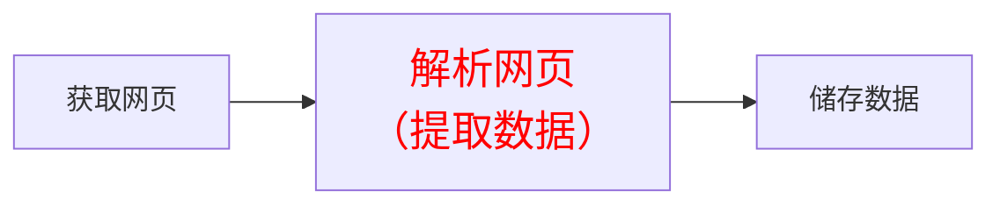
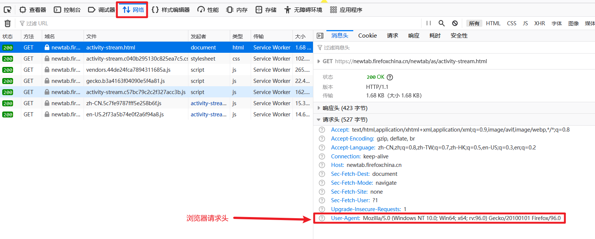
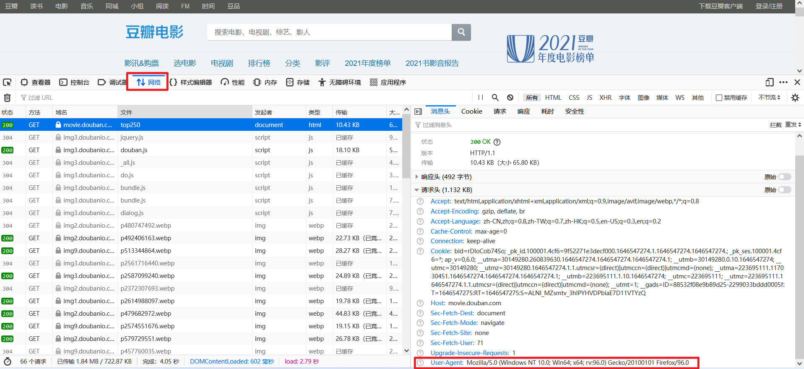
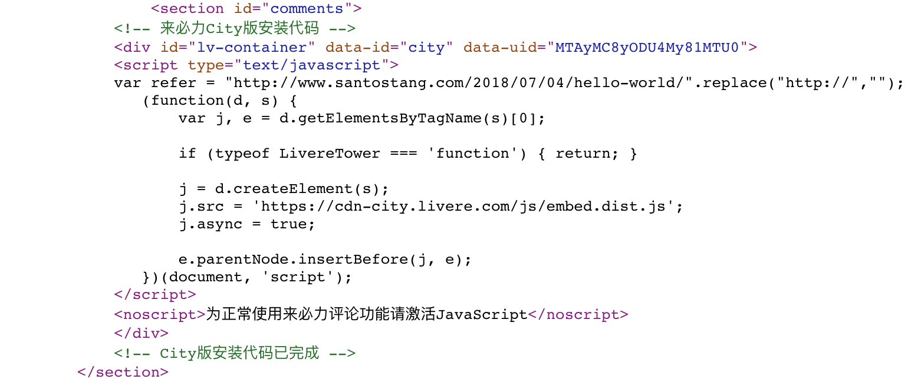
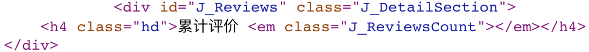
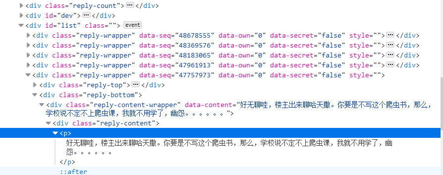

# 							网络爬虫从入门到实践

## 第1章 网络爬虫入门

### 	1.1 网络爬虫是否合法

#### 		1.1.1 Robots 协议

​				Robots 协议（爬虫协议）：网络爬虫排除标准（Robots Exclusion Protocol)

​				网络遵守协议，国际互联网界通行的<font color = red size = 5>道德规范</font>

​				淘宝网的robots.txt查看：https://www.taobao.com/robots.txt

协议内容：

> Disallow 禁止访问
>
> Allow 允许访问

#### 		1.1.2 网络爬虫的约束

​				爬虫自我约束：过快或者频密的访问网站，会给服务器带来巨大压力，网站会封IP或者法律行动

​				<font color = gree size = 5>遵守Robot 协议、约束爬虫速度、访问频率，使用数据保护网站知识产权</font>

### 	1.2 网络爬虫

#### 		1.2.1 Python 爬虫的流程

​				三部分： 获取网页 、解析网页（提取数据）、 储存数据



#### 		1.2.2 三个流程的技术实现

- 获取网页

  > 基础技术
  >
  > > > requests、urllib、selenium
  > >
  > > 进阶技术
  > >
  > > > 多进程多线程抓取、登录抓取、突破IP封禁、使用服务器抓取

 - 解析网页

   > 基础技术
   >
   > > re 正则表达式、BeautifulSoup、lxml
   >
   > 进阶技术
   >
   > > 解决中文乱码

- 储存数据

  > 基础技术
  >
  > > 存入txt文件、存入csv文件
  >
  > 进阶技术
  >
  > > 存入MySQLl数据库、MongoDB数据库

## 第2章 编写第一个网络爬虫

### 2.1 编写第一个简单的爬虫

#### 2.1.1 第一步：获取网页

1. 导入模块 requests

2. 定义目标网址地址url：http://www.santostang.com

3. 定义浏览器代理请求头headers

4. 获取网站返回内容Response

   ```python
   # coding:utf-8
   import requests  # 导入模块requests
   
   # 定义url为目标网址
   url = "http://www.santostang.com"
   # 定义请求头的浏览器代理，伪装成浏览器
   headers = {
       "User-Agent":
           "Mozilla/5.0 (Windows NT 10.0; Win64; x64; rv:96.0) Gecko/20100101 Firefox/96.0"
   }
   
   # 请求网页
   response = requests.get(url, headers=headers)
   print(response)  # 返回响应代码
   print(response.text)  # 返回网页内容代码
   ```

#### 2.1.2 第二步：提取需要的数据

1. 解析网页
2. 提取元素

```python
from bs4 import BeautifulSoup

# 解析页面
soup = BeautifulSoup(response.text, "html.parser")

# 找到第一篇文章标题，定位到class 是“post-title”的h1元素，提取a 里面的字符串，strip() 去除左右空格
title = soup.find("h1", class_="post-title").a.text.strip()
print(title)
```

#### 2.1.3  第三步：储存数据

储存到`title_test.txt`

```python
# 打开一个空白的txt,然后使用f.write写入刚刚的字符串title
with open('title_test.txt', "a+") as f:
    f.write(title)
```

### 2.2 Python 实践：基础巩固

#### 2.2.1 Python 基础试题

##### 试题1：输出奇数

请使用Python 中的循环打印输出从1到100的所有奇数

```python
for i in range(101):
    # if i % 2 == 1:
    #     print(i)
    while i < 101 and i % 2 == 1:
        print(i)
        i += 1
```

##### 试题2：修改字符串

请将字符串"你好$$$我正在学 Python@#@#现在需要&*&*&修改字符串"中的符号变成一个空格，需要输出的格式为："你好 我正在学 Python 现在需要 修改字符串"

```python
str1 = "你好$$$我正在学 Python@#@#现在需要&*&*&修改字符串"

str2 = str1.replace("$$$", " ").replace("&*&*&", " ").replace("@#@#", " ")  # replace 替换函数
print(str2)

import re  # 导入正则表达式模块

# re.sub("表达式","替换内容","需要处理的字符串")
str2 = re.sub('[@$&*#]+', " ", str1)
print(str2)
```

##### 试题3：输出乘法口诀表

输出 9 x 9 乘法口诀表

```python
for i in range(1, 10):
    for j in range(1, i + 1):
        print("%d x %d = %d\t" % (j, i, i * j), end="") # \t 水平制表符，end="" 禁止打印换行
    print("")
```

##### 试题4：写函数算奖金

请写出一个函数，当输入函数变量月利润为Ⅰ时，能返回应发放奖金的总数。例如，输出“利润为100 000元时，应发放奖金总数为10 000元”。其中，企业发放的奖金根据利润提成。利润（Ⅰ）低于或等于 10 万元时，奖金可提 10%；利润高于 10万元，低于 20 万元时，低于 10 万元的部分按 10%提成，高于 10 万元的部分，可提成 7.5%；利润在 20 万元到 40 万元之间时，高于 20 万元的部分可提成 5%；利润在 40 万元到 60 万元之间时，高于 40 万元的部分可提成 3%；利润在 60 万元到 100 万元之间时，高于 60 万元的部分可提成 1.5%；利润高于 100 万元时，超过 100 万元时，超过 100 万元的部分按 1%提成。

第一种方案：

```python
import pysnooper #代码调试模块


@pysnooper.snoop("log.txt")
def profits_bonus(I):
    I = I / 10000
    if I <= 10:
        b = I * 0.1
        return b * 10000
    elif I > 10 and I <= 20:
        b = 10 * 0.1 + (I - 10) * 0.075
        return b * 10000
    elif I > 20 and I <= 40:
        b = 10 * 0.1 + 10 * 0.075 + (I - 20) * 0.05
        return b * 10000
    elif I > 40 and I <= 60:
        b = 10 * 0.1 + 10 * 0.075 + 20 * 0.05 + (I - 40) * 0.03
        return b * 10000
    elif I > 60 and I <= 100:
        b = 10 * 0.1 + 10 * 0.075 + 20 * 0.05 + 20 * 0.03 + (I - 60) * 0.015
        return b * 10000
    else:
        b = 10 * 0.1 + 10 * 0.075 + 20 * 0.05 + 40 * 0.03 + (I - 100) * 0.01
        return b * 10000


I = int(input("请输入月度利润："))
bonus = profits_bonus(I)
print("月度利润为%d元时，应发奖金总数为%d元" % (I, bonus))
```

第二种方案：

```python
import pysnooper


@pysnooper.snoop("log.txt")
def profits_bonus(I):
    # 月度利润的分界值
    arr = [1000000, 600000, 400000, 200000, 100000, 0]
    # 分界值对应的奖金比例值
    rat = [0.01, 0.015, 0.03, 0.05, 0.075, 0.1]
    # 总奖金初始值
    b = 0
    for idx in range(6):
        if I > arr[idx]:
            b = b + (I-arr[idx]) * rat[idx]
            I = arr[idx]
    return b

I = int(input("请输入月度利润："))
bonus = profits_bonus(I)
print("月度利润为%d元时，应发奖金总数为%d元" % (I, bonus))
```

##### 试题5：对字典进行排序

用字典的值对字典进行排序，将``{1:2,3:4,4:3,2:1,0:0}``按照字典的值从大到小进行排序

```
import operator  # operator 模块提供了一套与 Python 的内置运算符对应的高效率函数。

dic = {1: 2, 3: 4, 4: 3, 2: 1, 0: 0}

# sorted() 函数对所有可迭代的对象进行排序操作
# perator.itemgetter函数获取的不是值，而是定义了一个函数，通过该函数作用到对象上才能获取值
sorted_dic = sorted(dic.items(), key=operator.itemgetter(0))

print(sorted_dic)
```

#### 2.2.2 自我实践

W3school Python 100 例学习各种基础知识，网址：https://www.w3cschool.cn/python/python-100-examples.html

## 第3章 静态页面抓取

### 3.1 安装模块Requests

`pip install requests`

### 3.2 获取相应内容

```python
# conding = utf-8

import requests

url = "http://www.santostang.com/"

response = requests.get(url)
print("文本编码：", response.encoding)
print("响应状态码：", response.status_code)
print("字符串方式的响应体：\n", response.text)
```

response响应体说明如下：

1. `response.text`  是服务器响应的内容，会自动根据响应头部的字符编码进行解码

2. `response.encoding`是服务器内容使用的文本编码

3. `response.status_code`用于检测响应的状态码

   > - 200：表示请求成功了
   > - 4xx：表示客户端错误
   > - 5xx；表示服务器错误响应

4. `response.content`是字节方式的响应体，会自动解码gzip、deflate编码的响应体
5. `response.json()`是requests中内置的JSON解码器

### 3.3 定制 Requests 

定制包含：传递URL参数、定制请求头、发送POST请求、设置超时等

#### 3.3.1 传递URL参数

自己构建URL，一般数据会跟在一个问号后面，以键值对的形式放在URL中，如：`http://httpbin.org/get?key1=value1`。

实现方法：把参数保存在字典中，用 parama（参数）构建至URL中

```python
import requests

key_dict = {"key1": "value1", "key2": "value2"}
url = "http://httpbin.org/get"
response = requests.get(url, params=key_dict)

print("URL 已经正确编码：",response.url)	# URL 已经正确编码： http://httpbin.org/get?key1=value1&key2=value2
print("字符串方式的响应体：\n", response.text)
```

#### 3.3.2 定制请求头

请求头 Headers 提供了关于请求、响应或其他发送实体的信息。

##### 1. 请求头在浏览器中的位置




##### 2. 请求头的使用

```python
import requests

url = "http://www.santostang.com/"
# 请求头
headers = {
    "User-Agent":
    "Mozilla/5.0 (Windows NT 10.0; Win64; x64; rv:96.0) Gecko/20100101 Firefox/96.0"
}

response = requests.get(url, headers=headers)

print("响应状态码：", response.status_code)
```

#### 3.3.3 发送POST请求

GET请求，内容会显示在URL中，不安全

POST请求，会以表单的形式发出，不显示在URL中

实现方法：把参数保存在字典中，传递给 Requests 中的 data 参数，发出请求会自动编码为表单形式

```python
import requests

key_dict = {"key1": "value1", "key2": "value2"}
url = "http://httpbin.org/post"
response = requests.post(url, data=key_dict)

print("URL 已经正确编码：", response.url)
print("字符串方式的响应体：\n", response.text)
```

#### 3.3.4 超时

爬虫遇到服务器长时间不返回，爬虫程序会一直等待，造成程序执行失败

解决方法：在 Requests 中设置参数 timeout ,返回异常，一般设置为20秒。

```python
import requests

key_dict = {"key1": "value1", "key2": "value2"}
url = "http://httpbin.org/post"
response = requests.post(url, data=key_dict,timeout=0.001)

print("字符串方式的响应体：\n", response.text)
```

异常：`requests.exceptions.ConnectTimeout`  请求异常连接超时

### 3.4 Requests 爬虫实践：TOP250电影数据

目的：获取豆瓣电影 TOP250所有电影名称

网页：https://movie.douban.com/top250

#### 3.4.1 网站分析

##### 1. 获取网页请求头

请求头：`User-Agent:Mozilla/5.0 (Windows NT 10.0; Win64; x64; rv:96.0) Gecko/20100101 Firefox/96.0`



##### 2.分析网页地址

第一页只有25个电影，如果获取所有的250个电影，就需要获取总共10页内容

网址变化：

- 第一页网址：https://movie.douban.com/top250?start=0&filter=
- 第二页网址：https://movie.douban.com/top250?start=25&filter=
- 第三页网址：https://movie.douban.com/top250?start=50&filter=

结论：每多一页，就给网页地址 start 参数加上25

#### 3.4.2 项目实践

##### 1. 构建每页网址

方法：使用 for 循环

```python
import requests

headers = {
    "User-Agent": "Mozilla/5.0 (Windows NT 10.0; Win64; x64; rv:96.0) Gecko/20100101 Firefox/96.0"
}

for i in range(10):
    url = "https://movie.douban.com/top250?start={0}&filter=".format(i * 25)
    response = requests.get(url, headers=headers, timeout=20)
    print("URL 已经正确编码：", response.url)
    print(str(i + 1), "页响应状态码：", response.status_code)
```

##### 2. 获取数据

使用到了 `lxml` 解析器

```python
import requests

headers = {
    "User-Agent": "Mozilla/5.0 (Windows NT 10.0; Win64; x64; rv:96.0) Gecko/20100101 Firefox/96.0"
}

movie_list = []
for i in range(10):
    # 获取网页代码
    url = "https://movie.douban.com/top250?start={0}&filter=".format(i * 25)
    response = requests.get(url, headers=headers, timeout=20)
    # print("URL 已经正确编码：", response.url)
    # print(str(i + 1), "页响应状态码：", response.status_code)
    # print(response.text)

    # 解析网页
    from bs4 import BeautifulSoup
    
    soup = BeautifulSoup(response.text, "lxml")  # 解析器的类型 lxml
    div_list = soup.find_all('div', class_='hd')
    # print(div_list)
    for each in div_list:
        movie = each.a.span.text.strip()
        movie_list.append(movie)
```

#### 3.4.3 自我实践题（待做）

进阶问题：获取TOP 250 电影的英文名、港台名、导演、主演、上映年份、电影分类以及评分

## 第4章 动态网页抓取

主流网站使用 JaveScript 展现网页内容，很多内容并不会出现在 HTML 源代码中，所以爬取静态网页的技术可能无法正常使用。

动态网页抓取两种技术：通过浏览器审查元素解析真实网页地址、使用 Selenium 模拟浏览器

### 4.1 动态抓取的实例

异步更新技术 —— AJAX (Asynchronous Javascript And XML，异步JavaScript 和 XML)，通过在后台与服务器进行少量数据交换就可以使网页的某部分进行更新。

1. 动态网页：http://www.santostang.com/2018/07/04/hello-world/，下面的评论就是用JavaScript加载的，这些评论数据不会出现在网页源代码中，只有一段JavaScript代码。最后呈现出来的数据就是通过JavaScript提取数据加载到源代码进行呈现的。



2. 天猫电商上找到AJAX技术的例子，商品网页的源代码，如下如所示，里面并没有用户评论，这一块内容是空白的



### 4.2 解析真实地址抓取

使用浏览器 “检查” 功能找到真实地址的URL进行爬取，不推荐

### 4.3 通过Selenium 模拟浏览器抓取

使用浏览器渲染引擎。直接用浏览器在显示网页时解析HTML，应用CSS样式并执行JavaScript的语句

方法：爬虫过程中会打开一个浏览器，加载该网页，自动操作浏览器浏览各个网页，顺便把数据抓下来。（使用浏览器渲染方法，爬取动态网页变成了爬取静态网页。）

selenium库<font color = red size = 5 >模拟浏览器</font>完成抓取。Selenium是一个用于Web应用程序测试的工具。Selenium测试直接运行在浏览器中，浏览器自动按照脚本代码做出点击，输入，打开，验证等操作，就像真正的用户在操作一样。

#### 4.3.1 selenium 的安装与基本介绍

1. selenium安装

```python
pip install selenium
```

2. selenium介绍

   selenium的脚本可以控制浏览器进行操作，可以实现多个浏览器的调用，包括IE（7, 8, 9, 10, 11），Firefox，Safari，Google Chrome，Opera等。最常用的是 Firefox

3. selenium使用

   - 打开浏览器和一个网页

     ```python
     from selenium import webdriver
     driver = webdriver.Firefox()
     driver.get("http://www.santostang.com/2018/07/04/hello-world/")
     ```

     运行之后，发现程序报错，错误为：
      selenium.common.exceptions.WebDriverException:Message: ‘geckodriver’ executable needs to be in PATH.
      在selenium之前的版本中，这样做是不会报错的，但是Selenium新版无法运行。

     我们要下载geckodriver，可以到https://github.com/mozilla/geckodriver/releases  下载相应操作系统的geckodriver，这是一个压缩文件，解压后可以放在桌面，如C:\Users\santostang\Desktop\geckodriver.exe。最后的代码如下：

     ```python
     from selenium import webdriver
     from selenium.webdriver.firefox.service import Service
     
     driver_service = Service(executable_path=r'D:\数据库\2022年项目\爬虫系列\selenium 浏览器驱动\火狐驱动\geckodriver.exe')
     # 把上述地址改成你电脑中geckodriver.exe程序的地址
     driver = webdriver.Firefox(service=driver_service)
     driver.get("http://www.santostang.com/2018/07/04/hello-world/")
     ```

#### 4.3.2 selenium的实战案例

**步骤一：**找到评论的HTML代码标签。使用Chrome打开该文章页面，右键点击页面，打开“检查”选项。按照第二章的方法，定位到评论数据。如下图所示：可以看到该数据的标签为



**步骤二：**尝试获取一条评论数据

```python
# conding = utf-8

from selenium import webdriver
from selenium.webdriver.firefox.service import Service
from selenium.webdriver.common.by import By

driver_service = Service(executable_path=r'D:\数据库\2022年项目\爬虫系列\selenium 浏览器驱动\火狐驱动\geckodriver.exe')
# 把上述地址改成你电脑中geckodriver.exe程序的地址
driver = webdriver.Firefox(service=driver_service)
driver.get("http://www.santostang.com/2018/07/04/hello-world/")

# driver.find_element(by=By.CSS_SELECTOR, value='div.reply-content')是用CSS选择器查找元素
comment = driver.find_element(by=By.CSS_SELECTOR, value='div.reply-content')

# find_element(by=By.TAG_NAME, value='p')则是通过元素的tag去寻找，意思是找到comment中的p元素
content = comment.find_element(by=By.TAG_NAME, value='p')

# 输出p元素中的text文本
print(content.text)
```

运行上述代码，我们得到的结果是错误：“Message: Unable to locate element:div.reply-content”

**步骤三：**我们可以在 jupyter 中键入driver.page_source 找到为什么没有定位到评论元素，通过排查我们发现，原来代码中的 JavaScript 解析成了一个 iframe，< iframe title=”livere” scrolling=”no”…>也就是说，所有的评论都装在这个框架之中，里面的评论并没有解析出来，所以我们才找不到div.reply-content元素。这时，我们需要加上对 iframe 的解析

```python
# conding = utf-8

from selenium import webdriver
from selenium.webdriver.firefox.service import Service
from selenium.webdriver.common.by import By

driver_service = Service(executable_path=r'D:\数据库\2022年项目\爬虫系列\selenium 浏览器驱动\火狐驱动\geckodriver.exe')
# 把上述地址改成你电脑中geckodriver.exe程序的地址
driver = webdriver.Firefox(service=driver_service)
driver.get("http://www.santostang.com/2018/07/04/hello-world/")

driver.switch_to.frame(driver.find_element(by=By.CSS_SELECTOR, value="iframe[title='livere-comment']"))

# driver.find_element(by=By.CSS_SELECTOR, value='div.reply-content')是用CSS选择器查找元素
comment = driver.find_element(by=By.CSS_SELECTOR, value='div.reply-content')

# find_element(by=By.TAG_NAME, value='p')则是通过元素的tag去寻找，意思是找到comment中的p元素
content = comment.find_element(by=By.TAG_NAME, value='p')

# 输出p元素中的text文本
print(content.text)
```

4.3.3 
