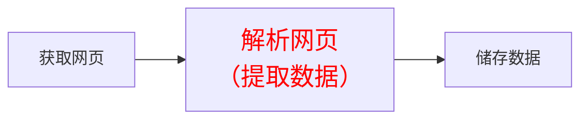

# 							网络爬虫从入门到实践

## 第1章 网络爬虫入门

### 	1.1 网络爬虫是否合法

#### 		1.1.1 Robots 协议

​				Robots 协议（爬虫协议）：网络爬虫排除标准（Robots Exclusion Protocol)

​				网络遵守协议，国际互联网界通行的道德规范

​				淘宝网的robots.txt查看：https://www.taobao.com/robots.txt

协议内容：

> Disallow 禁止访问
>
> Allow 允许访问

#### 		1.1.2 网络爬虫的约束

​				爬虫自我约束：过快或者频密的访问网站，会给服务器带来巨大压力，网站会封IP或者法律行动

​				遵守Robot 协议、约束爬虫速度、访问频率，使用数据保护网站知识产权

### 	1.2 网络爬虫

#### 		1.2.1 Python 爬虫的流程

​				三部分： 获取网页 、解析网页（提取数据）、 储存数据

#### 		1.2.2 三个流程的技术实现

- 获取网页

  > 基础技术
  >
  > > > requests、urllib、selenium
  > >
  > > 进阶技术
  > >
  > > > 多进程多线程抓取、登录抓取、突破IP封禁、使用服务器抓取

 - 解析网页

   > 基础技术
   >
   > > re 正则表达式、BeautifulSoup、lxml
   >
   > 进阶技术
   >
   > > 解决中文乱码

- 储存数据

  > 基础技术
  >
  > > 存入txt文件、存入csv文件
  >
  > 进阶技术
  >
  > > 存入Mysql数据库、MongoDB数据库