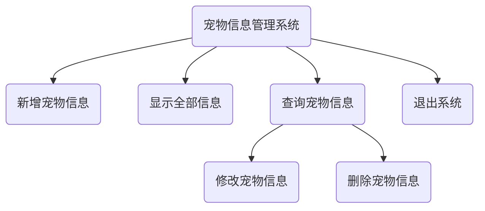
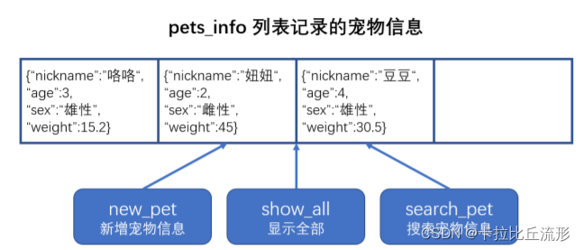
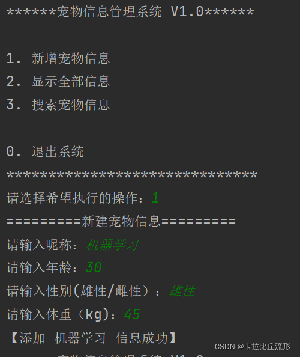
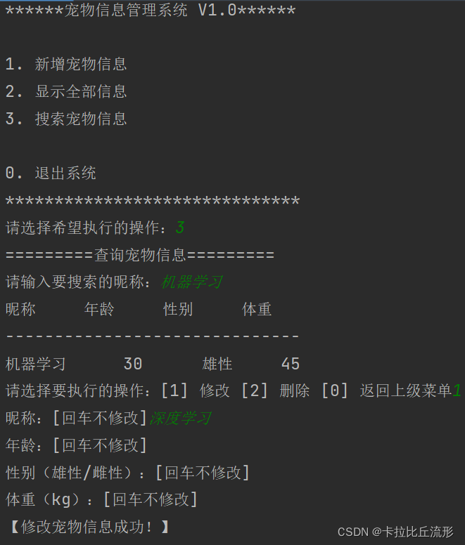
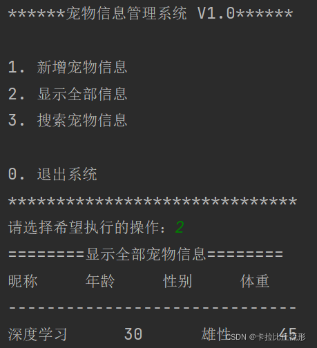
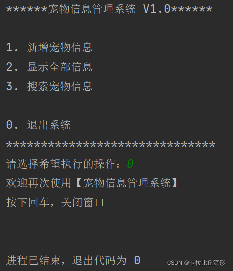

## 一、名词解释

## 1.1 什么是CLI?

**命令行界面**（英语：command-line interface，缩写：CLI）是在图形用户界面得到普及之前使用最为广泛的用户界面，它通常不支持鼠标，用户通过键盘输入指令，计算机接收到指令后，予以执行。也有人称之为字符用户界面CUI。


## 1.2 什么是[GUI](https://so.csdn.net/so/search?q=GUI&spm=1001.2101.3001.7020)?

**图形用户界面**（Graphical User Interface，简称 GUI，又称图形用户接口）是指采用图形方式显示的计算机操作用户界面。


## 二、项目目的

- 应用Python基础知识，理解命令行交互方式，学习软件设计与分析方法

- 通过函数定义与调用，掌握代码提取与复用的概念

- 综合运用基本数据结构和字符串处理等技能

- 了解需求提出、需求拆解、框架梳理、代码调试的思路与流程

  

## 三、宠物信息管理系统

Pet Information Management System，简称 PIMS。（自己定义的）

## 3.1 项目背景

随着消费能力的提升，人口结构的变化等原因，宠物市场规模在逐年增加，越来越多的宠物店、宠物医院发展了起来。为了提升对于宠物信息的管理效率，提高用户满意度，宠物信息管理系统的需求也会越来越多。**主要功能**包括：*宠物信息录入、查询、修改；宠物服务记录的增加与查询，宠物服务的报价与消费记录查询*等。

可以添加市场规模图，此处略。


## 3.2 需求分析

### 3.2.1 系统描述

系统1.0版本，主要功能为宠物基本信息的**录入**、**编辑**、**删除**、**查询**功能。

**核心功能**包括：新增宠物信息、显示全部宠物信息、查询宠物信息、修改或删除宠物信息，退出系统。


### 3.2.2 功能结构




## 3.3 主要功能描述

### 3.3.1 主界面：

```
******宠物信息管理系统 V1.0******
1. 新增宠物信息
2. 显示全部信息
3. 搜索宠物信息

0. 退出系统
******************************
请选择希望执行的操作：
```

根据用户输入的功能序号，显示对应操作的引导信息或结果
 例如：如果用户输入数字0，则显示欢送信息并退出系统。

```
请选择希望执行的操作：0
您选择的操作是：0
欢迎再次使用【宠物信息管理系统】
```


### 3.3.2 新建宠物信息

用户如果录入数字1，则提示用户输入宠物的昵称、年龄、性别和体重。
 并在输入完成后，提示输入成功信息。

```
您选择的操作是:1
==========新增宠物信息==========
请输入昵称：咯咯
请输入年龄：3
请输入性别(雄性/雌性）：雄性
请输入体重（kg)：15
【添加 咯咯 成功！】
```


### 3.3.3 显示全部宠物信息

用户如果录入数字2，则显示现有宠物信息列表。

```
请选择希望执行的操作：2
您选择的操作是:2
=========显示所有宠物信息========
昵称 年龄 性别 体重
-------------------------------
咯咯 3 雄性 15
```

如没有任何宠物信息，则显示提示信息，如下：

```
请选择希望执行的操作：2
您选择的操作是:2
=========显示所有宠物信息=========
【当前没有任何的宠物信息记录，请使用新增功能添加宠物信息！】
```


### 3.3.4 查询宠物信息

用户如果录入数字3，则提示用户输入要搜索的宠物昵称，并根据昵称进行搜索。
 搜索到对应信息，以列表形式显示：

```
请选择希望执行的操作：3
您选择的操作是:3
==========搜索宠物信息==========
请输入要搜索的昵称：咯咯
昵称 年龄 性别 体重
------------------------------
咯咯 3 雄性 15
请选择要执行的操作 [1] 修改 [2] 删除 [0] 返回上级菜单
```

如果没有搜索到，显示提示消息：

```
==========搜索宠物信息==========
请输入要搜索的昵称：妞妞
抱歉，没有找到 妞妞
```


### 3.3.5 修改宠物信息

在搜索结果显示后，根据提示输入数字1，进入修改宠物信息的环节，
 如果没有录入任何信息，直接回车，则默认保留原有信息；录入信息，则覆盖原有信息。
 修改成功后，显示修改成功消息提示。

```
请选择要执行的操作 [1] 修改 [2] 删除 [0] 返回上级菜单1
姓名：
年龄：
性别(雄性/雌性）：
体重(kg)：15.2
【修改宠物信息成功！】
```


### 3.3.6 删除宠物信息

在搜索结果显示后，根据提示输入数字2，删除对应的宠物信息，并显示删除成功的消息提示。

```
请选择要执行的操作 [1] 修改 [2] 删除 [0] 返回上级菜单2
【删除宠物信息成功！】
```


## 3.4 不足与扩展

本系统主要侧重核心流程搭建，功能不多，且未作输入校验与异常处理。
 未来可以补充的部分有：

1. 输入的校验与异常处理
2. 更多维度信息的管理，更多功能
3. 数据持久化：保存到文件或者数据库中
4. 用户交互升级为图形界面版


## 四、项目制作

### 4.1 [框架](https://so.csdn.net/so/search?q=框架&spm=1001.2101.3001.7020)搭建

**自顶向下**：从框架入手，逐一拆分为具体的业务逻辑，最后细化功能代码。
 **函数注释**：写在函数定义下方的注释。可以通过help函数显示。
 **TODO**：Pycharm工具，可以记录、定位需要完成的代码功能与位置
 **数据存储结构**：
 pets_info 是一个列表，用来存储宠物信息；每个宠物的信息使用字典格式来存储。
 每个函数都要对这个列表进行操作，所以适合做全局变量。




### 4.2 新增宠物信息

- 提示用户输入宠物信息
- 将输入的信息，保存为一个字典
- 将宠物信息的字典追加到列表中
- 提示用户添加成功


### 4.3 显示全部宠物信息

- 判断宠物信息列表中是否为空
- 打印表头
- 逐一打印列表中的每个宠物信息


### 4.4 查询宠物信息

- 引导用户输入要搜索的宠物昵称
- 在宠物信息列表中查找对应昵称的宠物信息
- 如果找到了，就打印输出列表
- 如果没找到，就打印输出提示信息
- 提示用户对于找到的信息，进行操作选择


### 4.5 修改宠物信息

- 提示用户输入要修改的信息
- 将新录入的信息，替换原有宠物信息
- 如果输入空格就默认保留原有宠物信息


### 4.6 删除宠物信息

- 将指定宠物信息从列表中移除


### 4.7 发布与运行

- 检查并补充文档和函数注释
- 运行结束时停止在命令提示符界面：添加input语句


## 五、完整代码实现

### **主程序：**

```
"""
这是宠物信息管理系统的主程序
"""
from pet_tools import *

#1.显示系统菜单
#2.根据用户输入，调用不同的功能（函数）
#3.不断的执行上述操作 （循环）

def main():
	while True:

		#  1.显示系统菜单					#在这里演示TODO的作用，并为后面的pass位置也加上
		#TODO("liuxu")
		show_menu()						#TODO后面可以写上小括号，包含（姓名/邮箱）标注责任人

		#2.根据用户输入，调用不同的功能（函数）
		action = input("请选择希望执行的操作：")
		if action in ["1","2","3"]:
		#if action == 1 or action ==2 or action == 3:
			if action == "1":			#写完循环后，使用debug进行代码调试
				#  新建宠物信息
				#print("新建宠物信息")
				new_pet()				#搭建框架的时候，就把函数名确定下来
				#pass					#并在pet_tools中定义出来，需要写出函数注释
			elif action == "2":
				#  显示全部宠物信息
				#print("显示全部宠物信息")
				show_all()
				#pass
			elif action == "3":
				# 查询宠物信息
				#print("查询宠物信息")
				search_pet()
				#pass
		elif action == "0":
			# 退出系统
			# print("退出系统")
			print("欢迎再次使用【宠物信息管理系统】")
			input("按下回车，关闭窗口")
			break
		else:
			print("【您输入的不正确，请重新选择】")

#3.不断的执行上述操作 （循环）


if __name__ == '__main__':
    main()
```


### **功能程序**

```
"""
这是宠物信息管理系统的工具程序
"""

pets_info = []	#用来保存宠物信息
#pets_info = [{'nickname':'咯咯','age':3,'sex':'雄性','weight':15}]
header = ["昵称","年龄","性别","体重"]

'''
******宠物信息管理系统 V1.0******

1. 新增宠物信息
2. 显示全部信息
3. 搜索宠物信息

0. 退出系统
******************************
'''
def show_menu():
	'''
	显示主菜单
	'''
	print("宠物信息管理系统 V1.0".center(25,'*'))
	print()
	print("1. 新增宠物信息")
	print("2. 显示全部信息")
	print("3. 搜索宠物信息")
	print()
	print("0. 退出系统")
	print("*"*30)


def new_pet():
	'''
	新建宠物信息
	'''
	print("新建宠物信息".center(24,"="))
	'''
	请输入昵称：咯咯
	请输入年龄：3
	请输入性别(雄性/雌性）：雄性
	请输入体重（kg)：15
	'''

	#1.提示用户输入宠物信息
	nickname = input("请输入昵称：")
	age = input("请输入年龄：")
	sex = input("请输入性别(雄性/雌性）：")
	weight = input("请输入体重（kg)：")

	# 2.将输入的信息，保存为一个字典
	# 3.将宠物信息的字典追加到列表中
	# 4.提示用户添加成功


	#2.将输入的信息，保存为一个字典
	pet = {"nickname":nickname,
		   "age":age,
		   "sex":sex,
		   "weight":weight}

	#3.将宠物信息的字典追加到列表中
	pets_info.append(pet)
	#print(pets_info)

	#4.提示用户添加成功
	print(f"【添加 {nickname} 信息成功】")


def show_all():
	'''
	显示全部宠物信息
	'''
	print("显示全部宠物信息".center(24,"="))

	# 判断宠物信息列表中是否为空
	# 打印表头
	# 逐一打印列表中的每个宠物信息

	#判断宠物信息列表中是否为空
	if len(pets_info) == 0:
		print("【当前没有任何的宠物信息记录，请使用新增功能添加宠物信息！】")
		return

	for title in header:
		print(title,end="\t\t")
	print()
	print("-"*30)
		#逐一打印列表中的每个宠物信息
	for pet in pets_info:
		#print(f"{pet['nickname']}\t\t{pet['age']}\t\t{pet['sex']}\t\t{pet['weight']}")
		for value in pet.values():
			print(f"{value}",end="\t\t")
		print()


def deal_pet(find_pet):
	"""处理查找到的宠物信息

    :param find_pet: 查找到的宠物信息
    """
	action = input("请选择要执行的操作：[1] 修改 [2] 删除 [0] 返回上级菜单")

	if action == "1":
		#执行修改操作
		# find_pet["nickname"] = input("昵称：")
		# find_pet["age"] = input("年龄：")
		# find_pet["sex"] = input("性别（雄性/雌性）：")
		# find_pet["weight"] = input("体重（kg）：")
		find_pet["nickname"] = input_pet_info(find_pet["nickname"],"昵称：[回车不修改]")
		find_pet["age"] = input_pet_info(find_pet["age"],"年龄：[回车不修改]")
		find_pet["sex"] = input_pet_info(find_pet["sex"],"性别（雄性/雌性）：[回车不修改]")
		find_pet["weight"] = input_pet_info(find_pet["weight"],"体重（kg）：[回车不修改]")
		print("【修改宠物信息成功！】")
	elif action == "2":
		#执行删除操作
		pets_info.remove(find_pet)
		print("【删除宠物信息成功！】")


def input_pet_info(pet_value,tip):
	"""输入宠物信息信息

    :param pet_value: 字典中原有的值
    :param tip: 输入的提示文字
    :return: 如果用户输入了内容，就返回内容，否则返回字典中原有的值
    """
	#1.提示用户输入信息
	result = input(tip)
	#2.用户输入的内容不为空，返回输入的值
	if len(result)>0:
		return result
	#3.如果用户输入的为空，返回宠物信息原有的值
	else:
		return pet_value


def search_pet():
	'''
	查询宠物信息
	'''
	print("查询宠物信息".center(24,"="))
	#1.引导用户输入要搜索的宠物昵称
	find_name = input("请输入要搜索的昵称：")
	#2.在宠物信息列表中查找对应昵称的宠物信息
	for pet in pets_info:
		if pet["nickname"] == find_name:
			# print("昵称\t\t年龄\t\t性别\t\t体重")
			for title in header:
				print(title, end="\t\t")
			print()
			print("-" * 30)
			#print(f"{pet['nickname']}\t\t{pet['age']}\t\t{pet['sex']}\t\t{pet['weight']}")
			for value in pet.values():
				print(f"{value}", end="\t\t")
			print()
			#提示用户对于找到的信息，进行操作选择
			deal_pet(pet)
			break
	else:
		print(f"【抱歉，没有找到 {find_name} 】")
	#3.如果找到了，就打印输出列表
	#4.如果没找到，就打印输出提示信息
```


### **测试文件程序：**

```
#test_doc.py
import pet_main
import pet_tools
help(pet_main)
#help(pet_tools)
```


```
NAME
    pet_main - 这是宠物信息管理系统的主程序

FUNCTIONS
    main()

DATA
    header = ['昵称', '年龄', '性别', '体重']
    pets_info = []

FILE
    e:\itsishu\python_workspace\pims\pet_main.py
```


## 六、运行实例

### **添加**：



### **修改**：



### **显示：**



### **退出：**



