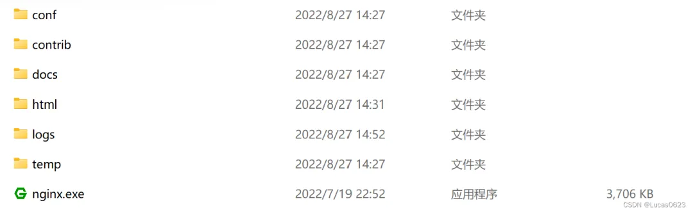
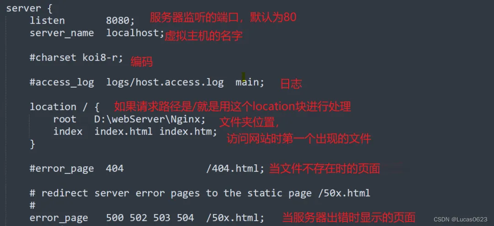
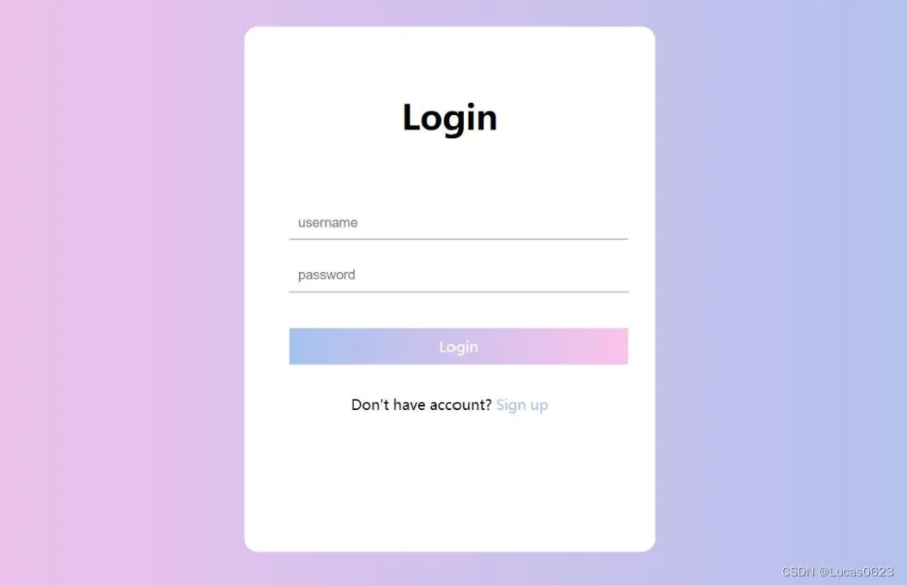
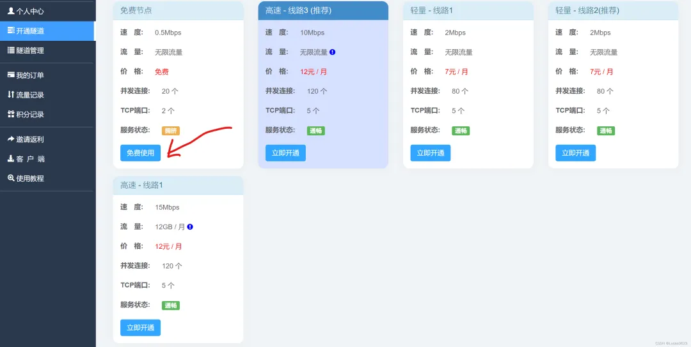
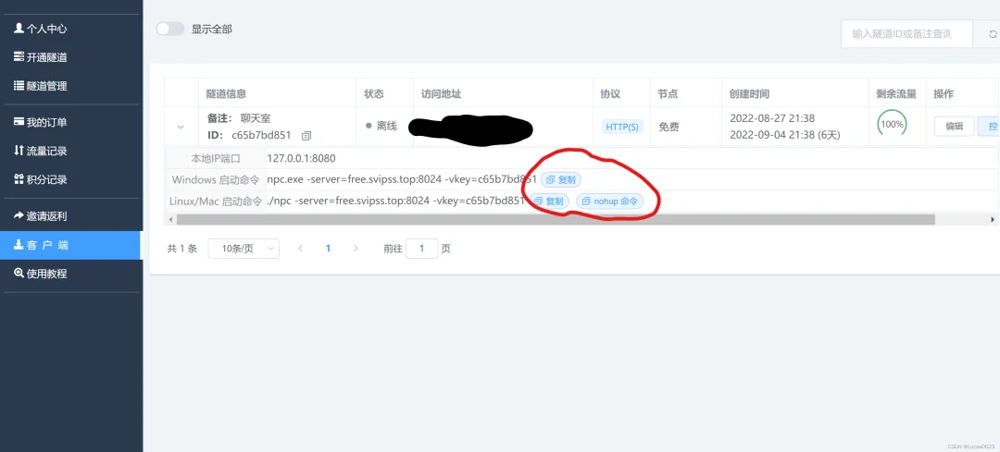

来源：[拿自己的旧电脑搭建了个服务器！](https://mp.weixin.qq.com/s/8308LOfgXHd1IFVx5M_dzw)

## ***\*1.安装Nginx\****

首先前往Nginx官网（nginx.org)进行下载，也可以直接用我提供的链接下载1.23版本：`http://nginx.org/download/nginx-1.23.1.zip`

安装完之后解压，然后你会看到如下目录：



由于Nginx的功能很多，而我们今天只是搭建个服务器，所以只会用到其中的一部分。

## ***\*2.配置Nginx\****

进入conf文件夹，打开nginx.conf文件进行编辑，里面的配置很多，我对其中一些重要的配置进行了说明（前面有“#”的表示并没有真正写入配置，若要加入，只需去掉“`#`”）：



## ***\*3.启动Nginx服务\****

配置完Nginx后，返回Nginx根目录，找到nginx.exe，双击运行它，你会看到有个小黑框一闪而过，这说明Nginx已经成功启动！你可以打开浏览器，输入：虚拟主机名称:监听的端口（刚刚的配置），回车，就会看到如下网页：


恭喜你，已经成功搭建了Nginx服务器！

## ***\*4.为你的网站添加文件\****

光开启了服务可还不够，如果别人看到你的网站只有干巴巴的一段文字，有什么用？接下来，进入刚刚配置的文件夹位置，在该文件夹下新建一个txt，打开后输入这段代码：

```html
<!DOCTYPE html>
<html lang="en">
<head>
    <meta charset="UTF-8">
    <meta name="viewport" content="width=device-width, initial-scale=1.0">
    <title>Document</title>
    <style>
        * {
            margin: 0;
            padding: 0;
        }
        html {
            height: 100%;
        }
        body {
            height: 100%;
        }
        .container {
            height: 100%;
            background-image: linear-gradient(to right, #fbc2eb, #a6c1ee);
        }
        .login-wrapper {
            background-color: #fff;
            width: 358px;
            height: 588px;
            border-radius: 15px;
            padding: 0 50px;
            position: relative;
            left: 50%;
            top: 50%;
            transform: translate(-50%, -50%);
        }
        .header {
            font-size: 38px;
            font-weight: bold;
            text-align: center;
            line-height: 200px;
        }
        .input-item {
            display: block;
            width: 100%;
            margin-bottom: 20px;
            border: 0;
            padding: 10px;
            border-bottom: 1px solid rgb(128, 125, 125);
            font-size: 15px;
            outline: none;
        }
        .input-item:placeholder {
            text-transform: uppercase;
        }
        .btn {
            text-align: center;
            padding: 10px;
            width: 100%;
            margin-top: 40px;
            background-image: linear-gradient(to right, #a6c1ee, #fbc2eb);
            color: #fff;
        }
        .msg {
            text-align: center;
            line-height: 88px;
        }
        a {
            text-decoration: none;
            color: #abc1ee;
        }
    </style>
</head>
<body>
    <div class="container">
        <div class="login-wrapper">
            <div class="header">Login</div>
            <div class="form-wrapper">
                <input type="text" name="username" placeholder="username" class="input-item">
                <input type="password" name="password" placeholder="password" class="input-item">
                <div class="btn">Login</div>
            </div>
            <div class="msg">
                Don't have account?
                <a href="#">Sign up</a>
            </div>
        </div>
    </div>
</body>
</html>
```

再将文件名改为index.html，保存，最后再次打开浏览器，输入虚拟主机名称:监听的端口（刚刚的配置），回车，你就会看见如下页面：



是不是非常好看？这个index.html其实是用HTML+CSS写出来的，感兴趣的同学可以去学习一下。

除了html文件，你还可以在该文件夹里放任何文件，如：图片，视频，压缩包等等。

## ***\*5.内网穿透\****

服务器搭建完了，网页也有了，但其实除了跟你在同一个局域网下的人，都无法访问你的网站。

这里就要用到内网穿透了，所谓内网穿透，也即是局域网能够直接通过公网的ip去访问，极大的方便用户的日常远程的一些操作的使用。这里我建议大家使用飞鸽内网穿透，使用方法如下：

#### **5.1 注册**

进入飞鸽内网穿透官网，进行注册，这步就不多讲了。

#### **5.2 开通隧道**

注册好后，我们点击“开通隧道”选项，选择“免费节点”，有实力的也可以选贵的。



然后填写信息，其中前置域名可以自定，本地ip端口一定要设置成：你的内网ip:刚配置的端口号。

最后点击确认开通，就OK了，这样你就得到了免费域名+免费公网ip。

#### **5.3 启动服务**

点击此链接，根据电脑系统下载客户端。下载完后解压，一共有两个文件：傻瓜式运行点击我.vbs和npc.exe。

点击傻瓜式运行点击我.vbs，打开后会看见一个弹窗，让你填写指令。我们切回飞鸽官网，点击“隧道管理”，如下图：根据电脑系统选择指令，点击复制，然后切回刚才的弹窗，将指令输入进去，点击确定。



这样内网穿透就成功了！打开浏览器，输入刚才开通的隧道的访问地址（上图被抹掉的地方），回车，同样能开到之前编写的网页，就成功了。