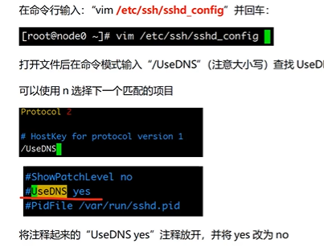
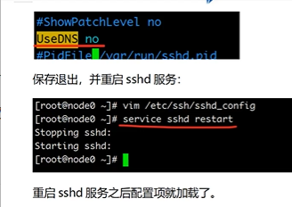
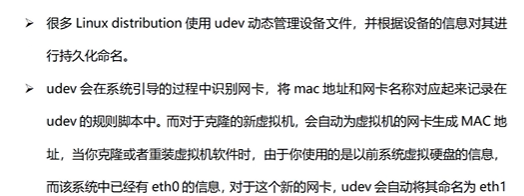
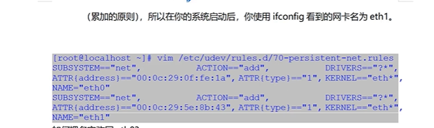

# 一、系统配置：

## 1.1 设置计算机名称

- RedHat的hostname修改

​			vi   /etc/sysconfig/network 

​			HOSTNAME=你要设置的hostname

- Debian发行版hostname修改

​			vi  /etc/hostname 修改主机名

​			cat /etc/hostname 查看主机名

重启系统读取配置文件设置新的hostname

## 1.2 编辑网络配置文件

- 修改配置文件 ifcfg-ens33 命令 vi /etc/sysconfig/network-scripts/ifcfg-ens33

  TYPE="Ethernet" #网卡类型为以太网卡 ==需要==
  PROXY_METHOD="none"
  BROWSER_ONLY="no"
  BOOTPROTO="staitc"    # dhcp 自动分配ip ，staitc 静态ip。==必须修改==
  DEFROUTE="yes"
  IPV4_FAILURE_FATAL="yes"
  IPV6INIT="yes"
  IPV6_AUTOCONF="yes"
  IPV6_DEFROUTE="yes"
  IPV6_FAILURE_FATAL="no"
  IPV6_ADDR_GEN_MODE="stable-privacy"
  NAME="ens33" # 网卡名称 ==需要==
  UUID="e8a9dda6-1f3d-416b-802f-16fcc4b4761c" # 网卡设备编号，可以删除
  DEVICE="ens33" # 网卡设置 ==需要==
  ONBOOT="yes"  激活网卡 ==必须修改==
  IPADDR="192.168.88.151"  # ip地址  ==必须添加==
  PREFIX="24" # 掩码 ==必须添加==
  GATEWAY="192.168.88.2" #网管 ==必须添加==
  DNS1="192.168.88.2" # 域名服务器1 ==必须添加==
  DNS2="114.114.114.114" # 域名服务器2 ==必须添加==
  IPV6_PRIVACY="no"

- 重启服务 sudo systemctl restart network / service network restart

```
centos7.2设置静态ip不生效

一、检查/etc/sysconfig/network-scripts目录下配置文件
1、看到了一个陌生的配置文件 ifcfg-Wired_connection_1，度娘查询了一下这个配置文件是系统启动调用的网卡配置文件和NetworkManager服务相关。
在这里插入图片描述
2、在CentOS系统上，目前有NetworkManager和network两种网络管理工具。如果两种都配置会引起冲突，而且NetworkManager在网络断开的时候，会清理路由，如果一些自定义的路由，没有加入到NetworkManager的配置文件中，路由就被清理掉，网络连接后需要自定义添加上去。

二、解决方法
1、停掉NetworkManager服务
systemctl stop NetworkManager.service
2、设置开机不自动启动
systemctl disable NetworkManager.service
----------------------输出信息---------------------------
Removed /etc/systemd/system/multi-user.target.wants/NetworkManager.service.
Removed /etc/systemd/system/dbus-org.freedesktop.NetworkManager.service.
Removed /etc/systemd/system/dbus-org.freedesktop.nm-dispatcher.service.
3、systemctl is-enabled NetworkManager #查看是否禁用
4、设置network服务开机自启动
systemctl enable network.service
----------------------输出信息---------------------------
network.service is not a native service, redirecting to /sbin/chkconfig.
Executing /sbin/chkconfig network on
5、输出的大概意思就是需要执行一下 chkconfig network on
6、以上执行完成后配置你的物理网卡信息
vim /etc/sysconfig/network-scripts/ifcfg-ens32

7、配置完成后重启服务器即可
```


## 1.3 Hosts 映射

- 修改配置文件hosts 命令 vi /etc/hosts

  添加内容

  ```
  # IP地址			别名	 网址
  192.168.88.151 centos1 centos.centos1.cn
  192.168.88.152 centos2 centos.centos2.cn
  192.168.88.153 centos3 centos.centos3.cn
  ```

- 查看主机映射 cat /etc/hosts 

## 1.4 安装 vim 和 ntp（集群时间同步）

- ntp :时间同步 yum install ntp -y  ‘-y’ 可以省略确认提示

  依赖 ntpdate 会同步安装

  date 查看系统时间

  chkconfig 查看服务状态  举例：chkconfig ntp on 服务状态打开

  - 3 命令行启动 
  - 5 图形界面启动
  - 6 重启
  - 0 关机
  - 2 无网络用户
  - 1 单用户模式
  - 4 未用

  >  集群时间同步 ==推荐==
  >
  >  yum -y install ntpdate  安装插件
  >
  >  ntpdate ntp5.aliyun.com  阿里云时间授权
  >
  >  ```
  >  硬件时间和系统时间之间同步
  >  
  >      hwclock --systohc  #将系统时间写入硬件时间
  >      hwclock --hctosys  #将硬件时间写入系统时间
  >  
  >  强制系统时间写入CMOS中防止重启失效
  >  
  >  　　hwclock -w
  >  　　或clock -w
  >  ```
  >
  >  

- vim :编辑器

## 1.5 防火墙关闭

systemctl stop firewalld.service  关闭防火墙

systemctl disable firewalld.service  禁止防火墙开启自启

systemctl status firewalld.service  防火墙状态

## 1.6 禁用 selinux

增强安全子系统，不需要，关掉

getenforce 查看状态

编辑配置文件 vim /etc/selinux/config 

SELINUX=enforcing  修改为 disabled

重启生效

## 1.7 ssh免密登录

（node1执行- node1|node2|node3)

ssh-keygen #4个回车 生成公钥、私钥

ssh-copy-id nodel、ssh-copy-id node2、ssh-copy-id node3 可以把本地主机的公钥复制到远程主机的authorized_keys文件上（推荐）

 scp -r authorized_keys root@hadoop02:/root/.ssh/ 远程传输文件

## 1.8 关闭 sshd 服务的DNS 【非必须】

加快 SSH登录远程的速度 





## 1.9 删除 70-persistent-net.rules文件

文件路径 /etc/udev/rules.d





## 1.10 创建统一工作目录

mkdir -p /export/server/  软件安装路径

mkdir -p /export/data/  数据储存路径

mkdir -p /export/software/  安装包存放路径

# 二、命令

## 2.1 远程传输文件

scp -r authorized_keys root@hadoop02:/root/.ssh/

## 2.2 常用命令

sudo su 获取超级管理员权限

ls 显示指定目录下内容

-  -a 显示所有文件及目录
-  -l 列出文件详细信息，ls -l 简写 ll
-  -la

cd 切换目录

pwd 查看所处目录

. 表示当前路径（隐藏文件）

.. 当前目录的上一级

~ 

/ 根目录

history 显示历史执行命令

Tab键 补全命令

shutdown -r 重启电脑

## 2.3 创建、删除

mkdir 创建目录

- -p 父目录不存在，自动创建

touch 创建空文件

rm 删除文件或目录（空目录）

- -f 强制直接删除，无需确认
- -r 将目录及以下所有递归逐一删除

## 2.4 复制、移动

cp 复制文件或目录

- -r 复制目录下的所有文件

mv 文件或目录改名或移入其它位置

## 2.5 文件内容查看

cat 文件输出到控制台，适合小文件

more 文件逐页显示，适合大文件，空格键向下翻页，回退向上翻

tail 查看文件结尾部分

- n 用于显示行数，默认10
- -f 实时显示文件动态追加的内容

## 2.6 其它

echo 用于内容输出

| 管道符号，先执行前面内容，把结果给后面命令

‘> 输出重定向（覆盖）

‘>> 输出重定向（追加）

## 2.7 解压缩命令

打包、解包

tar 

- -c  打包，创建文件
- -x 解包
- -v 显示执行过程
- -f 指定文件
- -C 指定目录(默认当前路径)
- -z 压缩算法，.tar.gz(tgz)

## 2.8 时间、日期查看

data 显示 或设定系统日期与时间，用+设定显示格式

cal 显示当前或指定日期的公历

## 2.9 内存、磁盘使用率

free 显示内存使用率

df 显示磁盘使用率

参数：-h 

## 2.10 进程查看

ps 显示当前进程状态，参数 -ef

kill -9 进程号 杀死进程

jps 专门查看java进程

## 2.11 软件包安装

安装tools工具：apt install open-vm-tools-desktop fuse

apt update  同步包的索引文件，检查软件的最新版本
