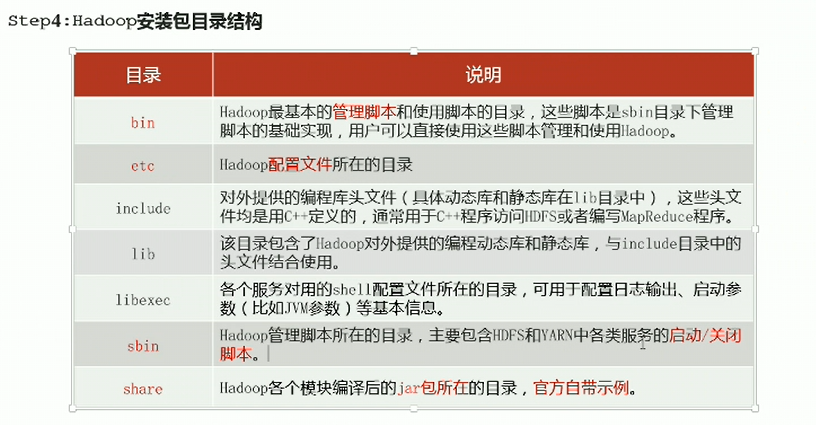
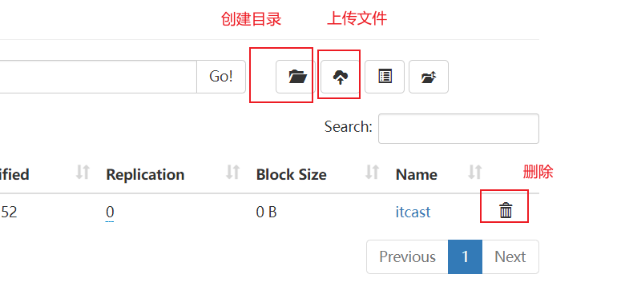
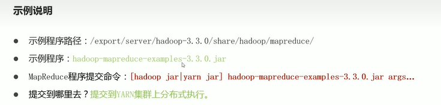

# Hadoop 源码编译

ntpdate ntp5.aliyun.com  阿里云时间授权，同步时间

sudo systemctl restart network 同步网卡配置

## 一、java安装

下载：https://www.oracle.com/java/technologies/downloads/#java8  【jdk-8u351-linux-x64.tar.gz】

上传、解压 JDK 1.8安装包

tar -zxvf jdk-8u351-linux-x64.tar.gz 解压文件安装

​	配置环境变量

​	vi /etc/profile 编辑环境变量文件

```
export JAVA_HOME=/export/server/jdk1.8.0_351
export PATH=$PATH:$JAVA_HOME/bin
export CLASSPATH=.:$JAVA_HOME/lib/dt.jar:$JAVA_HOME/lib/tools.jar
```

重新加载环境变量文件

 source /etc/profile

检查是否安装成功

java -version

## 二、安装maven

进入到maven的conf目录：cd /root/apps/apache-maven-3.5.3/conf

修改配置文件settings.xml：

在配置文件的中部找到localRepository这个标签，是被注释掉的，将其放出      来自己添加路径:

创建仓库并配置

```powershell
# mkdir repo 创建仓库
<localRepository>/export/server/apache-maven-3.8.6/repo</localRepository>  settings.xml配置仓库
```

在 mirrors节点中添加阿里云镜像

```
  <mirrors>

   <mirror>

       <id>nexus-aliyun</id>

        <mirrorOf>central</mirrorOf>

        <name>Nexus aliyun</name>

       <url>http://maven.aliyun.com/nexus/content/groups/public</url>

   </mirror>

  </mirrors>
```

配置环境变量

​	vi /etc/profile 编辑环境变量文件

```
export MAVEN_HOME=/export/server/apache-maven-3.8.6
export PATH=$PATH:$MAVEN_HOME/bin
```

重新加载环境变量文件

 source /etc/profile

检查是否安装成功

mvn -version

## 三、安装相关的依赖

注意安装依赖顺序不可乱,可能会出现依赖找不到问题

\# 安装gcc make 

yum install -y gcc* make

 

\#安装压缩工具 		

yum -y install snappy*  bzip2* lzo* zlib*  lz4* gzip*

 

\#安装一些基本工具 		

yum -y install openssl* svn ncurses* autoconf automake libtool

 

\#安装扩展源,才可安装zstd

yum -y install epel-release

\#安装zstd

yum -y install *zstd*

## 四、安装cmake

解压安装：tar -zxvf /root/cmake-2.8.12.2.tar.gz

编译安装：

进入根目录：cd /root/apps/cmake-2.8.12.2/

依次执行一下命令（比较耗时）：

./bootstrap 

gmake 

 gmake install

检查安装是否成功：cmake -version

## 五、安装protobuf

解压安装：tar -zxvf /export/server/protobuf-2.6.0.tar.gz

编译安装：

进入根目录：cd /root/apps/protobuf-2.6.0

依次执行下列命令 --prefix 指定安装到当前目录 		

./configure --prefix=/export/server/protobuf-2.6.0

 make && make install

 

\#配置环境变量 		

 vim /etc/profile

 ```
 export PROTOC_HOME=/export/server/protobuf-2.6.0
 export PATH=$PATH:$JAVA_HOME/bin:$MAVEN_HOME/bin:$PROTOC_HOME/bin
 ```

重新加载环境变量文件

source /etc/profile

检查是否安装成功

protoc --version

## 六、编译源码

解压安装：tar -zxvf /export/server/hadoop-3.3.4-src.tar.gz

编译安装：

进入根目录：cd /export/server/hadoop-3.3.4-src

执行下列命令

mvn clean package -DskipTests -Pdist,native -Dtar

编译过程会非常漫长，第一次编译需要下载很多依赖jar包,最终所有的模块全部SUCCESS

成功的64位hadoop包位/hadoop-3.3.4-src/hadoop-dist/target下的hadoop-3.3.4.tar.gz压缩包

# Hadoop 集群分布式安装

解压安装：tar -zxvf hadoop-3.3.4.tar.gz

安装包目录结构说明：



## 集群角色规划

- 校色规划准则

  根据软件工作特性和服务器硬件资源情况合理分配

  比如依赖内存工作的NameNode是不是部署在大内存机器上

- 角色规划注意事项

  资源上有抢夺冲突的，尽量不要部署在一起

  工作上需要相互配合的，尽量部署在一起

  | 服务器            | 运行角色                                      |
  | ----------------- | --------------------------------------------- |
  | centos.centos1.cn | namenode datanode resourcemanager nodemanager |
  | centos.centos2.cn | secondarynamenode datanode nodemanager        |
  | centos.centos3.cn | datanode nodemanager                          |

  

## 一、hadoop 配置文件修改

配置文件路径 /export/server/hadoop-3.3.4/etc/hadoop

xxxx-site.xml , site 表示的是用户定义的配置，会覆盖default 中的默认配置

### 1.1 hadoop-env.sh

配置java路径

```
# 文件最后添加
export JAVA_HOME=/export/server/jdk1.8.0_351

export HDFS_NAMENODE_USER=root
export HDFS_DATANODE_USER=root
export HDFS_SECONDARYNAMENODE_USER=root
export YARN_RESOURCEMANAGER_USER=root
export YARN_NODEMANAGER_USER=root
```

### 1.2 core-site.xml

核心模块配置，文件系统配置

```html
<!-- 设置默认使用的文件系统 Hadoop支持file、HDFS、GFS、ali|Amazon元等文件系统 -->
<property>
    <name>fs.defaultFS</name>
    <value>hdfs://centos1:8020</value>
</property>

<!-- 设置Hadoop本地保存数据路径 -->
<property>
    <name>hadoop.tmp.dir</name>
    <value>/export/data/hadoop-3.3.4</value>
</property>

<!-- 整合hive 用户代理设置 -->
<property>
    <name>hadoop.proxyuser.root.hosts</name>
    <value>*</value>
</property>

<property>
    <name>hadoop.proxyuser.root.groups</name>
    <value>*</value>
</property>

<!-- 文件系统垃圾桶保存时间 -->
<property>
    <name>fs.trash.interval</name>
    <value>1440</value>
</property>
```

### 1.3 hdfs-site.xml

hdfs 文件系统模块配置-辅助角色设置

```html
<!-- 设置SNN进程运行机器位置信息 -->
<property>
	<name>dfs.namenode.secondary.http-address</name>
	<value>centos2:9868</value>
</property>
```

### 1.4 mapred-site.xml

MapReduce模块配置

```html
<!-- 设置MR程序默认运行模式：yarn集群模式 local本地模式 -->
<property>
    <name>mapreduce.framework.name</name>
    <value>yarn</value>
</property>

<!-- 设置MR程序历史服务地址 -->
<property>  
    <name>mapreduce.jobhistory.address</name>  
    <value>centos1:10020</value>  
</property> 

<!-- 设置MR程序历史服务器web端地址 -->
<property>  
    <name>mapreduce.jobhistory.webapp.address</name>  
    <value>centos1:19888</value>  
</property> 

<property>  
    <name>yarn.app.mapreduce.am.env</name>  
    <value>HADOOP_MAPRED_HOME=${HADOOP_HOME}</value>  
</property> 

<property>  
    <name>mapreduce.map.env</name>  
    <value>HADOOP_MAPRED_HOME=${HADOOP_HOME}</value>  
</property> 

<property>  
    <name>mapreducereduce.env</name>  
    <value>HADOOP_MAPRED_HOME=${HADOOP_HOME}</value>  
</property> 
```

### 1.5 yarn-site.xml 

yarn模块配置

```html
<!-- 设置YARN集群主角色运行机器位置 -->
<property>
    <name>yarn.resourcemanager.hostname</name>
    <value>centos1</value>
</property>

<property>
    <name>yarn.nodemanager.aux-services</name>
    <value>mapreduce_shuffle</value>
</property>

<!-- 是否将对容器实施物理内存限制,真实环境可以删除 -->
<property>  
    <name>yarn.nodemanager.pmem-check-enabled</name>  
    <value>false</value>  
</property>  

<!-- 是否将对容器实施虚拟内存限制,真实环境可以删除 -->
<property>  
    <name>yarn.nodemanager.vmem-check-enabled</name>  
    <value>false</value>  
</property>  

<!-- 开启日志聚集 -->
<property>
    <name>yarn.log-aggregation-enable</name>
    <value>true</value>
</property>

<!-- 设置yarn历史服务器地址 -->
<property>
    <name>yarn.log.server.url</name>
    <value>http://centos1:19888/jobhistory/logs</value>
</property>

<!-- 历史日志保存的时间 7天 -->
<property>
    <name>yarn.log-aggregation.retain-seconds</name>
    <value>604800</value>
</property>
```

### 1.6 workers

从角色运行位置 

```
centos.centos1.cn
centos.centos2.cn
centos.centos3.cn
```

### 1.7 将Hadoop 添加到环境变量

vi /etc/profile 编辑环境变量文件

```
export HADOOP_HOME=/export/server/hadoop-3.3.4
export PATH=$PATH:$HADOOP_HOME/bin:$HADOOP_HOME/sbin
```

重新加载环境变量文件

 source /etc/profile

## 二、分发同步hadoop安装包及环境变量

```
cd /export/server

scp -r hadoop-3.3.4 root@centos2:$PWD
scp -r hadoop-3.3.4 root@centos3:$PWD

scp -r /etc/profile root@centos2:/etc/profile
scp -r /etc/profile root@centos3:/etc/profile
```

## 三、Hadoop集群启动

### 3.1 初始化操作

- 首次启动HDFS时，必须对其进行格式化操作

- format 本质上是==初始化工作，进行HDFS清理和准备工作==

- 命令：hdfs namenode -format  ==后续禁止操作,多次会造成数据丢失==

  初始化成功标志：


### 3.2 集群启停

#### 3.2.1 手动逐个进程启停

- 每台机器上每次手动启动关闭一个角色进程，可以精准控制每个进程启停，避免群启群停

- HDFS集群

  ```
  # hadoop3.x版本命令
  hdfs --daemon start|stop namenode|datanode|secondarynamenode
  ```

  

- YARN集群

```
# hadoop3.x版本命令
yarn --daemon start|stop resourcemanager|nodemanager
```

### 3.2.3 shell脚本一键启停

在node1上，使用软件自带的shell脚本一键启动。前提：==配置好机器之间的ssh免密登录和workers文件。

- HDFS集群

  start-dfs.sh

  stop-dfs.sh

- YARN集群

  start-yarn.sh

  stop-yarn.sh

- Hadoop集群

  start-all.sh

  stop-all.sh

### 3.2.4 启动状态查看

进程、日志查看，jps查看java进程

- 启动完毕后可以使用 jps 命令查看进程是否启动成功
- Hadoop启动日志路径：/export/server/hadoop-3.3.4/logs

### 3.2.5 官方提供的web页面 

#### 1、HDFS集群

地址：http://namenode_host:9870

其中namenode_host 是 namenode运行所在机器的主机名或者ip

如果使用主机名访问，别忘了在windows配置hosts

作用：浏览文件系统 [Utilities] -----[Browse the file system]

#### 2、YARN集群

地址：http://resourcemanager_host:8088

其中resourcemanager_host 是 resourcemanager运行所在机器的主机名或者ip

如果使用主机名访问，别忘了在windows配置hosts

作用：管理集群上运行的程序

# Hadoop使用 

### 一、HDFS 分布式文件系统基础

- 主从架构

- 分块存储

​			HDFS中的文件在物理上是分块存储的，3.xxx系统默认128M，不足128M就是一块

​			块的大小通过配置参数来规定，参数位于hdfs-default.xml中：dfs.blocksize.

- 副本机制

  ​	保障数据安全

  ​	副本数量由参数dfs.replication控制，默认3，可以在创建文件时指定，也可以之后通过命令改变。

- 元数据管理

  Namenode管理的元数据具有两种类型：

  - 文件自身属性信息
  - 文件块位置映射信息

- namespace(名称空间)
  - 支持传统的层次型文件组织结构
  - Namenode负责维护文件系统的namespace名称空间，任何对文件系统名称空间或属性修改都会记录下来
  - HDFS给客户端提供一个统一的抽象目录树，客户端通过路径来访问文件

- 数据块存储

  文件的各个block的具体存储管理由DataNode节点承担

#### shell命令操作

Hadoop提供了文件系统的shell命令行客户端：hadoop fs [generic options]

1. 文件系统协议

   - HDFS Shell CLI 支持操作多种文件系统，包括本地文件系统（file:///）、分布式文件系统（hdfs://nn:8020）等

   - 具体操作的是什么文件系统取决于命令中文件路径==URL中的前缀协议==。

   - 如果没有指定前缀，则将会读取环境变量中的fs.defaultFS属性，以改属性值作为默认文件系统。

     ```
     hadoop fs -ls /  # 直接根目录，没有指定协议，将加载读取fs.defaultFS属值
     hadoop fs -ls file:///  # 操作本地文件系统
     hadoop fs -ls hdfs://node1:8020   # 操作HDFS分布式文件系统
     
     hadoop fs -help 查看命令帮助文档
     ```

创建文件夹： hadoop fs  -mkdir /itcast 参数同LINUX系统

上传文件： hadoop fs  -put file:///root/zookeeper.txt  hdfs://centos1:8020/itcast

下载文件： hadoop fs  -get hdfs://centos1:8020/itcast/zookeeper.t xt   file:///

查看文件内容：hadoop fs -cat /itcast/zookeeper.text

拷贝文件：hadoop fs -cp

追加数据：hadoop fs -appendToFile

移动文件：hadoop fs -mv

#### Web UI页面操作



### 二、MapReduce 分布式程序

分开 整合

优势：离线大数据处理

官方示例文件：



## 三、YARN分布式管理系统

资源管理、任务分配

- 调度器策略

  - 先进先出调度器（FIFO Scheduler）：

    先提交的应用先运行，不考虑优先级和范围，适用于负载较低的小规模集群，不使用大型共享集群。

  - 容量调度器（Capacity Scheduler）,默认调度策略

    允许多个组织共享整个集群资源， 通过为每个组织分配专门的队列，再为每个队列分配一定的集群资源。

  - 公平调度器（Fair Scheduler）

    配置方法：yarn-site.xml 中 yarn.resourcemanager.scheduler.class