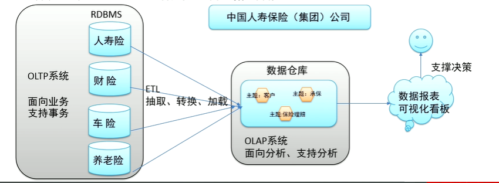

# 数据仓库（Data Warebouse）

# 一、概念

数仓（DW）：是一个用于存储、分析、报告的数据系统

目的：构建面向分析的集成化数据环境，分析结果为企业提供决策支持

OLAP（联机分析处理）：面向分析、支持分析，代表：数仓

OLTP（联机事务处理）：面向业务、支持事务，代表：MySQL数据库  



# 二 、数仓主流开发语言-SQL

SQL：结构化查询语言，是一种数据库查询和程序设计语言，用于存取数据以及查询、更新和管理数据。

## SQL语法分类

- 数据定义语言（DDL）

  创建或删除表，以及数据库、索引等各种对象，但不涉及表中具体数据操作

  - 创建新数据库	CREATE DATABASE
  - 创建新表  CREATE TABLE

- 数据操纵语言（DML）

  针对表中数据的插入、更新、删除、查询操作

  - 查询数据   SELECT
  - 更新数据   UPDATE
  - 删除数据   DELETE
  - 插入数据   INSERT

# 三、Apache Hive

开源数据仓库系统

- 介绍：

  将储存在Hadoop文件中的结构化、半结构化数据文件映射为一张数据库表，基于表提供了一种类似SQL的查询模型，称为==Hive查询语言（HQL）==，用于访问和分析储存在Hadoop文件中的大型数据集。

- 作用：

  Hive核心是将==HQL转换为MapReduce==程序，然后将程序提交到Hadoop集群执行

- 优势：

  操作接口采用类SQL语法，提供快速开发的能力，避免直接写MapReduce，支持自定义函数，背靠Hadoop,擅长存储分析海量数据集。

## 3.1 Hive组件

- 用户接口
  - CLI  shell命令行
  - JDBC/ODBC  Hive中的Thrift服务器允许外部客户端通过网络与Hive进行交互，类似于JDBC或ODBC协议
  - WebGUI  通过浏览器访问Hive

- 元数据存储

  通常存储在关系数据库，如 mysql / derby 中。Hive 中的元数据包括表的名字，表的列和分区及其属性，表的属性（是否为外部表等），表的数据所在目录等。

- Driver 驱动程序，包括语法解析器、计划编译器、优化器、执行器（==核心==）

  完成HQL 查询语句从词法分析、语法分析、编译、优化以及查询计划的生成。

  生成的查询计划存储在HDFS中，并在随后有执行引擎调用执行。

- 执行引擎

  Hive本身并不直接处理数据文件。而是通过执行引擎处理。当下支持MapReduce、Tez、==Spark== 3种执行引擎。

## 3.2 Hive部署安装

- Hive Metadata

  ```
  Hive的元数据，包含用Hive创建的database、table、表的位置、类型、属性、字段顺序类型等辕信息，存储在关系型数据库中
  ```

- Hive Metastore

  ```
  元数据服务，作用是管理metadata元数据，对外暴露服务地址，让各种客户端通过连接metastore服务，由metastore再去连接MySQL数据库来存取元数据，某种程度上保证了hive元数据安全。
  ```

### 3.2.1 metastore配置方式

配置模式：

- 内嵌模式

- 本地模式

- 远程模式（==企业推荐模式==）

  |                         | 内嵌模式 | 本地模式 | 远程模式 |
  | ----------------------- | -------- | -------- | -------- |
  | Metastore单独配置、启动 | 否       | 否       | 是       |
  | Metastore存储介质       | Derby    | MySQL    | MySQL    |

### 3.2.2 安装前准备

- 服务器基础环境

  集群时间同步、防火墙关闭、主机Host映射、免密登录、JDK安装

- Hadoop集群健康可用

  启动Hive之前必须先启动Hadoop集群。特别注意，需==等待HDFS安全模式关闭之后再启动运行Hive。==

  Hive不是分布式安装运行的软件，其分布式的特性主要借由Hadoop完成。包括分布式存储、分布式计算。


