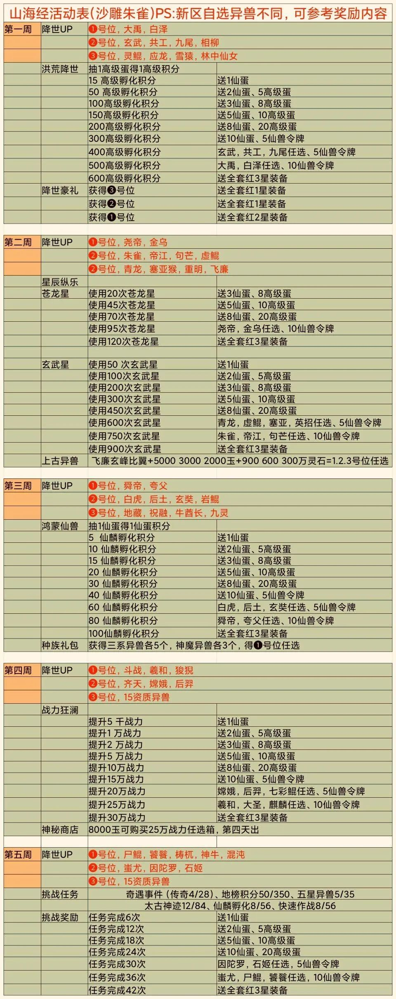

# 礼包码

## 神兽服

 新手推荐阵容：狻猊 羲和 嫦娥 睚眦 玄武

  zhubo200 zhubo201  zhubo202  zhubo501	zhubo502	zhubo503	dz888    wlg666   wlg777     wlg888	 ll666	ll777 	ll888

dt666      dt888 	qyh666  qyh888	xl666 	jqfl9999     guanzhu888    bg666    bg888   hg888	 lz666  mc666      dy888 	chen666  

py666      zz888   xj999  fengye666	ssygng999  ssqyyds888   sssrrr999  xiazai666	xfshj999    shyzn9999	shznlx9999   

xinshou666  xinshou888   cdb666	sanqian666（仙灵蛋） shnnnb9999	paidd8896 	qgzb100  fuli08   youxika666（快速作战）       

yyds4864       SSR666   SSR668	SSR888	SSR999 FDSA3568

VIP666	VIP888	BY666	BY888 	BS888	 QG648    IYMDHL8435  FGFJ5288	SYLO9639      FGWB7668	LUCK2022C

# 升星

# 囤资源

# 攻略

避坑指南  https://mp.weixin.qq.com/s/1rdFpBHPu-ufQe369QtwKg

V0指南	 https://mp.weixin.qq.com/s/Bf3-Xd29WPdkSbF6JqJ6pg

平民玩家攻略	https://m.66game.cn/news/503543/

法宝	https://mp.weixin.qq.com/s/j8174NPZFcIiJAlZFUs-Pw

# 具体玩法

​	(一）关于新人玩家： 

​	★对于新手玩家，首先你得认识到这是一个堆资源的游戏，开局第8天后，开始五周一轮回的活动，每次活动时间持续一周。 

​	★对于开服的活动排名奖励，我是建议你不要去争，因为大概率是争不到的，还不如把这些资源留到8天后的活动里面去，这些资源包括高级蛋600，苍龙星120，玄武星900，仙鳞蛋100，仙玉越多越好。每一次活动之前尽量存够这些东西。 

​	（二）关于异兽培养： 

​	★异兽培养：考虑到后期要开种族塔，每个种族的异兽至少需要培养5个。前期只需要上阵三个，随着关卡难度提升，会解锁更多的上阵异兽，可以先每个种族着重培养1-2个。（按序培养） 

​	★九天异兽：帝江，朱雀，句芒，金乌，尧。帝江着重培养，打远古之森的利器，朱雀重点培养，平民玩家必不可少的异兽。 

​	★四海异兽：玄武，灵鲲，相柳，共工，白泽，禹。玄武着重培养，打远古之森的利器。走控制流的平民玩家必玩灵鲲，相柳可以限制对面治疗。 

​	★八荒异兽：后土，白虎，祝融，夸父，舜。后土作为八荒异兽中强力打后排的输出，建议培养。（或者培养后土，地藏，苦行憎，玄奘，金刚。后面四个需要一起培养，培养难度略大于之前的阵容） 

​	★神道异兽：羲和，嫦娥，斗战胜佛，齐天大圣，圣麒麟。羲和在太古遗迹中是必备的，着重培养。太清圣人，黄帝，元始天尊，帝俊，看欧气培养。 

​	★混沌异兽：因陀罗，幽冥尸鲲，蚩尤，饕餮，梼杌，五彩神牛（之后应该会进入仙鳞商店）。因陀罗着重培养，平民玩家基本人手一只。炎帝，通天教主，东皇太一，看欧气培养。 

​	（三）关于商店： 

​	★道具商店：真元丹，高级蛋必买。 

​	★异兽商店：只买因陀罗。 

​	★宗门商店：5星随机精魄，蓝色法宝礼盒，绿色法宝礼盒。 

​	★观星商店：1000的随便买。 

​	★仙鳞商店：尽量只买神魔。 

​	★宝石商店：根据你培养的异兽去选择。 

​	★神迹商店：存够买弑神斧和东皇钟。 

​	★地榜商店：仙鳞蛋。 

​	★洪荒商店：羲和，因陀罗，玄武，朱雀，依次降低。 

​	★巅峰商店：法宝精华。 

​	★斗法商店：神兽精魄。 

​	★仙界商店：铭刻符石。 

​	★封神商店：麋鹿少女。 

​	★云游商人：灵石的都买，其他可以不买。 

​	★远古密商：灵石的都买，其他可以不买。真元丹看情况是否使用仙玉购买，真元丹肯定是会缺的。 

​	★聚灵宝树：免费即可，后期不缺灵石，开服期间可以争取排名奖励。 

​	★限时活动兑换商店：仙鳞蛋，打折高级蛋，苍龙星，五星随机精魄，玄武辰晶，真元丹，高级蛋，神源石。依次购买。 

​	（四）仙玉的使用： 

​	★奇遇：建议用仙玉刷新，只要10次能够刷出一个橙色就至少是保本了。 

​	★奇遇小技巧：在限时兑换活动开始前一天不要去领挂机收益，存满自己最高挂机时限，零点去领可以刷满限时兑换道具。 

​	★仙脉争夺战：最好不适用仙玉，如果排不上名，最多使用一次仙玉。 

​	12下一页 

​	山海经异兽录V5及以下平民玩家攻略,山海经异兽录 

​	的相关资源如下：  ★仙界排位赛：刷满。 

​	★天地榜：一般不会缺挑战券，尽量屯着挑战券，到快到赛季期限的时候把排名刷上去，争取那个头像框。 

​	★封魔塔：中期不要推得太快，争取可以每天都能至少过一层，这样可以节省20仙玉。种族塔不推荐买次数。 

​	★每日修行：经验和异兽刷满，其他免费即可。 

​	★九重天劫：免费即可。 

​	★宗门异兽塔：基本必刷一次。 

​	（五）其他小技巧： 

​	★第一个月的活动会有头像框奖励，所以资源都得留起来，尤其是神迹商店要留着买天赋元石，把某个神器天赋等级弄到6级。 

​	★灵石的获取技巧：分解高级装备是获取灵石的重要途径之一，红1,红2都可以分解。尽量不要去合成高级装备，灵石伤不起。 

​	★凡是可以用灵石购买的道具，都买。快速作战建议全买。 

​	★跨服点赞可以获得仙玉，其他能点赞的地方也可以都点一下，积少成多。 

​	★远古之森技巧：远古之森是平民玩家获取资源最重要的途径，打到高阶的层数显得尤为重要。在培养了乌龟和帝江的情况下，当爬到可以通关又很容易因为错误而无法通关时，需要注意以下异兽最好使用仙玉通关：重明，乌龟，帝江。只要自己的乌龟一死，而且楼层数离通关还不是很近的时候，就不要使用仙玉了。 

​	★观星技巧：玄武星，活动期间尽量刷到5星异兽碎片再去观星。 

​	★碎片合成：尽量屯着，等着20资质的异兽出来完了再慢慢去合成。 

​	★法宝技能：对于玄武，全给防御即可，帝江，防御和输出即可。他们可以只用在远古之森。对有全体伤害的异兽给速度和控制，对阵容的主要输出给速度和输出。 

​	★兽魂：玄武还是可以给防御，帝江可以给防御和输出。阵容异兽给援护，先发制人，激励人心，应急救援。 

​	★仙侣：第一时间合成出麋鹿少女，然后着重培养即可，天赋先点速度和攻击。 

​	★仙鳞蛋：尽量去抽神魔，然后就是缺什么抽什么。 

​	★封神榜：尽量晚上零点去占个坑位。 

​	★孵化：虽然有攻略说先单抽3-4次，再10连，再3-4次，再10连。但是我觉得直接10连就行，但是不能一次把蛋抽完，还是需要在活动期间分开来抽。抽到一个五星就可以停下来等一会再抽。 

​	★神器培养：弑神斧，东皇钟，女娲石，惊夜枪，无量尺。前面两个必备，后面三个看个人喜好。 

​	★周末福利：奇遇券和融金石。 

​	★活动异兽试炼：如果是持续14天的试炼，前面7天不要兑换任何东西，留着后面7天兑换心愿道具。 

​	★组队斗法：尽量和大佬组队。打积分比己方略高的，战力和自己持平或者略高一点点的。 

​	★充值：可以选择98的成长基金或者封魔战令，然后购买终生卡，终生卡可以等一天后去购买，然后再买一个每日礼包到达V3，V3对于平民来说其实已经够了，不缺钱的请随意~ 