# 一、来源一

## KNN算法-邻近算法

来源：https://aistudio.baidu.com/projectdetail/619297?ad-from=1742

这次简要介绍knn算法和具体实现的案例代码，依旧会是很基础并且不会刻意利用python的高级特性。

整个内容大概分成三个部分，knn介绍，python实现，和进阶方法。

不论你现在熟悉哪种语言，感兴趣的话都可以动手自己尝试一下。

### 一、KNN介绍

在我看来，knn就是计算测试数据与每一个训练数据的距离，取出距离最近的K个训练数据的标签，以其中数量最多的作为测试数据的预测标签。

官方地说：

邻近算法，或者说K最近邻(kNN，k-NearestNeighbor)分类算法是数据挖掘分类技术中最简单的方法之一。所谓K最近邻，就是k个最近的邻居的意思，说的是每个样本都可以用它最接近的k个邻居来代表。Cover和Hart在1968年提出了最初的邻近算法。KNN是一种分类(classification)算法，它输入基于实例的学习（instance-based learning），属于懒惰学习（lazy  learning）即KNN没有显式的学习过程，也就是说没有训练阶段，数据集事先已有了分类和特征值，待收到新样本后直接进行处理。与急切学习（eager learning）相对应。

KNN是通过测量不同特征值之间的距离进行分类。

思路是：如果一个样本在特征空间中的k个最邻近的样本中的大多数属于某一个类别，则该样本也划分为这个类别。KNN算法中，所选择的邻居都是已经正确分类的对象。该方法在定类决策上只依据最邻近的一个或者几个样本的类别来决定待分样本所属的类别。

提到KNN，网上最常见的就是下面这个图。

我们要确定绿点属于哪个颜色（红色或者蓝色），要做的就是选出距离目标点距离最近的k个点，看这k个点的大多数颜色是什么颜色。当k取3的时候，我们可以看出距离最近的三个，分别是红色、红色、蓝色，因此得到目标点为红色。


#### 算法流程：

1）计算测试数据与各个训练数据之间的距离；

2）按照距离的递增关系进行排序；

3）选取距离最小的K个点；

4）确定前K个点所在类别的出现频率；

5）返回前K个点中出现频率最高的类别作为测试数据的预测分类

#### K的取值

K：临近数，即在预测目标点时取几个临近的点来预测。

K值得选取非常重要，因为：

如果当K的取值过小时，一旦有噪声得成分存在们将会对预测产生比较大影响，例如取K值为1时，一旦最近的一个点是噪声，那么就会出现偏差，K值的减小就意味着整体模型变得复杂，容易发生过拟合；

如果K的值取的过大时，就相当于用较大邻域中的训练实例进行预测，学习的近似误差会增大。这时与输入目标点较远实例也会对预测起作用，使预测发生错误。K值的增大就意味着整体的模型变得简单；

如果K==N的时候，那么就是取全部的实例，即为取实例中某分类下最多的点，就对预测没有什么实际的意义了；

K的取值尽量要取**奇数**，以保证在计算结果最后会产生一个较多的类别，如果取偶数可能会产生相等的情况，不利于预测。

常用的方法是从k=1开始，使用检验集估计分类器的误差率。重复该过程，每次K增值1，允许增加一个近邻。选取产生最小误差率的K。一般k的取值不超过20，上限是n的开方，随着数据集的增大，K的值也要增大。

# 二、来源二

来源：https://zhuanlan.zhihu.com/p/544911041?utm_id=0

## 递归算法

> **递归算法**：是一种直接或者间接地调用自身的算法。在计算机编写程序中，递归算法对解决一大类问题是十分有效的，它往往使算法的描述简洁而且易于理解。

递归过程一般通过函数或子过程来实现。

**递归算法的实质**：是把问题转化为规模缩小了的同类问题的子问题。然后递归调用函数(或过程)来表示问题的解。

**递归算法解决问题的特点**：

1. 　　递归就是在过程或函数里调用自身。
2. 　　在使用递归策略时，必须有一个明确的递归结束条件，称为递归出口。
3. 　　递归算法解题通常显得很简洁，但递归算法解题的运行效率较低。所以一般不提倡用递归算法设计程序。
4. 　　在递归调用的过程当中系统为每一层的返回点、局部变量等开辟了栈来存储。递归次数过多容易造成栈溢出

等。所以一般不提倡用递归算法设计程序。

## 排序算法

> 排序是程序设计中常做的操作，初学者往往只知道冒泡排序算法，其实还有很多效率更高的排序算法，比如希尔排序、快速排序、基数排序、归并排序等。
> 不同的排序算法，适用于不同的场景，本章最后从时间性能，算法稳定性等方面，分析各种排序算法。
> 排序算法，还分为内部排序算法和外部排序算法，之间的区别是，前者在内存中完成排序，而后者则需要借助外部存储器。
> 这里介绍的是内部排序算法。

### 冒泡排序：

起泡排序，别名“冒泡排序”，该算法的核心思想是将无序表中的所有记录，通过两两比较关键字，得出升序序列或者降序序列。

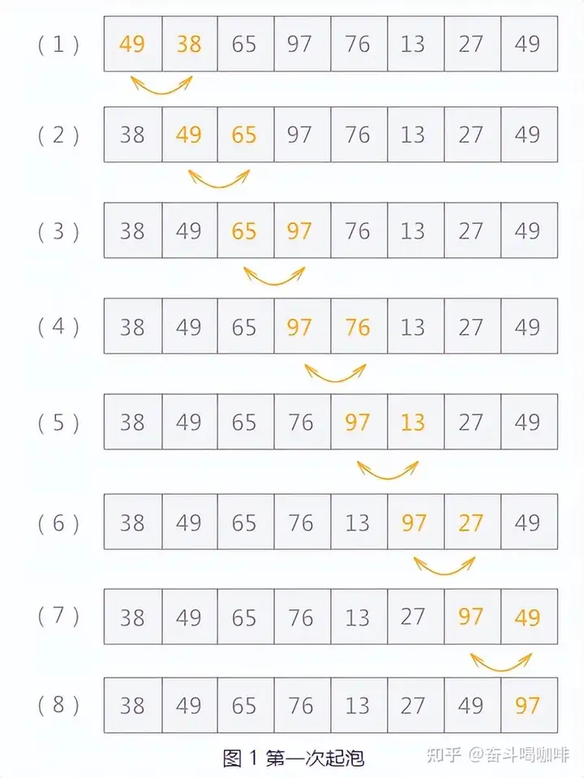

### 快速排序：

> 快速排序算法是在起泡排序的基础上进行改进的一种算法，
> 其实现的基本思想是：通过一次排序将整个无序表分成相互独立的两部分，其中一部分中的数据都比另一部分中包含的数据的值小，然后继续沿用此方法分别对两部分进行同样的操作，
> 直到每一个小部分不可再分，所得到的整个序列就成为了有序序列。

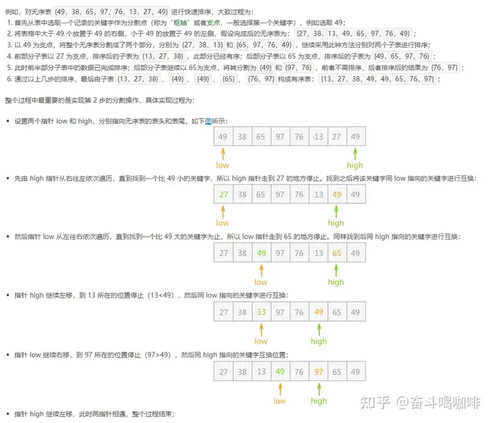

## 二分查找算法

> 二分査找就是折半查找，
> 其基本思想是：首先选取表中间位置的记录，将其关键字与给定关键字 key 进行比较，若相等，则査找成功；
> 若 key 值比该关键字值大，则要找的元素一定在右子表中，则继续对右子表进行折半查找；
> 若 key 值比该关键宇值小，则要找的元素一定在左子表中，继续对左子表进行折半査找。
> 如此递推，直到査找成功或査找失败（或査找范围为 0）。

例如：

要求用户输入数组长度，也就是有序表的数据长度，并输入数组元素和査找的关键字。

程序输出查找成功与否，以及成功时关键字在数组中的位置。

例如，在有序表 11、13、18、 28、39、56、69、89、98、122 中査找关键字为 89 的元素。

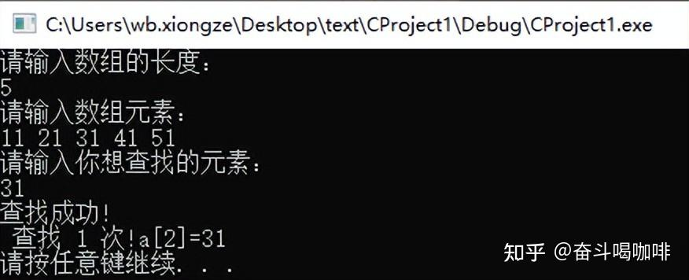

## 搜索算法

> 搜索算法是利用计算机的高性能来有目的的穷举一个问题解空间的部分或所有的可能情况，从而求出问题的解的一种方法。
> 现阶段一般有枚举算法、深度优先搜索、广度优先搜索、A*算法、回溯算法、蒙特卡洛树搜索、散列函数等算法。
> 在大规模实验环境中，通常通过在搜索前，根据条件降低搜索规模；
> 根据问题的约束条件进行剪枝；利用搜索过程中的中间解，避免重复计算这几种方法进行优化。

## **深度优先搜索**

- 深度优先遍历首先访问出发点v，并将其标记为已访问过；然后依次从v出发搜索v的每个邻接点w。若w未曾访问过，则以w为新的出发点继续进行深度优先遍历，直至图中所有和源点v有路径相通的顶点均已被访问为止。
- 若此时图中仍有未访问的顶点，则另选一个尚未访问的顶点作为新的源点重复上述过程，直至图中所有顶点均已被访问为止。

深度搜索与广度搜索的相近，最终都要扩展一个结点的所有子结点。

> 　　区别在于对扩展结点过程，深度搜索扩展的是E-结点的邻接结点中的一个，并将其作为新的E-结点继续扩展，当前E-结点仍为活结点，待搜索完其子结点后，回溯到该结点扩展它的其它未搜索的邻接结点。
> 而广度搜索，则是扩展E-结点的所有邻接结点，E-结点就成为一个死结点。

## 哈希算法

**1. 什么是哈希**

Hash，一般翻译做散列、杂凑，或音译为哈希，是一个典型的利用空间换取时间的算法，把任意长度的输入（又叫做预映射pre-image）通过散列算法变换成固定长度的输出，该输出就是散列值。

如有一个学生信息表：

学生的学号为：年纪+学院号+班级号+顺序排序号【如：19(年纪)+002(2号学院)+01(一班)+17(17号)---à190020117】类似于一个这样的信息，当我们需要找到这个学号为【190020117】的学生，在不适用哈希的时候，我们通常是使用一个顺序遍历的方式在数据中进行查询大类，再查询子类得到，这样的作法很明显不够快 ，需要O(n)左右的时间花费，对于大型的数据规模而言这显然不行，而哈希的做法是，根据一定的规律(比如说年纪不存在过老和过小的情况，以此将【190020117】进行压缩成一个简短的数据如：

【192117】)并且将这个数据直接作用于内存的地址，届时我们查询【190020117】只需要进行一次压缩并访问【192117】这个地址即可，而这个压缩的方法（函数），就可以称之为哈希函数

一般的对于哈希函数需要考虑如下内容:

1. 计算散列地址所需要的时间（即hash函数本身不要太复杂）
2. 关键字的长度
3. 表长(不宜过长或过短，避免内存浪费和算力消耗)
4. 关键字分布是否均匀，是否有规律可循
5. 设计的hash函数在满足以上条件的情况下尽量减少冲突

**2.哈希与哈希表**

在理解了哈希的思维之后，我们要了解什么是哈希表，哈希表顾名思义就是经过哈希函数进行转换后的一张表，通过访问哈希表，我们可以快速查询哈希表，从而得出所需要得到的数据，构建哈希表的核心就是要考虑哈希函数的冲突处理（即经过数据压缩之后可能存在多数据同一个地址，需要利用算法将冲突的数据分别存储）。

冲突处理的方法有很多，最简单的有+1法，即地址数直接+1，当两个数据都需要存储进【2019】时，可以考虑将其中的一个存进【2020】此外还有，开放定址法，链式地址发，公共溢出法，再散列法，质数法等等，各方法面对不同的数据特征有不同的效果。


**3.哈希的思维**

Hash算法是一个广义的算法，也可以认为是一种思想，使用Hash算法可以提高存储空间的利用率，可以提高数据的查询效率，也可以做数字签名来保障数据传递的安全性。

所以Hash算法被广泛地应用在互联网应用中。

比如，利用哈希的思维在O(1)的复杂度情况下任意查询1000以内所有的质数（在创建是否是质数的时候并不是O(1)的复杂度），

注意本样例只是演示思维，面对本需求可以有更好的空间利用方式（本写法比较浪费空间，仅供了解）

如下例子：

**【电话聊天狂人】**

给定大量手机用户通话记录，找出其中通话次数最多的聊天狂人。

**输入格式:**
输入首先给出正整数N（≤105​​），为通话记录条数。随后N行，每行给出一条通话记录。简单起见，这里只列出拨出方和接收方的11位数字构成的手机号码，其中以空格分隔。

**输出格式:**
在一行中给出聊天狂人的手机号码及其通话次数，其间以空格分隔。如果这样的人不唯一，则输出狂人中最小的号码及其通话次数，并且附加给出并列狂人的人数。
**输入样例：**

> 4
> 13005711862 13588625832
> 13505711862 13088625832
> 13588625832 18087925832
> 15005713862 13588625832

**输出样例：**

> 13588625832 3

## 贪心算法

> 贪心算法（又称贪婪算法）是指，在对问题求解时，总是做出在当前看来是最好的选择。
> 也就是说，不从整体最优上加以考虑，他所做出的仅是在某种意义上的局部最优解。
> 贪心算法不是对所有问题都能得到整体最优解，但对范围相当广泛的许多问题他能产生整体最优解或者是整体最优解的近似解。

贪心算法的基本思路是从问题的某一个初始解出发一步一步地进行，根据某个优化测度，每一步都要确保能获得局部最优解。每一步只考虑一个数据，他的选取应该满足局部优化的条件，直到把所有数据枚举完。

贪心算法的思想如下：

1. 建立数学模型来描述问题；
2. 把求解的问题分成若干个子问题；
3. 对每一子问题求解，得到子问题的局部最优解；
4. 把子问题的解局部最优解合成原来解问题的一个解。

与动态规划不同的是，贪心算法得到的是一个局部最优解（即有可能不是最理想的），而动态规划算法得到的是一个全局最优解（即必须是整体而言最理想的），

一个有趣的事情是，动态规划中的01背包问题就是一个典型的贪心算法问题。

如下例子：**贪心算法货币统计问题**


## 分治算法

分治算法的基本思想是将一个规模为N的问题分解为K个规模较小的子问题，这些子问题相互独立且与原问题性质相同。
求出子问题的解，就可得到原问题的解。即一种分目标完成程序算法

> 简单问题可用二分法完成。

#### 归并排序

时间复杂度是O(NlogN)O(Nlog⁡N)，空间复制度为O(N)O(N)（归并排序的最大缺陷）
归并排序（Merge Sort）完全遵循上述分治法

三个步骤：

1. 分解：将要排序的n个元素的序列分解成两个具有n/2个元素的子序列；
2. 解决：使用归并排序分别递归地排序两个子序列；
3. 合并：合并两个已排序的子序列，产生原问题的解。

## 回溯算法

> 回溯算法，又称为“试探法”。解决问题时，每进行一步，都是抱着试试看的态度，如果发现当前选择并不是最好的，或者这么走下去肯定达不到目标，立刻做回退操作重新选择。
> 这种走不通就回退再走的方法就是回溯算法。

例如，在解决列举集合 {1,2,3} 中所有子集的问题中，就可以使用回溯算法。

从集合的开头元素开始，对每个元素都有两种选择：取还是舍。当确定了一个元素的取舍之后，再进行下一个元素，直到集合最后一个元素。

其中的每个操作都可以看作是一次尝试，每次尝试都可以得出一个结果。将得到的结果综合起来，就是集合的所有子集。

很多人认为回溯和递归是一样的，其实不然。在回溯法中可以看到有递归的身影，但是两者是有区别的。
回溯法从问题本身出发，寻找可能实现的所有情况。和穷举法的思想相近，不同在于穷举法是将所有的情况都列举出来以后再一一筛选，而回溯法在列举过程如果发现当前情况根本不可能存在，就停止后续的所有工作，返回上一步进行新的尝试。
递归是从问题的结果出发，例如求 n！，要想知道 n！的结果，就需要知道 n*(n-1)! 的结果，而要想知道 (n-1)! 结果，就需要提前知道 (n-1)*(n-2)!。这样不断地向自己提问，不断地调用自己的思想就是递归。

使用回溯法解决问题的过程，实际上是建立一棵“状态树”的过程。

例如，在解决列举集合{1,2,3}所有子集的问题中，对于每个元素，都有两种状态，取还是舍，所以构建的状态树为：

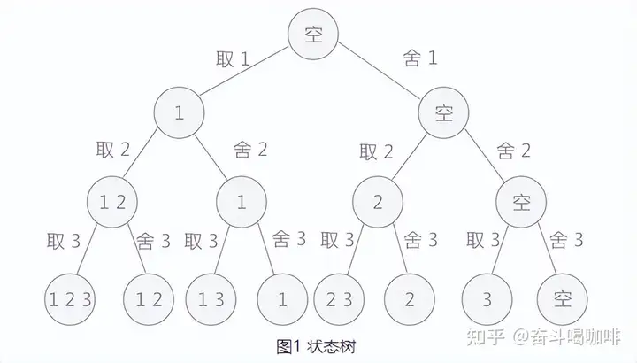

回溯算法的求解过程实质上是先序遍历“状态树”的过程。树中每一个叶子结点，都有可能是问题的答案。图 1 中的状态树是满二叉树

，得到的叶子结点全部都是问题的解。

在某些情况下，回溯算法解决问题的过程中创建的状态树并不都是满二叉树，因为在试探的过程中，有时会发现此种情况下，

再往下进行没有意义，所以会放弃这条死路，回溯到上一步。在树中的体现，就是在树的最后一层不是满的，即不是满二叉树，需要自己判断哪些叶子结点代表的是正确的结果。

## 动态规划(DP)算法

> 动态规划过程：每一次决策依赖于当前的状态，即下一状态的产生取决于当前状态。一个决策序列就是在变化的状态中产生的，这种多阶段最优化问题的求解过程就是动态规则过程。

**基本思想原理**

与分而治之原理类似，将待求解的问题划分成若干个子问题（阶段）求解，顺序求解各个子问题（阶段），前一子问题（阶段）为后一子问题（阶段）的求解提供有用的信息。

通过各个子问题（阶段）的求解，依次递进，最终得到初始问题的解。一般情况下，能够通过动态规划求解的问题也可通过递归求解。

动态规划求解的问题多数有重叠子问题的特点，为了减少重复计算，对每个子问题只求解一次，将不同子问题（阶段）的解保存在数组中。

**与分而治之的区别**：

> 分而治之得到的若干子问题（阶段）一般彼此独立，各个子问题（阶段）之间没有顺序要求。而动态规划中各子问题（阶段）求解有顺序要求，具有重叠子问题（阶段），后一子问题（阶段）求解取决于前一子问题（阶段）的解。

**与递归区别：**

> 与递归求解区别不大，都是划分成各个子问题（阶段），后一子问题（阶段）取决于前一子问题（阶段），但递归需要反复求解同一个子问题（阶段），相较于动态规划做了很多重复性工作。

**适用解决问题**

采用动态规划求解的问题一般具有如下性质：

1. 最优化原理：求解问题包含最优子结构，即，可由前一子问题（阶段）最优推导得出后一子问题（阶段）最优解，递进得到初始问题的最优解。
2. 无后效性：某状态以后的过程不会影响以前的状态，只与当前状态有关。

有重叠子问题：子问题（阶段）之间不是独立的，一个子问题（阶段）的解在下一子问题（阶段）中被用到。（不是必需的条件，但是动态规划优于其他方法的基础）

比如斐波那契数列，就是一个简单的例子。

定义：

```text
Fab(n)= Fab(n-1)+Fab(n-2)
Fab(1)=Fab(2)=1;
```

假如我们求Fab(5) 。那我们需要求Fab（4） +Fab（3）。

Fab(4) =Fab(3) + Fab(2).....显然。 Fab（3）被计算机不加区别的计算了两次。而且随着数字的增大，计算量是指数增长的。

如果我们使用一个数组，记录下Fab的值。当Fab(n)!=null 时。

直接读取。那么，我们就能把时间复杂度控制在 n 以内。

## 字符串匹配算法

字符串匹配问题的形式定义：

- **文本（Text）**是一个长度为 n 的数组 T[1..n]；
- **模式（Pattern）**是一个长度为 m 且 m≤n 的数组 P[1..m]；
- T 和 P 中的元素都属于有限的**字母表 Σ 表**；
- 如果 0≤s≤n-m，并且 T[s+1..s+m] = P[1..m]，即对 1≤j≤m，有 T[s+j] = P[j]，则说模式 P 在文本 T 中出现且位移为 s，且称 s 是一个**有效位移（Valid Shift）**。

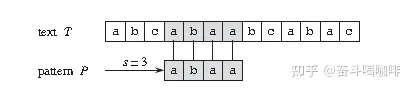

比如上图中，目标是找出所有在文本 T = abcabaabcabac 中模式 P = abaa 的所有出现。

该模式在此文本中仅出现一次，即在位移 s = 3 处，位移 s = 3 是有效位移。

解决字符串匹配的算法包括：

1. 朴素算法（Naive Algorithm）、
2. Rabin-Karp 算法、
3. 有限自动机算法（Finite Automation）、
4. Knuth-Morris-Pratt 算法（即 KMP Algorithm）、Boyer-Moore 算法、Simon 算法、Colussi 算法、Galil-Giancarlo  算法、Apostolico-Crochemore 算法、Horspool 算法和 Sunday 算法等。

字符串匹配算法通常分为两个步骤：预处理（Preprocessing）和匹配（Matching）。所以算法的总运行时间为预处理和匹配的时间的总和。

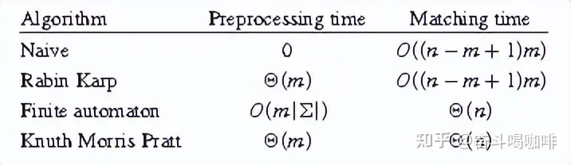

# 三、来源三

来源：https://baijiahao.baidu.com/s?id=1793233085347019870&wfr=spider&for=pc

## 傅里叶变换与快速傅里叶变换：宇宙之音的解码器

它是现代通信的基石，无论是在你的智能手机中，还是在远在太空的卫星通信中，FFT都在确保信息以最清晰的形式传递

## 迪杰斯特拉算法：寻找知识海洋中的最短航线

迪杰斯特拉算法是一种经典的寻路算法，它如同一位经验丰富的航海家，能够在复杂的网络中找到两点间的最短路径。在你使用地图软件规划路线时，在每一个数据包在互联网中寻找目的地时，迪杰斯特拉算法都在默默地发挥作用。

## RSA算法：数字世界的守护者

在这个信息泄露的时代，RSA算法就像是守护秘密的骑士，它利用数学中的质数之美来构建一座安全的城堡。无论是保护你的在线交易，还是加密你的私人通信，RSA算法都确保只有持有钥匙的人才能解开信息的锁链。

## 安全散列算法：数字身份的指纹

安全散列算法（如MD5、SHA-1和SHA-2）是网络世界的指纹鉴定法，它可以将任意长度的数据压缩成一段固定长度的唯一序列。正如每个人的指纹都是独一无二的，安全散列算法确保每一份数据都能被准确地验证，从而防止了数据被篡改的可能。

## 整数因数分解：密码学中的哥德尔不完备定理

整数因数分解问题是现代密码学的基础之一，它的难解性保证了加密信息的安全。这一问题就像数学中的哥德尔不完备定理，表明了我们知识的界限，在这个界限之内，我们能够构建起几乎不可能破解的密码体系。

## 链接分析：网络世界的社会学家

链接分析算法是互联网时代的社会学家，它能够分析网页之间的关系，就像研究社会网络中人与人之间的联系。这些算法，如谷歌的PageRank，通过评估链接的质量和数量，决定了网页在搜索结果中的排名。在社交媒体的海洋中，它们分析我们的连接和互动，帮助发现影响力者并优化广告投放。

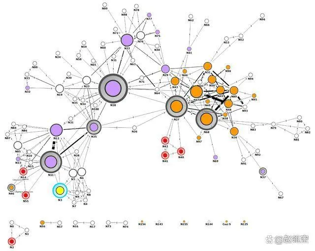

## 比例积分微分算法（PID）：现代自动控制的大师

PID算法是控制理论的灵魂，无论是在保持飞机的稳定飞行，还是在自动驾驶汽车中维持车速和方向，PID算法都在其中起着至关重要的作用。这个算法组合了过去（比例），现在（积分）和未来（微分）的信息，以创造出一个平衡的响应系统。

## 数据压缩算法：数字世界的压缩魔术师

在我们的设备和网络中，存储空间和带宽都是宝贵的资源。数据压缩算法，像是JPEG图像压缩、MPEG视频压缩、ZIP文件压缩和MP3音频压缩，它们就像是魔术师，能够在不损失太多品质的情况下，将大量信息压缩成更小的空间。这使得我们能够在数字高速公路上更快地传输数据，并在我们的设备上存储更多的记忆。

## 随机数生成：宇宙混沌的数字化

在加密、游戏设计、人工智能和金融模型中，随机数生成是创造不可预测性的基石。这些算法是现代版的掷骰子，确保每一次的结果都是公平且随机的，从而为我们的数字决策提供了一个坚实的基础。

# 四、来源四

来源：https://www.bilibili.com/video/BV1wa4y117PC?p=9&vd_source=d6c3edd9a4f6205095ccfba6b2a61eec

## 线性回归

来源：https://zhuanlan.zhihu.com/p/700441736

1. **什么是线性回归**

线性回归是一种统计方法，用于分析和建立因变量 Y 与一个或多个自变量 X 之间的线性关系，并使用最小二乘法

计算最小化误差，预测因变量的值。

- **举个例子**

买房是老百姓生活中的头等大事了，对房价进行预测和评估是非常重要的事情。在本案例中我们收集了一组关于房价的数据，并计划通过线性回归分析

来探索房价与多个因素之间的关系。这些数据包括以下变量：

- 房价（因变量Y）：表示房产的价格，单位为万元。
- 房间平方（m²）：表示房间的面积大小，是一个连续变量

- 楼层：表示房间所在的楼层数，是一个整数变量。
- 房龄（年）：表示房间的使用年限，是一个连续变量。
- 配套电梯（1表示有电梯，0表示没有电梯）：表示房间所在的楼栋是否配备电梯，是一个二分类变量。

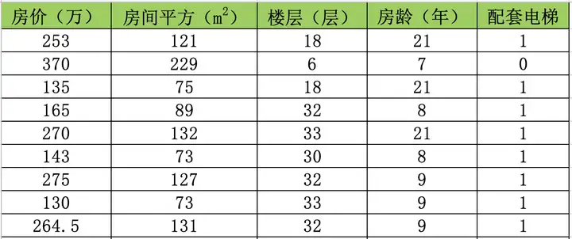

通过使用这些数据，我们将建立一个线性回归模型，以量化这些自变量对房价的影响。这一分析将帮助我们更好地理解不同因素对房价的贡献，并为预测房价提供一个可靠的工具。

接下来我们使用线性回归模型一步一步完成这个任务。

线性回归算法是一种用来找出因变量（目标变量）与一个或多个自变量（预测变量）之间关系的统计方法，在案例中我们认为房子价格会受到房子的面积、房龄、楼层和是否有电梯（自变量）会对房价有影响。线性回归的任务就是找到一个“最佳拟合线”，用数学公式来描述房价与这些因素之间的关系。

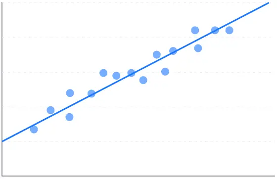

## 逻辑回归

来源：https://zhuanlan.zhihu.com/p/694288220、https://cloud.tencent.com/developer/article/1080874

**算法介绍**

逻辑回归（Logistic Regression，简称 LR）是一种广义线性模型（GLM），通常用于分类问题。与传统的线性回归模型（预测连续值输出）不同，逻辑回归预测的是一个概率值，表示为介于 0 和 1 之间的数。这使得它非常适合于二分类问题，比如预测一个电子邮件是不是垃圾邮件。

 Logistic regression （逻辑回归）是一种非线性回归模型，特征数据可以是连续的，也可以是分类变量和哑变量，是当前业界比较常用的机器学习方法，用于估计某种事物的可能性，主要的用途：

1. 分类问题：如，反垃圾系统判别，通过计算被标注为垃圾邮件的概率和非垃圾邮件的概率判定；
2. 排序问题：如，推荐系统中的排序，根据转换预估值进行排序；
3. 预测问题：如，广告系统中CTR预估，根据CTR预估值预测广告收益；

这个世界是随机的，所以万物的发生都可以用可能性或者几率（Odds）来表达。“几率”指的是某事物发生的可能性与不发生的可能性的比值。

​    LR可以用来回归，也可以用来分类，主要是二分类。logistic回归模型在多分类问题上的推广是softmax regression。

**决策边界**

逻辑回归模型的决策边界是功能的关键，这是一个用来决定样本分类的边界。在逻辑回归中，这个边界是线性的，意味着它可以用一条直线（或者在多维空间中是一个超平面）来表示。当逻辑回归模型的输出（概率）等于 0.5 时，对应的输入特征组合就位于这条决策边界上。

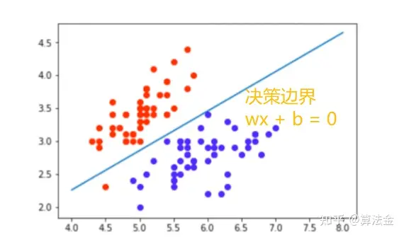


## 梯度下降

来源：https://zhuanlan.zhihu.com/p/694288220

**算法原理**

梯度下降法是一种用于优化逻辑回归模型参数的流行算法，其核心思想是利用函数的梯度（或斜率）来确定参数更新的方向。梯度指示了函数增长最快的方向，因此在优化过程中，我们沿着梯度的相反方向（下降最快的方向）调整参数，以寻找函数的最小值。

梯度下降可以通过一个简单的比喻来理解：想象你在山上，需要找到下山的最快路径。在任何位置，你都可以查看周围最陡峭的下坡路，然后朝那个方向迈出一步。梯度下降法就是这样在参数空间中寻找损失函数最小值的方法

## SVM支持向量机

来源：https://baijiahao.baidu.com/s?id=1797542421807438715&wfr=spider&for=pc

支持向量机（Support Vector Machines,  SVM）作为一种经典的机器学习方法，以其卓越的泛化能力和对非线性问题的有效处理，在模式识别、分类及回归分析等领域展现出强大的应用潜力。其核心理念在于构建一个最优的决策边界，该边界不仅能够清晰地划分不同类别样本，而且具有最大间隔，以期增强模型在未知数据上的预测性能。

**SVM的应用**

> SVM凭借其优秀的泛化能力和处理非线性问题的优势，在诸多领域得到广泛应用：
>
> ● 图像识别：在人脸识别、物体检测、医学影像分析等任务中，SVM能够有效处理图像像素间的非线性关系，实现精确分类。
>
> ● 语音识别：通过对语音信号的特征提取，SVM可用于区分不同的语音命令或说话人，提升语音交互系统的准确率。
>
> ● 基因表达分析：在生物信息学领域，SVM可用于肿瘤亚型分类、疾病诊断标志物筛选等任务，揭示基因表达数据背后的生物学意义。
>
> ● 文本分类：针对大规模文本数据，SVM结合词袋模型、TF-IDF等特征表示方法，可实现新闻分类、情感分析、主题识别等任务。
>
> ● 手写识别：在光学字符识别（OCR）系统中，SVM用于识别手写数字、字母甚至汉字，提升自动识别的准确度。

## 随机森林

来源：https://aistudio.baidu.com/projectdetail/625811?ad-from=1730

随机森林是利用多棵树对样本进行训练并预测的一种分类器。

随机选择特征数目，随机选择训练数据，对同一个预测数据取出现次数最多的预测标签为最终预测标签。

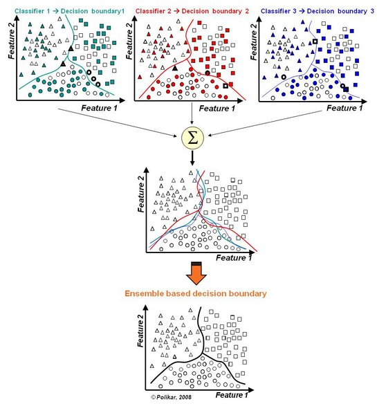

## 决策树

来源：https://aistudio.baidu.com/projectdetail/2501305?ad-from=7276

决策树的的原理实际上可以由下图进行展示：

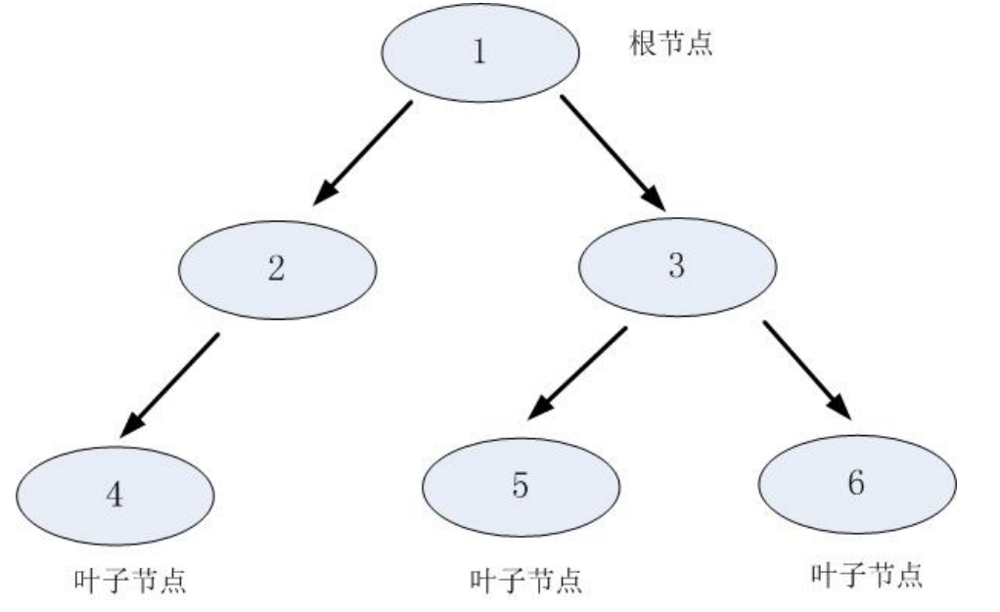

其中父节点和子节点是相对的，说白了子节点由父节点根据==某一规则分裂==而来，然后子节点作为新的 父亲节点继续分裂，==直至不能分裂为止==。而根节点是没有父节点的节点，即初始分裂节点，叶子节点是 没有子节点的节点。

决策树利用如上图所示的树结构进行决策，每一个非叶子节点是一个判断条件，每一个叶子节点是结 论。从跟节点开始，==经过多次判断得出结论==。

## 贝叶斯

来源：https://blog.csdn.net/AnneQiQi/article/details/59666980

所谓的贝叶斯定理源于他生前为解决一个“逆概”问题写的一篇文章，而这篇文章是在他死后才由他的一位朋友发表出来的。在贝叶斯写这篇文章之前，人们已经能够计算“正向概率”，如“假设袋子里面有 N 个白球，M  个黑球，你伸手进去摸一把，摸出黑球的概率是多大”。而一个自然而然的问题是反过来：“如果我们事先并不知道袋子里面黑白球的比例，而是闭着眼睛摸出一个（或好几个）球，观察这些取出来的球的颜色之后，那么我们可以就此对袋子里面的黑白球的比例作出什么样的推测”。这个问题，就是所谓的==逆向概率问题==。

它在很多计算机应用领域中都大有作为，如自然语言处理，机器学习，推荐系统，图像识别，博弈论等等。

## 聚类算法

来源：https://www.cnblogs.com/LittleHann/p/6595148.html

**1：聚类是什么？**

聚类是一种运用广泛的探索性数据分析技术，人们对数据产生的第一直觉往往是通过**对数据进行有意义的分组，通过对对象进行分组，使相似的对象归为一类，不相似的对象归为不同类。**

**2：聚类的悖论**

在研究聚类算法原理以及应用聚类算法的时候，我们自己首先要明白，聚类算法并不总是有效，甚至是完全不合理的。我们称其为”**聚类的悖论**“，之所以会出现悖论，主要的原因是：

- ”相似对象归为一类，不相似对象归为不同类“这两个目标在很多情况下是互相冲突的。从数学上讲，虽然聚类共享具有等价关系甚至传递关系，但是**相似性（或距离）不具有传递关系**。具体而言，假定有一对象序列，X1，....，Xm，所有相邻元素（Xi-1、Xi+1）两两都非常相似，但是X1和Xm非常不相似。这种情况常常发生在cluster超过一定尺寸的时候，元素之间的传递性假设在这些场景下不一定100%成立。
- 聚类是一种无监督学习，即我们不能预测label，因此**对于聚类，我们没有明确的成功评估过程**。当然也不是完全没有任何的聚类效果评价指标，分类效用（category utility）就是一个理论上的评价指标。
- 对于**一个给定的对象集合，可以有多种有意义的划分方式**，这可能是因为**对象间的距离（或相似性）有多种隐式的定义**，例如将演讲者的录音根据演讲者的口音聚类或根据内容聚类。所以，给定一个数据集，有多种不同的聚类解决方案

## 朴树贝叶斯

朴素贝叶斯(naive Bayes)算法是基于贝叶斯定理与==特征条件独立假设==的分类方法。对于给定的训练数据集，首先基于特征条件独立假设学习输入输出的联合概率分布。然后基于此模型，对给定的输入x，利用贝叶斯定理求出后验概率最大的输出y。不同于其他分类器，朴素贝叶斯是一种基于概率理论的==分类算法==；总体来说，朴素贝叶斯原理和实现都比较简单，学习和预测效率较高，是一种经典而常用的分类算法。其中的朴素（naive）是指的对于数据集中的各个特征（feature)都有较强的独立性假设，并未将特征之间的相关性考虑其中。

## 神经网络

来源：https://cloud.tencent.com/developer/article/1086850

我们在设计机器学习系统时，特别希望能够建立类似人脑的一种机制。神经网络就是其中一种。但是考虑到实际情况，一般的神经网络（BP网络）不需要设计的那么复杂，不需要包含反馈和递归。 人工智能的一大重要应用，是分类问题。本文通过分类的例子，来介绍神经网络。

之前针对一个线性不可分的区域，需要将其变换到更高维度的空间去处理。但如果用神经网络，你总可以通过n条直线，将整个区间围起来。只要直线数量够多，总能绘制出任意复杂的区域。每一个子区域都是凸域：

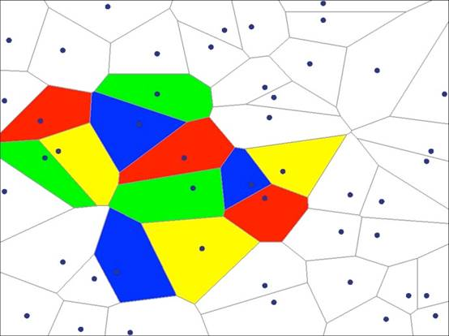

数学家证明了，双隐层神经网络能够解决任意复杂的==分类问题==。