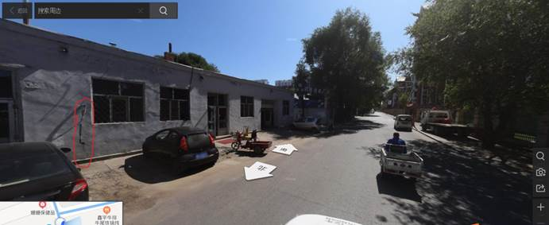
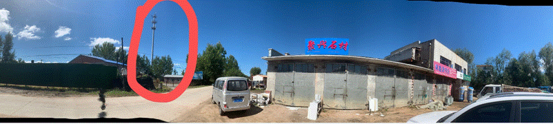

# FDD找点要比TDD难

 

## 1.原理说明

TDD--收发共用一个射频频点，上下链路使用不同的时隙来进行通讯

 

FDD --收发使用不同的射频频点来进行通讯

 

信道互异性：当手机处于不同的无线环境，基站需要实时获取当前手机和自己间的信道信息，去评估信道质量，然后调整自己的传输策略（比如 MCS）。

上行方向基站接收容易判断，但是下行是Ue接收的，只有手机清楚的知道下行信道的情况，有两种办法：一种是手机在上行数据传输时，上报CSI（信道状态指示），报告给基站下行信道咋样。

另一种，就是通过信道互易性来直接获取，互易性就是指，当上行和下行的信道质量完全一致是，基站只要去评估上行的信道质量，就可以认为下行质量一样，评估的方法是手机在上行传输时额外传输一个信号，叫SRS（当然它还有其它用处）

 

对于TDD来说，上下通过时间分开，在同样的频段上传输，信道自然是一样的

对于FDD来说，上下行在两个频段上传输，没办法通过互易性来得到下行的质量。

 

CSI上报信息是比较模糊的信息，而基站通过SRS测量出来的信息非常精准，对于5G来说，通过波束赋形的传输数据，下行信道质量约准确，赋形才会越精准。

 

所以FDD找点比TDD要难。

 

找点前的准备：

  对寻找的无线环境心中有数：

​    3流/MCS26/BLER个位数或者4流MCS22及以上

  提前查看一下卫星图，了解主覆盖有建筑的地方在哪里位置

弄清楚天馈的朝向和下倾

**不论市区还是高塔站点要优先排查干扰情况**

 

 *******************针对市区多径丰富的站点***********************************

 矮塔站点可以在站点附近：

  --寻找主覆盖前方有较多建筑的位置

  --寻找主覆盖前方稍有遮挡的位置

  --靠墙

  --手机靠地上

  --闭塞本站其它小区和周边的小区

  --车外找寻

  --保留方案：如果一个地方的速率不稳定，不能2min保持在270M，可以拉长测试时间，分割log，再合并。

 

  可以边走测边观察速度，如果低于200，一般不用停下来摸索了

  一个地方峰值可以看到300，希望有90%

  峰值可以过290，前后左右走几步，手机上下左右调整下位置，下行达标机会超过80%

  

 *******************针对高塔站点***********************************  

--可以去的更远的地方寻找，经验距离，离塔（150M-200M）。

 --实在没有建筑，只能找塔工，掰天线和压倾角（本质上是人为制造多径）

 

## 2.排查干扰手段

通过将终端锁到band1，终端制式且仅4G，如果终端能够成功接入，查看鼎力软件上RSRP和SINR；如果看到RSRP大于-110左右，就有相应的LTE频点干扰；具体如下图

## 3.解决方法

找后台修改频点到其它频段进行验证，注意测试完成要改回，如果修改频点可以通过，则证明是干扰问题。

 

 

## 4.一些例子-(矮站+多径丰富)：

站点:通河新民 (矮站+多径丰富)--高20M

站为楼顶站，天面对着条路，路面有较为丰富的建筑（不算高）

下图为小区1/2

小区1，测试地点为下图标红圈位置，在天面下方有一点遮挡的矮房旁边靠墙，车外

小区2，测试点，天面下方一个小窄巷入口靠墙，车外

下图为小区3天面位置和指向

小区3，测试点在天面正对方向矮房下方，背后有楼房，车外

 

 

从绥化肇东的测试情况来看，市区内还是很容易找到下行过270M的点

 

## 5.一些例子-(高塔)

站点：溪树湾小区北塔--高50M

站为高塔站点，周边有一定的建筑

 

 

小区1，离站点大约150M的主瓣方向，车内

 

 

小区2，马路对面的建筑下面，距离约120M，跨过了两条马路

小结：需要离塔一定距离，周边需要有建筑

 

通河农贸市场站点，楼顶站

当时3流MCS到了26，但是BLER在19%，采用了这个方法，使BLER降了下来，下行速率过了270M

通河农机公司

高塔--周边只有零星建筑

 

从卫星图上看，站点比楼高，有一个小区侧面对着楼层，另一个小区对着远程的矮房，周边都是空地

1 小区1在六楼窗口测试怎么摆都只在250M左右。

2 小区2在空地的小屋边，峰值可以过270，但是平均值不能。

3 小区3使用压下倾和调整角度正对测试人员可以达标

小区1,从塔上位置观察和塔下观察，实际覆盖位置和想象还是有差距，塔上观察角度如下：

  

最终是在图片天线覆盖的右边，有房子的地方，找到了下行可以达标的地方

 

 

 

通河四号站--50M塔站，在城市边缘仅有一个小区主覆盖有楼宇，该小区单验达标，另外两天覆盖旷野,未达标

  

上述站点未达标站点，通过调整天线和重新找点，下行速率可达标

 

   

  通河4号塔--小区3：

  正覆盖在一块荒地上，正对一路测试持续2流，后通过改变方位，使之打向有建筑方向，下行速率可以达标

 

上述结果说明，旷野上面RI确实上不了3流，但是通过调整天线，对着建筑物，也有机会达标。

 

## 6.高塔空旷站点测试点位选择增量经验

总原则：在天线面板正对方向附近边走边侧，发现有出现过流量超过250M的时候，停下来，前后左右走几步，手机上下左右调整下位置，找找点，下行达标机会超过80%。

### 靠墙或有铁皮的地方

### 放在有起伏的地上

### 手机靠在车边

### 稍有遮挡的地方

### 实在没有建筑找栏杆

###  闭塞本站其它小区和周边的小区

 