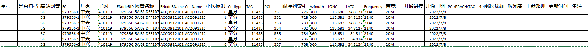
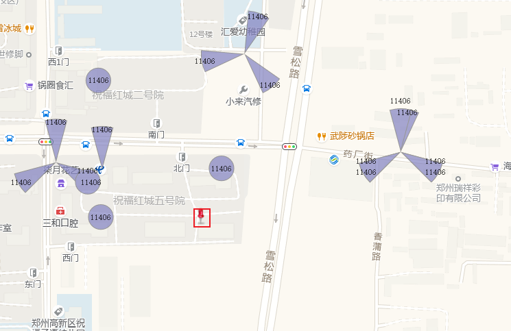
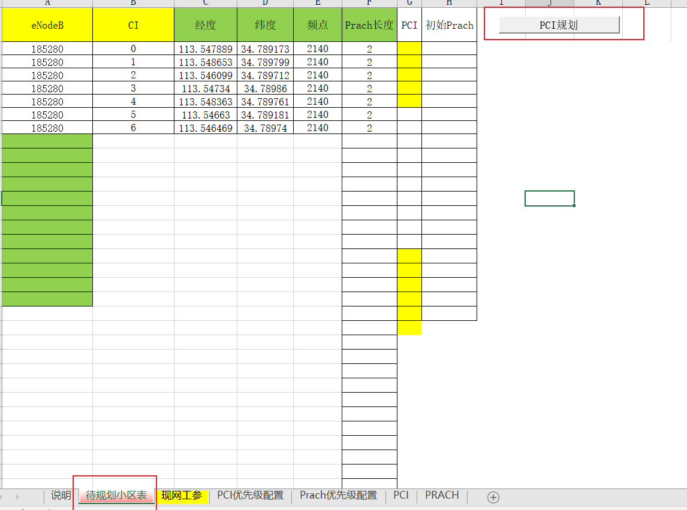
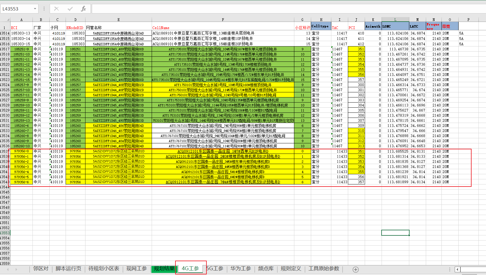
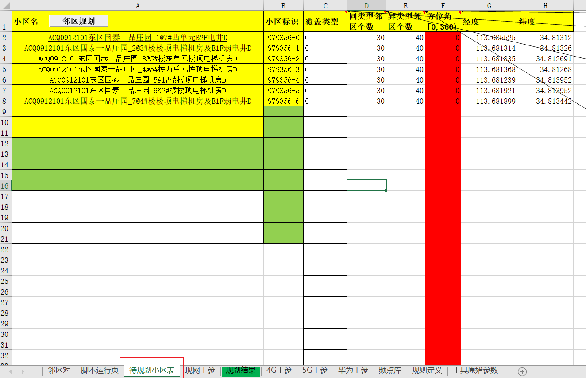
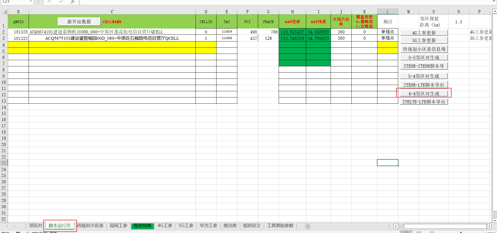
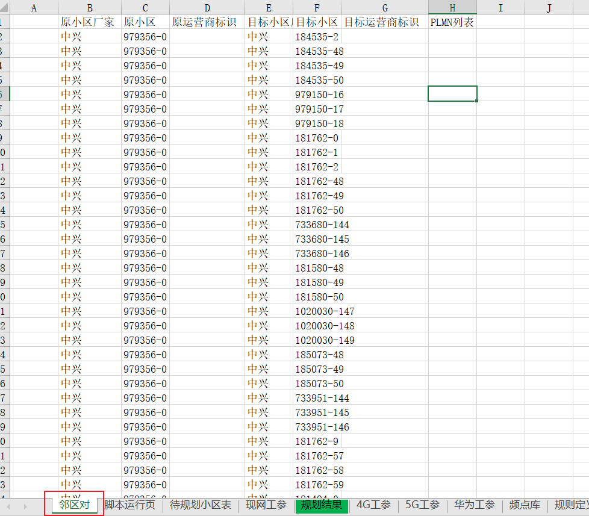
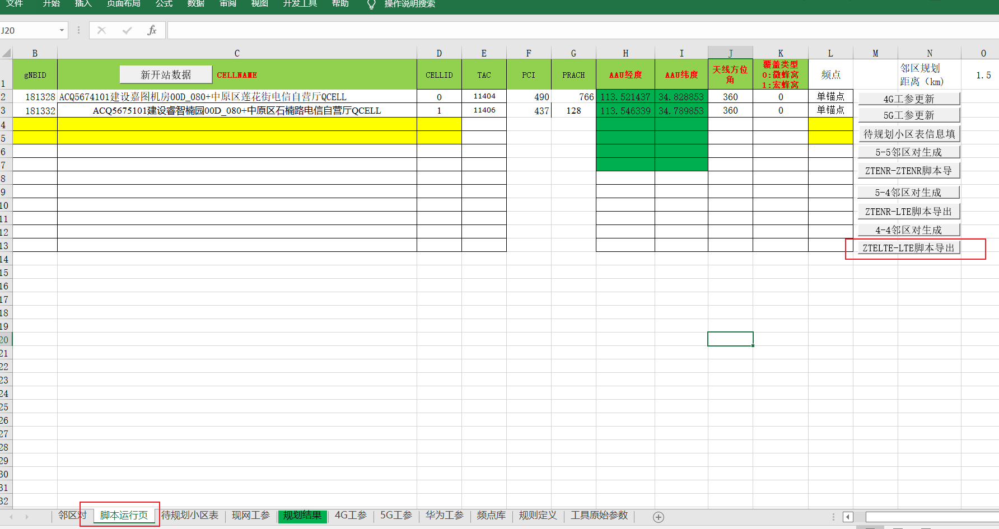
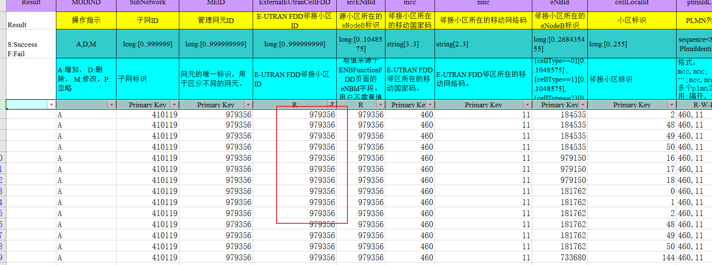

**5G网管4G开通**

# 一、开通站点信息整理

作用：对站点开通记录，便于后期查阅，跟踪。

# 二、规划TAC、PCI、跟序列（PRACH）

PCI、PRACH规划原则，《LTE基站PCI&PRACH规划工具-20201103.xlsm》里面有具体注意事项。

## 2.1 TAC规划

规则：TAC图层为依据，每个TAC有固定区域，禁止跨区域使用

两种方法：

### 1、利用TAC图层，在Mapinfo软件上撒点，圈选TAC值

### 2、利用现网工参，查看周围站点TAC，确认TAC值

## 2.2 PCI规划

规则：3公里内，不允许PCI复用

### 1、利用EXCEL宏工具《LTE基站PCI&PRACH规划工具-20201103.xlsm》

### 2、圈选站点，筛查可用PCI

## 2.3 PRACH规划

同PCI规划

# 三、邻区规划

利用EXCEL宏工具《邻区规划工具v5.3_v0.1.xlsm》对邻区规划

## 3.1更新【4G工参】

将新开站点信息添加进工参里面

## 3.2 更新【待规划小区表】

将需要规划邻区的小区信息添加进待规划小区表

## 3.3 规划邻区对

## 3.4 补充【邻区对】信息

补充<原运营商标识>、<目标运营商标识>、<PLMN列表>

## 3.5 导出邻区脚本

## 3.6 邻区脚本整理

### 3.6.1 5G网管上邻区脚本整理

#### 1、筛选5G网管上面的站点，这一部分站点在5G网管上，邻区在5G网管上面添加

#### 2、整理5G 网管4G邻区添加脚本

### 3.6.2 4G 网管上邻区脚本整理

# 四、解闭塞

站点数据添加完成后，放开站点