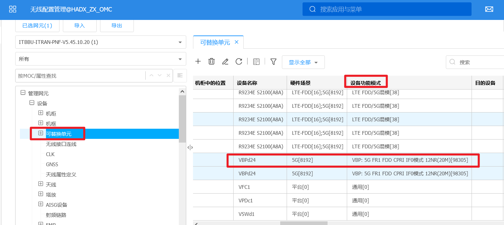
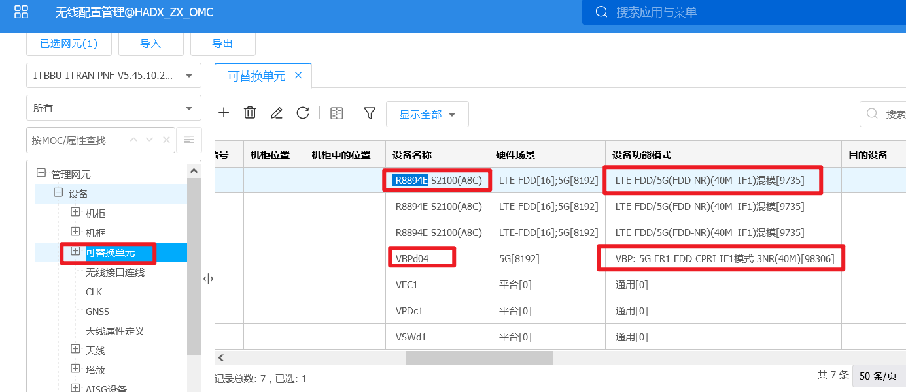
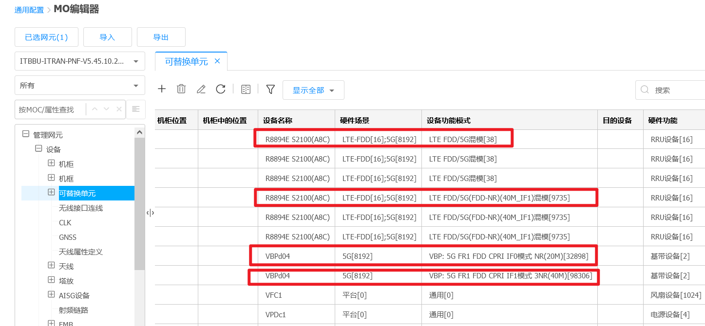
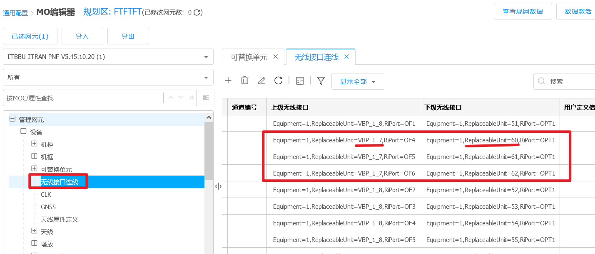
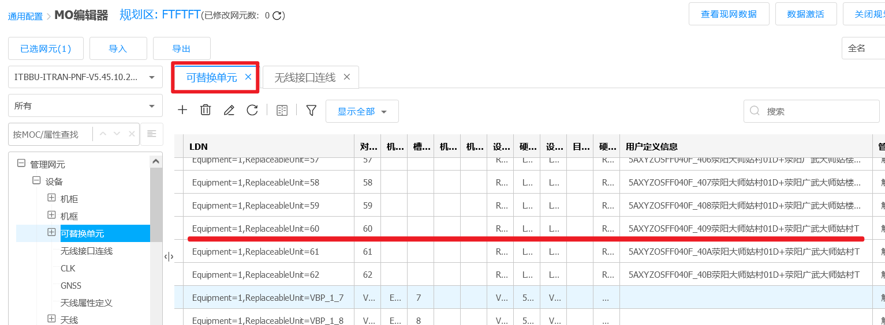

#                                       NR2.1G带宽修改

# 一、修改单板模式

20M带宽：VB板设备功能模式设置为：98305

40M带宽：VB板设备功能模式设置为：98306

# 二、修改AAU对应的设备功能模式

备注：仅AAU型号8894E需要

 R8894E：

20M带宽：AAU设备功能模式设置为：38

40M带宽：AAU设备功能模式设置为：9735

其它：

20M/40M带宽：AAU设备功能模式设置为：38

# 三、核查VB板下带的小区

备注：VB板下小区带宽必须保持一致

# 三、修改BWP套

根据物理小区DU标志选取VB板下挂的所有小区修改

20M带宽：BWP套参数设置112

40M带宽：BWP套参数设置

# 四、修改小区带宽

备注：带宽会根据BWP套设置自动变更，如带宽未改变，需要重新按照【修改BWP套】操作，直至带宽自己变更。

# 五、激活规划区

激活规划区，参数生效，小区会出现网元复位，注意观察告警。