## 知识库：

https://uniportal.huawei.com/uniportal1/login-pc.html?redirect=https%253A%252F%252Finfo.support.huawei.com%252Fwireless%252Fwirelessnew%252Findex.html%2523%252Fglobal%252Fzh%252FG1-1#/passwordLogin

### 简介

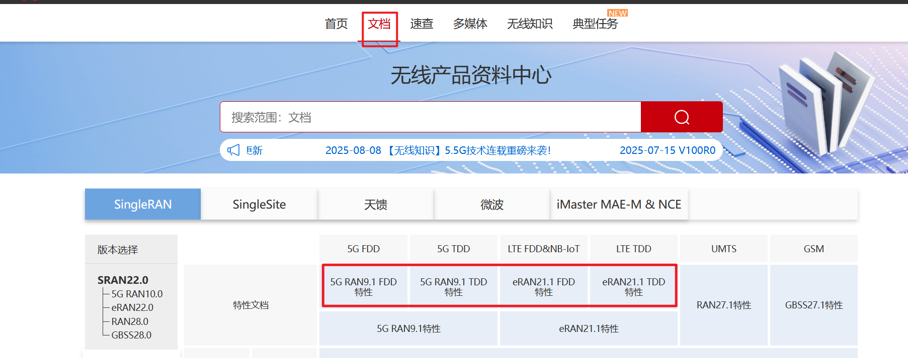

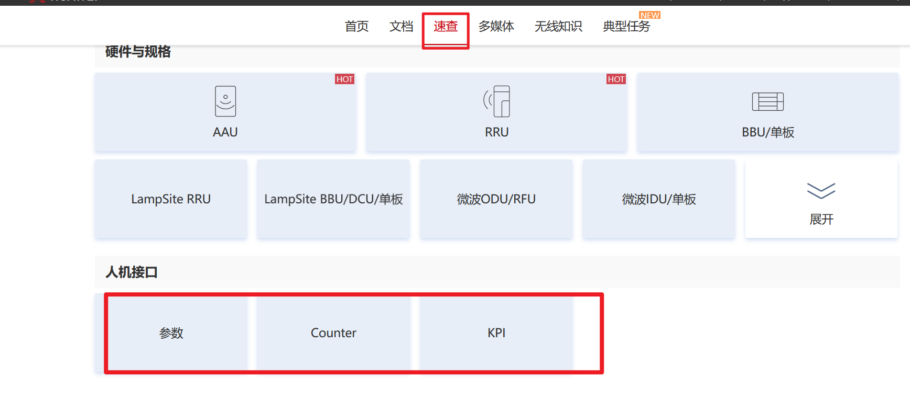

## 网管登录

### 安装VPN

D:\数据库\软件\WINDOWS2012版本offline-浙江移动网管中心零信任安全管理平台.exe

### 登录

手机号验证码登录，个人自己手机号

### 金库预约

单小时预约

### 进入4A

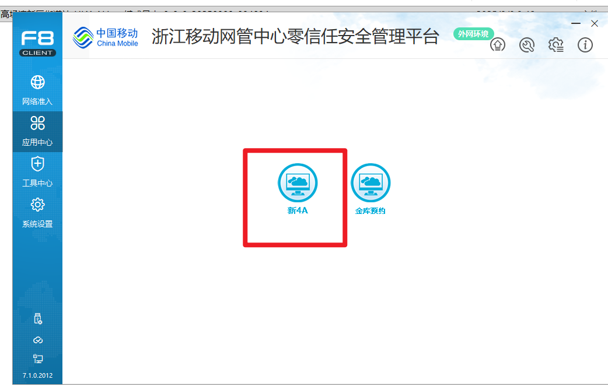

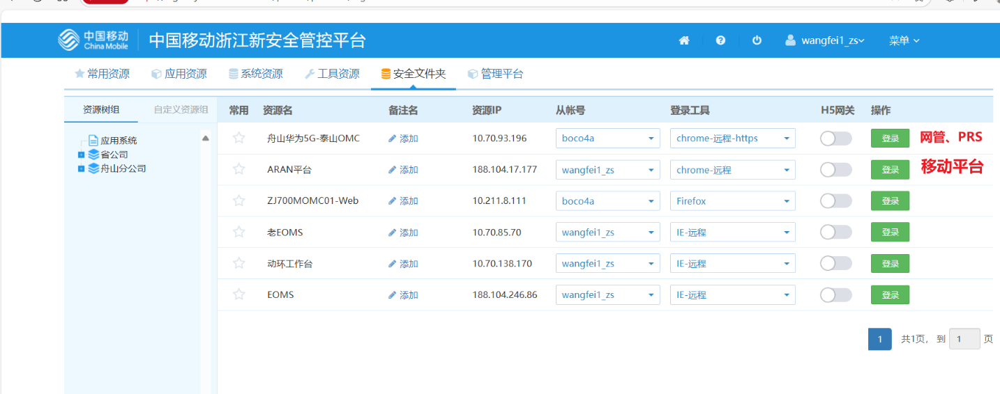

#### 安全文件夹 保存下载的文件（远程在X:盘）

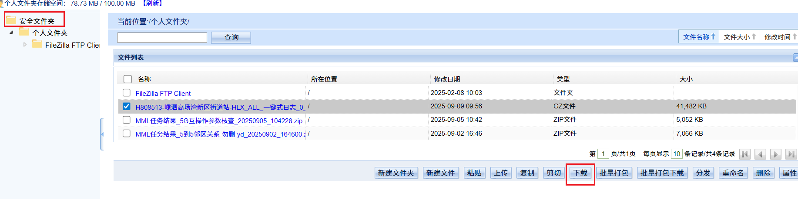

## 网管使用

### MML命令

#### 查询参数配置

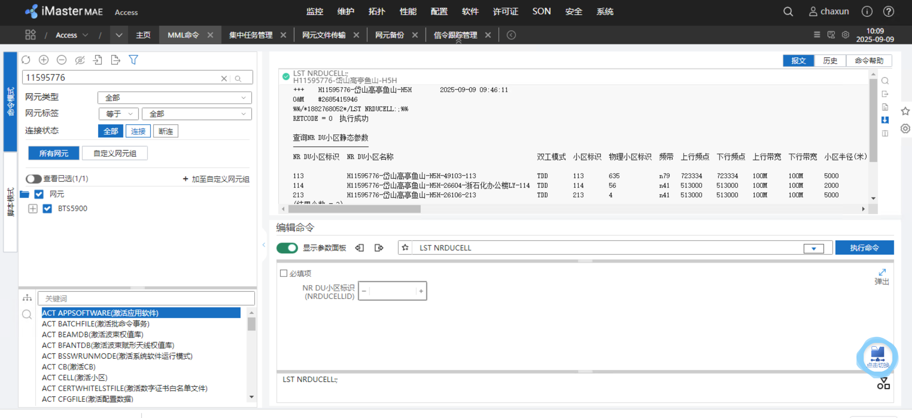

#### 查询天线小区对应关系

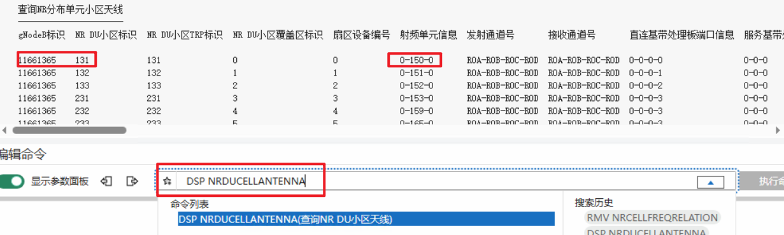

#### 查询单板

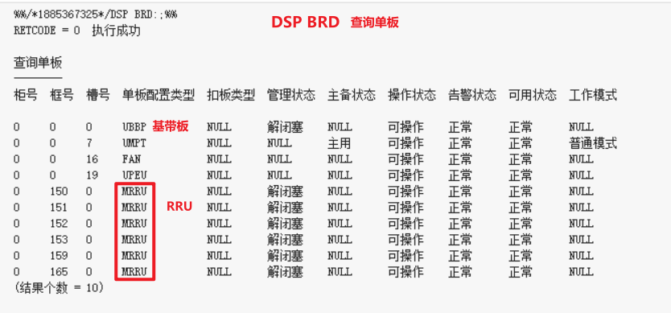

#### 查询5G反开4G小区

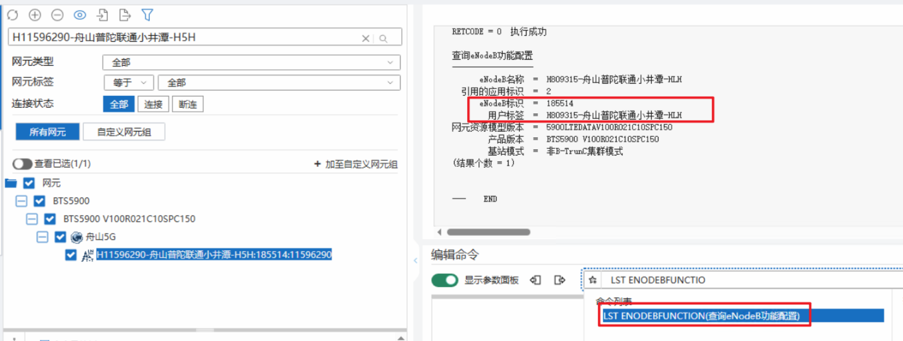

### 集中任务

集中跑MML命令->导出txt->华为工具解析

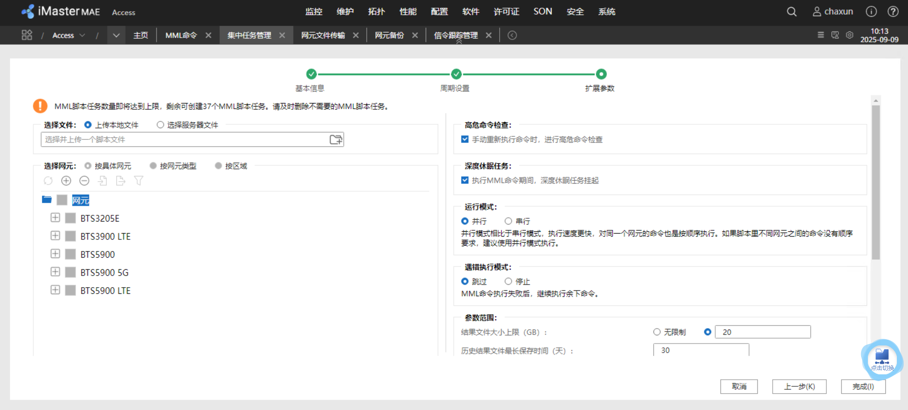

### 网元传输

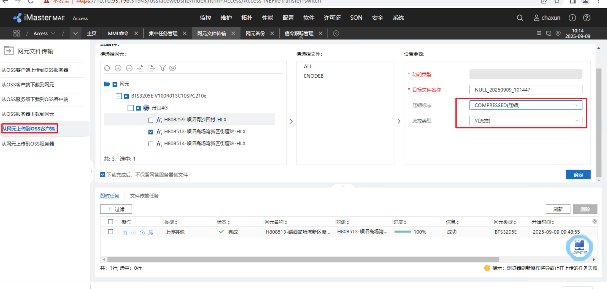

#### 一键式日志

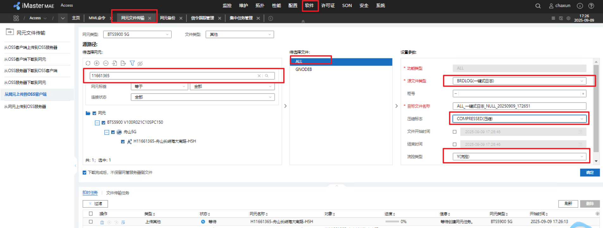

#### RRU日志

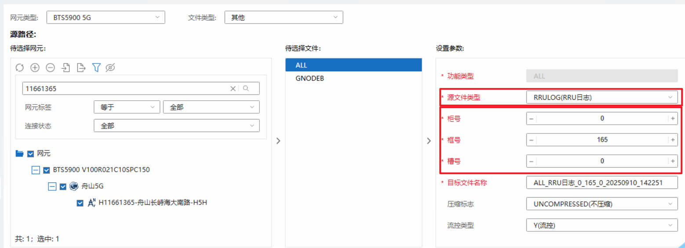

#### 基带板

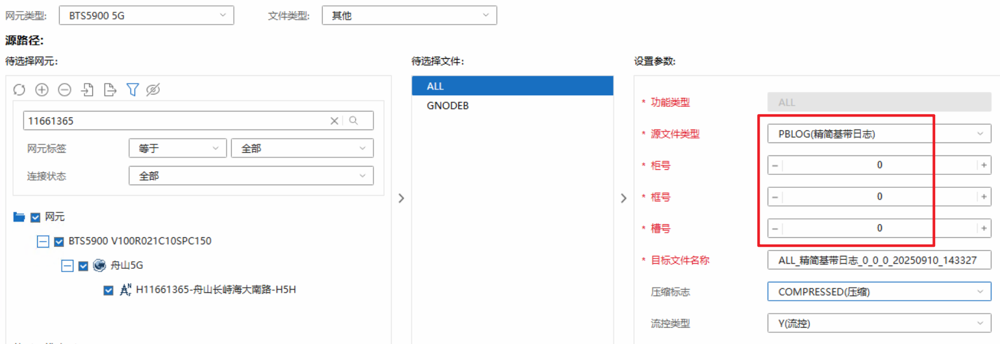

### 网元备份

网元参数配置

选择网元->点击备份->刷新查看->下载文件

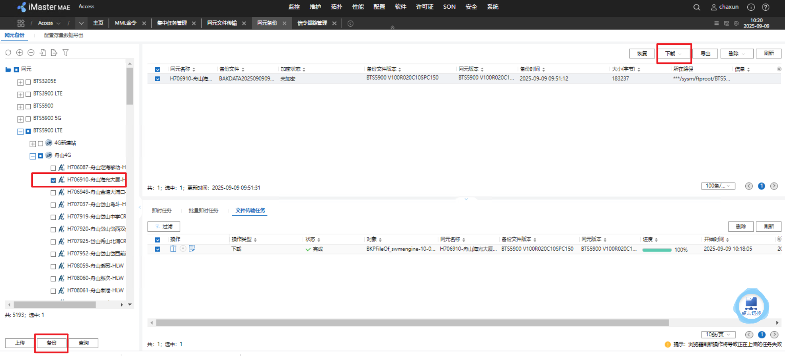

### 信令跟踪管理

需要借助别人账号