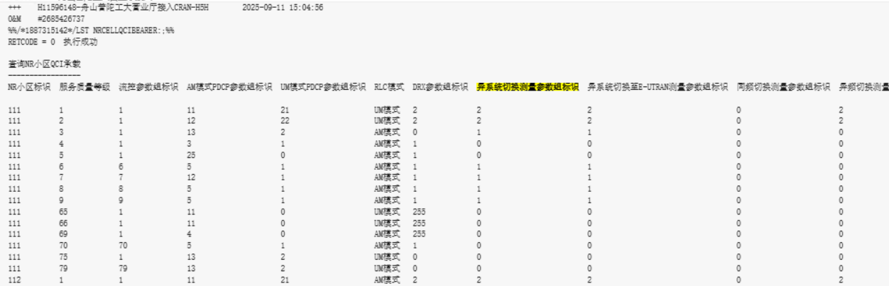
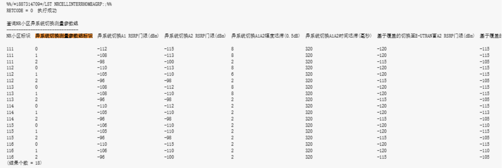
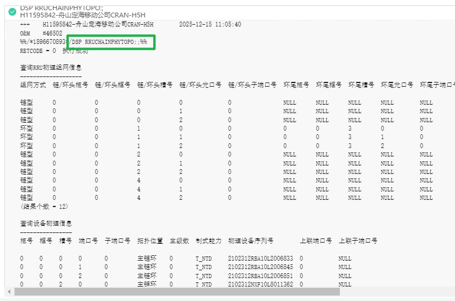
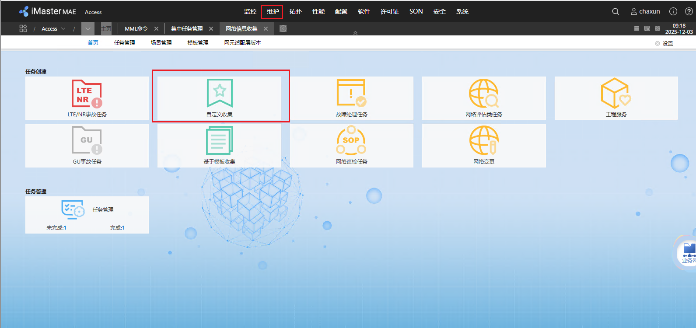
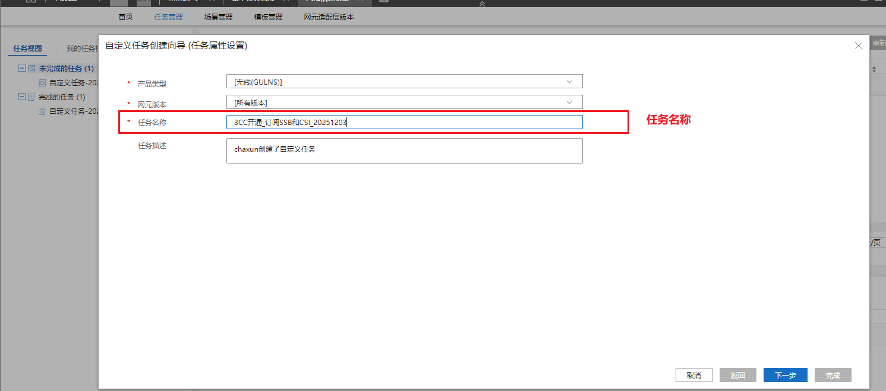
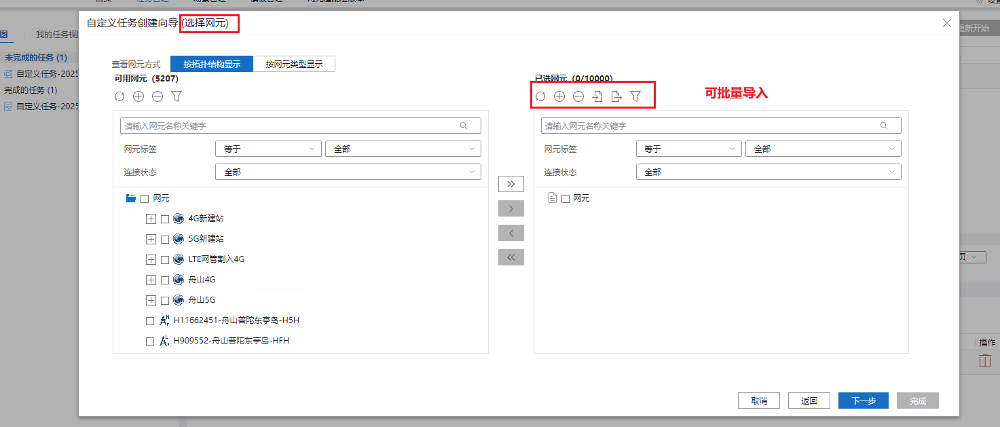
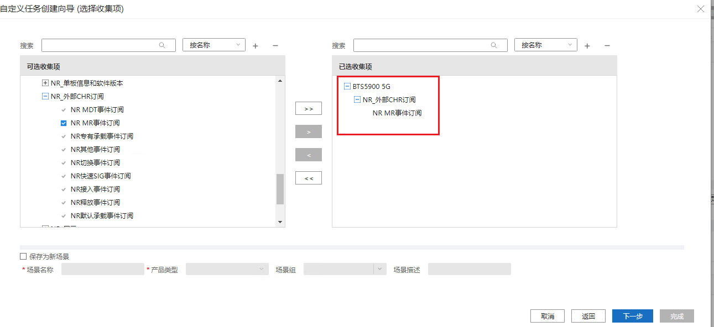
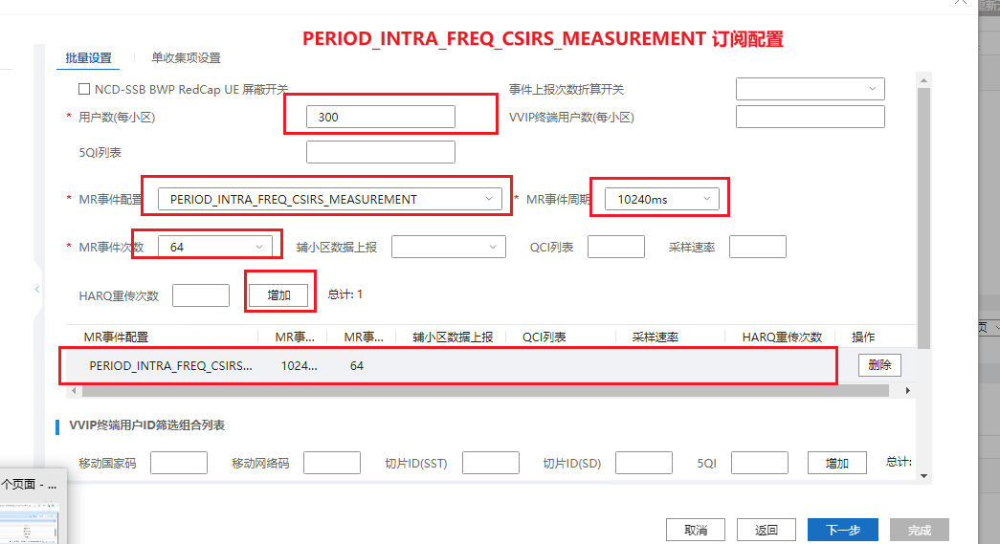
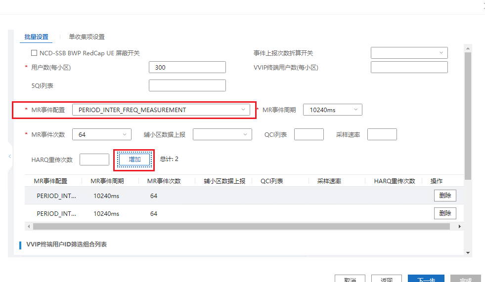
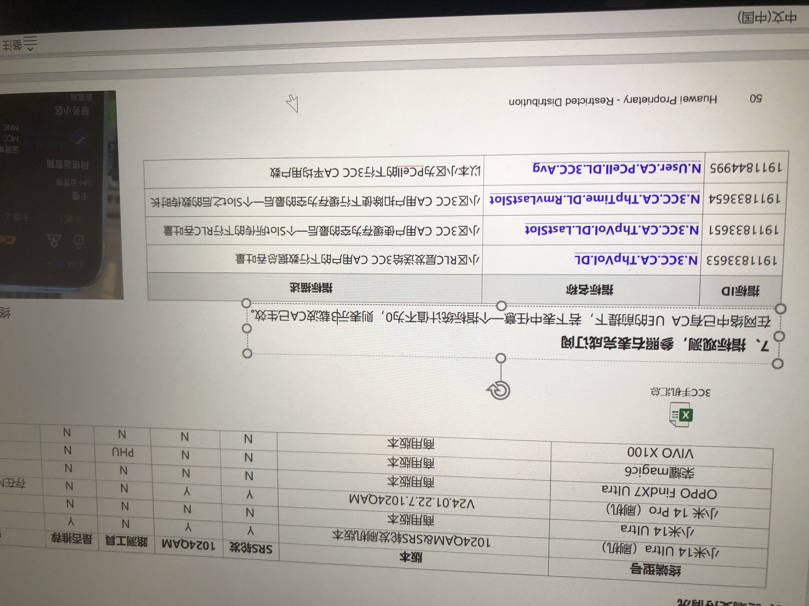

知识库：

https://uniportal.huawei.com/uniportal1/login-pc.html?redirect=https%253A%252F%252Finfo.support.huawei.com%252Fwireless%252Fwirelessnew%252Findex.html%2523%252Fglobal%252Fzh%252FG1-1#/passwordLogin

### 简介


## 网管登录

### 安装VPN

D:\数据库\软件\WINDOWS2012版本offline-浙江移动网管中心零信任安全管理平台.exe

### 登录

手机号验证码登录，个人自己手机号

### 金库预约

单小时预约

### 进入4A


#### 安全文件夹 保存下载的文件（远程在X:盘）


## 网管使用

### MML命令

#### 查询参数配置


#### 查询天线小区对应关系


直连基带处理板端口信息 对应的槽号


#### 查询单板


#### 查询5G反开4G小区


#### 查询NR小区QCI承载 （异频 0 数据 2语音 异系统 1数据 2语音）



#### 查询NR小区异系统切换测量参数组



#### 查询设备序列号



### 集中任务

集中跑MML命令->导出txt->华为工具解析


### 网元传输


#### 一键式日志


#### RRU日志


#### 基带板


### 网元备份

网元参数配置

选择网元->点击备份->刷新查看->下载文件


### 信令跟踪管理

需要借助别人账号

### CSI订阅













## 互操作参数核查

# 载波聚合

### CA功能全景

| 功能名称                           | 频段内 | 频段间 | 站内 | 站间 | 上行 | 下行 |
| ---------------------------------- | ------ | ------ | ---- | ---- | ---- | ---- |
| 站内频段内下行CA                   | √      | -      | √    | -    | -    | √    |
| 站内频段内上行CA                   | √      | -      | √    | -    | √    | -    |
| 灵活载波管理(TDD高频)              | √      | -      | √    | -    | √    | √    |
| 站内FR内频段间下行CA               | -      | √      | √    | -    | -    | √    |
| 站内FR内频段间上行CA               | -      | √      | √    | -    | √    | -    |
| FR间频段间CA                       | -      | √      | √    | √    | √    | √    |
| CA SRS载波轮发                     | √      | √      | √    | √    | -    | √    |
| 站间CA                             | √      | √      | -    | √    | -    | √    |
| 3载波CA                            | √      | √      | √    | √    | -    | √    |
| 快速CA                             | √      | √      | √    | √    | -    | √    |
| Massive CA                         | -      | √      | √    | √    | -    | √    |
| CA用户基于频率优先级的异频切换[^a] | √      | √      | √    | √    | √    | √    |
[^a]:CA用户基于频率优先级的异频切换是指CA用户在执行PCell的异频切换时按照CA用户特有的流程进行，在本表格表头中不同列所代表的场景下均可使用。

### 载波聚合功能全景功能开关


## 3CC


### 查询开通3CC小区

#### 网管开通

```
LST NRDUCELLCARRMGMT  参数配置 CA下行最大载波个数【CaDlMaxCcNum=DL3CC】
```

#### 指标查询



## 流量均衡

1、查看互操作参数

2、核查周边小区频点及邻区是否添加、参数是否正确

[^a]:

# 周报

上传网址：http://188.102.5.14:8088/storeManage/pages/login.jsp