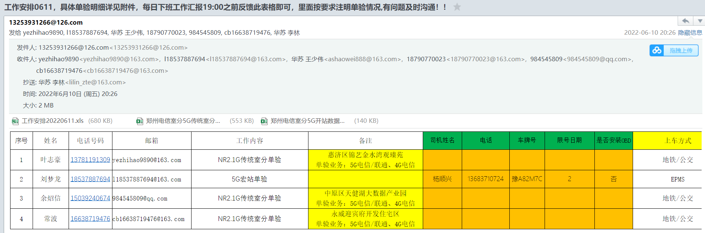
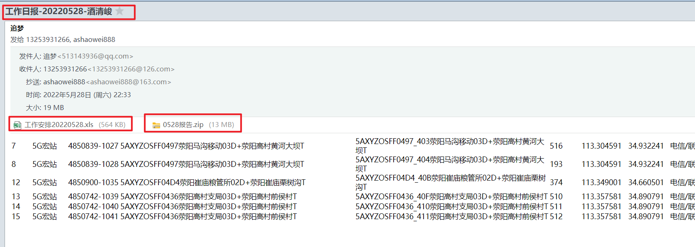
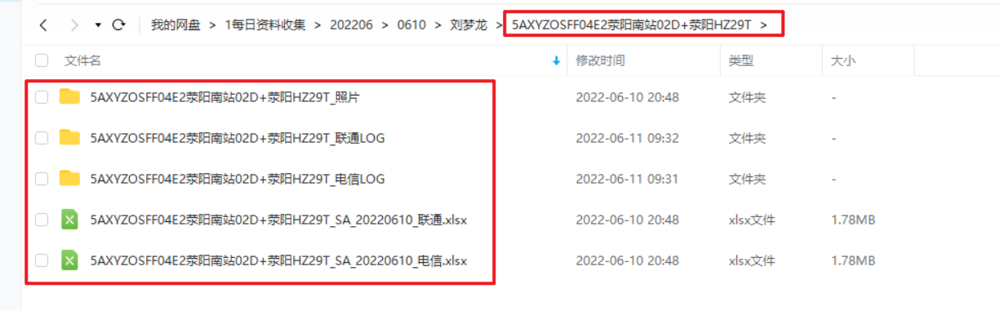
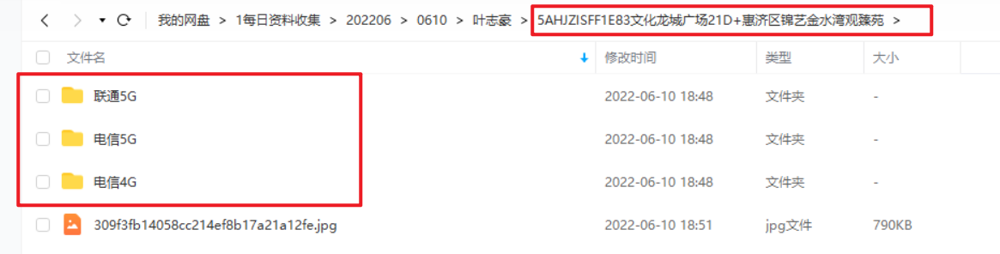

# 华苏员工培训

## 一、新员工入场资料提交

### 1.1 云盘上传资料-所有新人

- 廉洁承诺书
- 中兴合规承诺书
- 安全承诺书

### 1.2 公司提交资料

#### 1.2.1 签订实习协议-实习生

公司打印：链接：https://pan.baidu.com/s/1vr5lYpJdjMZwrH1J6tzZVg?pwd=bwi0  提取码：bwi0 

员工资料准备：

- 光大银行工资卡办理

- 入职体检：乙肝五项 [^费用公司报销]

## 二、考勤

钉钉打卡要求：

- 打卡地必须与考勤地一致，比如：考勤在郑州，钉钉打卡地必须在郑州
- 每天打卡一次（法定节假日除外），只要在项目地都要打卡，与工资挂钩
- 打卡时间不限
- 手机上禁止虚拟定位软件
- 漏打卡不能补卡，不允许安排调休（个人原因）

## 三、住宿

- 工程项目公司免费提供住宿，宿舍产生的水、电、气费用宿舍成员均摊；
- 新员工入场公司报销购买被褥费用，上限150元。

## 四、工作

### 4.1 工作安排：

每天已邮件的形式安排第二天工作

### 4.2 工作汇报：

每天以邮件形式反馈工作情况

### 4.3 工作资料上传网盘

#### 4.3.1 宏站单验

#### 4.3.2 室分单验

## 五、费用报销

每月月底汇总

[^费用公司报销]: 需要发票