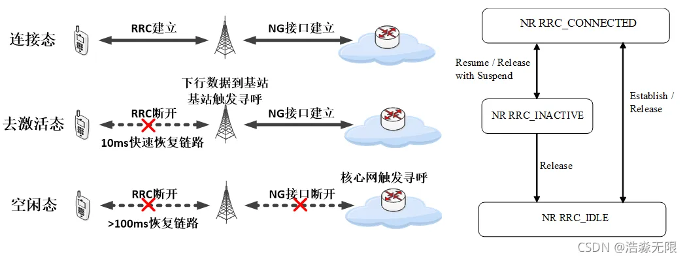

5G移动性管理

# 一、移动性管理

## 1.1 UE状态

为了实现NR 5ms控制面时延，NR R15协议版本引入==去激活状态（RRC_INACTIVE）==。

特点：去激活状态可以快速恢复链路传输数据

Inactive：Uu连接断开，NG连接保持，UE/gNR/AMF保留UE context，可以10ms进入连接态。

## 1.2 位置管理

- TA：Tracking Area，跟踪区

> - 包含一个或多个小区，每个TA用TAC（TrackingAreaCode）进行标识，TAC在小区的SIB1中广播
>
> - 网络中用TAI作为TA的唯一标识，TAI= MCC + MNC + TAC

- RNA：RNA-based Notification Area, RNA通知区

> - 包含一个或者多个小区，用RAN-AreaCode标识，可以等于TAC或者TAC的一部分，在RRC释放消息中通知UE对应的RNA
> - UE的RAN定时器超时或者移动出了RNA范围时，要发起RANU

|                         | RRC_CONNECTED | RRE_IDLE | RRC_INACTIVE |
| ----------------------- | ------------- | -------- | ------------ |
| PLMN选择                |               | 是       |              |
| 接收系统广播消息        |               | 是       | 是           |
| UE移动性-小区选择和重选 |               | 是       | 是           |
| UE移动性-小区切换       | 是            |          |              |
| 接收5GC发起的寻呼       |               | 是       | 是           |
| 接收基站发起的寻呼      |               |          | 是           |
| 5G控制的寻呼区域        |               | 是       |              |
| NG-RAN控制的寻呼区域    |               |          | 是           |
| 基站保留UE上下文        | 是            |          | 是           |
| 5GC-NG-RAN链路建立      | 是            |          | 是           |
| UE发送/接收单播数据     | 是            |          |              |

## 1.3 位置区管理

- 在开机入网选择了小区之后

  > UE发起注册流程，将其位置信息（TA）上报给5GC进行登记

- 以下情形，UE需要向5GC更新TA信息：

  > 1、CM-CONNECTED或CM-IDLE态UE发现TA改变，IDLE态小区重选，CONNECTED态切换
  >
  > 2、CM-IDLE态UE周期性TA更新定时器（T3512）超时

- 以下情形，UE需要向gNB更新RNA信息：

  > 1、RRC_INACTIVE的UE发现进入新的小区不在RNA列表
  >
  > 2、RRC_INACTIVE的UE周期性RNA更新定时器（T380）超时

# 二、小区选择与重选

## 2.1 小区类别

对UE来说，NR的小区服务状态分为四类：

- 合适的小区：UE可以获取所注册服务

  > - PLMN属于选定的PLMN或注册的PLMN或等效的PLMN
  > - 满足小区选择条件
  > - 未禁止接入
  > - 所属TA不在禁止的TA列表

- 可接收的小区：UE可以发起紧急呼叫、接收ETWS、CMAS

  > - 未禁止接入
  > - 满足小区选择条件

- 禁止的小区：UE无法驻留

  > 系统信息中”cellBarred“指示小区禁止接入

- 保留的小区：只有系统消息中指示允许的UE可以驻留（小区所属运营者）

  > 系统信息中”reserved“指示属于保留的小区