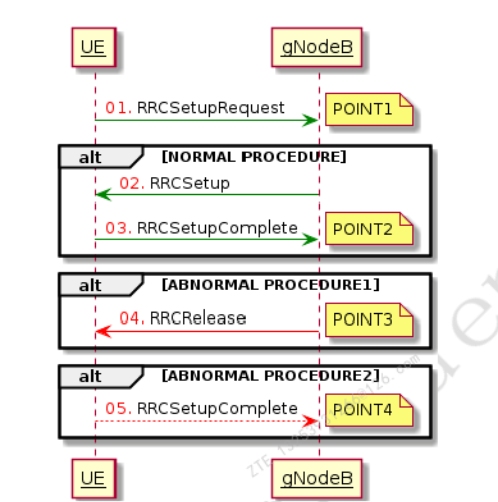

**NR 网优中级培训资料 R1.0**

# 概述

​	介绍 5G SA 场景下锚点小区以及 NR 小区常用 KPI 指标提升手段，适用于网优中级工程师培训。

# 一、KPI 指标定义

## 1、接入类 KPI 指标

​	接入类指标包括无线接通率、RRC 连接建立成功率、NG 接口 UE 相关逻辑信令连接建立成功率和 QoS Flow 建立成功率。

### 1.1 无线接通率

​	无线接通率反映 UE 成功接入网络的性能，指标定义如下：

​	无线接通率（667184）= （RRC 连接建立成功次数 / RRC 连接建立请求次数）\*（Flow 建立成功数 / Flow 建立请求数）\*（NG 接口 UE 相关逻辑信令连接建立成功次数 / NG 接口 UE 相关逻辑信令连接建立请求次数）\* 100% = P667000 \* P667014 \* P667183

| 指标或计数器 | 指标或计数器描述                           |
| ------------ | ------------------------------------------ |
| 667184       | 无线接通率（%）                            |
| 667000       | RRC 连接建立成功率（Percentage）           |
| 667183       | NG 接口 UE 相关逻辑信令连接建立成功率（%） |
| 667104       | QoS Flow 建立成功率（Percentage）          |

### 1.2 RRC 连接建立成功率

​	RRC 连接建立成功率反映 gNB 或者小区的 UE 接纳能力，RRC 连接建立成功意味着 UE 与网络建立了信令连接。RRC 连接建立，包括（如位置更新、系统间小区重选、注册等）的 RRC 连接建立。

#### 1.2.1 RRC 连接建立成功率指标定义

​	RRC 连接建立成功率（667000）= RRC 连接建立成功次数 / RRC 连接建立请求次数 \* 100% = C600000001 / C600000000 \* 100%

| 指标或计数器 | 指标或计数器描述                 |
| ------------ | -------------------------------- |
| 667000       | RRC 连接建立成功率（Percentage） |
| C600000001   | 分接入类型 RRC 连接建立成功次数  |
| C600000000   | 分接入类型 RRC 连接建立请求次数  |

#### 1.2.1.2 RRC 连接建立统计流程图

