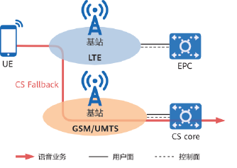
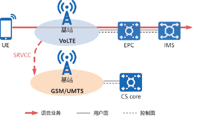

**4G语音解决方案**

语音业务作为移动通信网络的核心业务之一，是每一代通信网络的基本诉求。

进入4G全IP时代，只有PS分组域，不再支持传统CS电路域，主要采用**CS FallBack**和**VoLTE**两种解决方案来支持语音业务。

# 1、CS FallBack

指当终端在4G网络中发起或接收语音呼叫时从4G网络回落到2G或3G网络，借助2G或3G网络的CS电路域来完成语音通话，通话结束后再返回4G网络。

# 2、VoLTE

即Voice over LTE，指通过引入IMS（IP multimedia subsystem），使得4G LTE网络能够直接提供基于PS分组域的语音业务。

