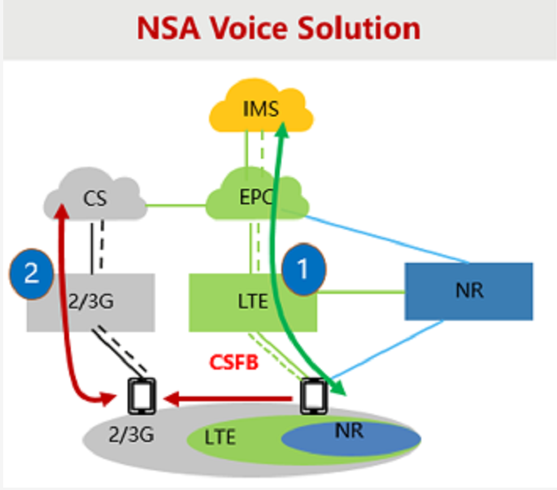
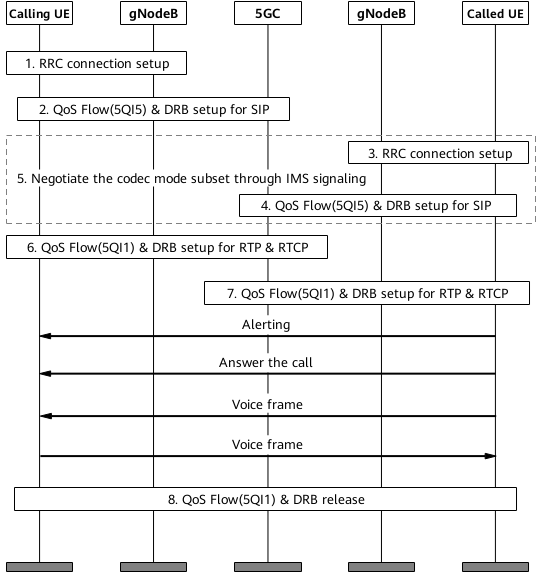
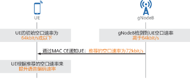
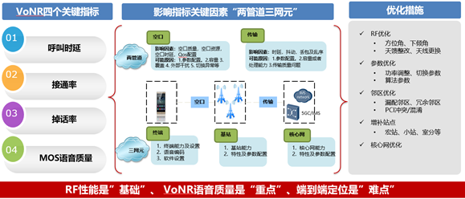

**5G时代语音解决方案**

语音业务作为移动通信网络的核心业务之一，是每一代通信网络的基本诉求。

# 1、NSA组网

NSA组网下的语音业务直接建立在LTE网络，采用LTE语音解决方案**VoLTE**，如下图①所示

# 2、SA组网

主要采用**EPS FB**和**VoNR**两种解决方案来支持语音业务。

## 2.1 EPS FB

​		当SA组网商用初期，由于覆盖不足以及端到端产业不成熟，没有部署VoNR时（即NR侧无法提供语音业务承载时），语音业务采用回落的方式，即**EPS FB**，语音用户承载到LTE侧进行通话。

## 2.2 VoNR

​		即Voice over NR，即NR用户可以基于NR网络直接进行语音业务，从而获得更高质量的语音业务体验和更高速率的数据业务体验，SA Option2组网下最终语音方案。

### 2.2.1 VoNR呼叫的流程

在NR网络内的UE和IMS（IP multimedia subsystem）间建立基于IP传输网络的语音专用承载，即NR用户可以直接基于NR网络进行语音业务。

具体流程为：

1.主叫UE发起呼叫后，主叫UE和gNodeB之间建立RRC连接。

2.5GC建立主叫UE的用于承载SIP（Session Initiation Protocol）信令的QoS Flow（5QI5），gNodeB建立相应的DRB（data radio bearer）承载。

3.被叫UE和gNodeB之间建立RRC连接。

4.5GC建立被叫UE的用于承载SIP信令的QoS Flow（5QI5），gNodeB建立相应的DRB承载。

5.主被叫UE和IMS进行语音业务的SIP会话协商，如编码方式、IP地址、端口号和主被叫相关信息等。

6.SIP会话协商成功后，5GC建立主叫UE的用于承载RTP（Real-Time Transport Protocol）和RTCP（Real-Time Transport Control Protocol）数据流的QoS Flow（5QI1），gNodeB建立相应的DRB承载。

7.5GC建立被叫UE的用于承载RTP和RTCP数据流的QoS Flow（5QI1），gNodeB建立相应的DRB承载。

8.呼叫结束后，主被叫UE释放各自的QoS Flow（5QI1），gNodeB释放各自相应的DRB承载。5QI5为默认承载，建立后仅当UE进入空闲态时才会被释放。

### 2.2.2 **VoNR关键技术**

#### 2.2.2.1、EVS语音编解码

人类从外界获取的信息20％以上来自听觉，人耳能感知的声音是一种机械振动波，频率范围在20Hz～20000Hz之间。人的发音器官发出的声波频率可高达15000Hz左右，为便于研究和处理，人们将声音相应的机械振动波转换成电信号，即模拟语音信号。模拟语音信号存在高冗余度的特点，即存在不能被人耳感知到的音频信号（频率范围在20Hz～20000Hz之外）以及需要被掩蔽掉的音频信号（如一个强音信号与一个弱音信号同时存在时，弱音信号将被强音信号所掩蔽而听不见），它们对确定声音的音色、音调等信息没有任何帮助。因此，基于模拟语音信号的高冗余度的特点，需要在尽量减少失真的情况下去除语音信号的冗余成分；同时，由于模拟语音信号属于低频信号，不利于远距离传输与存储，还需要对模拟语音信号进行数字转换，使得远距离语音通信成为可能。这就是语音编码的目的。

语音编码后的数字语音信号在接收端经过语音解码可恢复到原始的模拟语音信号，语音解码是语音编码的逆过程，如下主要以发送端的语音编码过程来进行介绍，语音编解码方式也简称为语音编码方式。

#### 2.2.2.2、ROHC语音包头压缩

我们都知道VoNR是基于IP网络传输的语音业务，并且语音包采用的都是小包高频传输（每20ms发送或接收一次），因此语音包的头部的开销占整个数据包的比例较大。对于 IPv4和 IPv6语音数据包，头部开销分别达到了40字节和60字节。

语音数据包的净荷（有效负荷）大小与语音的编码速率有关，通常为32字节~61字节，以IPv4语音数据包为例，包头的开销占到了语音数据包总数据量的39.6%（40/101）~55.6%（40/72）左右，即带宽资源的有效利用率只有44.4%~60.4%；同样的，IPv6语音数据包对带宽资源的有效利用率只有34.8%~50.4%。这么低的资源利用率对于带宽资源稀缺的无线网络来说是不可接受的，会直接阻碍无线网络IP化的发展，因此有必要通过对包头部分进行压缩来提升无线资源的利用率。

#### 2.2.2.3、基于MAC CE调速

我们可以假设一下，当空口速率非常高时，也就是网络环境比较好时，如果UE的编码速率比较低，传输的语音包就比较小，此时，对资源的利用率就不够，并未能充分利用较好的网络条件来提升UE的语音业务体验；而当空口速率非常低时，如果UE的编码速率又比较高，此时，会导致传输过程中的丢包，从而影响语音体验。

### 2.2.3 优化思路

VoNR路测典型考核指标主要包含语音接通率、呼叫建立时延、掉话率以及MOS语音质量等。VoNR语音相对数据业务，对网络覆盖、邻区规划、系统干扰、传输质量等的影响更敏感，对网络优化的要求更高。VoNR整体优化思路如下：

