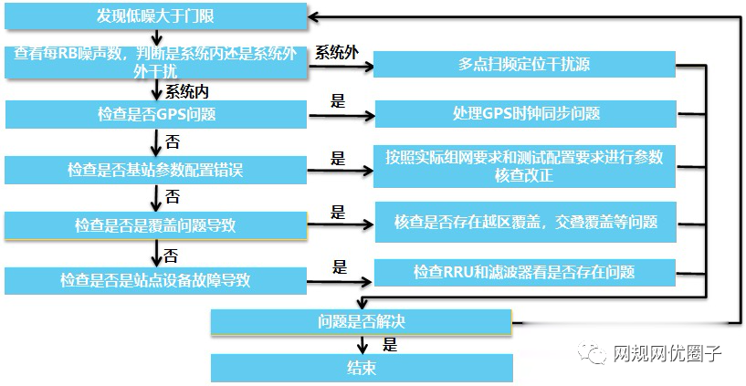
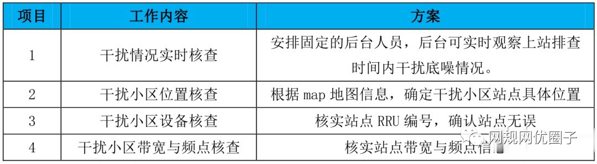
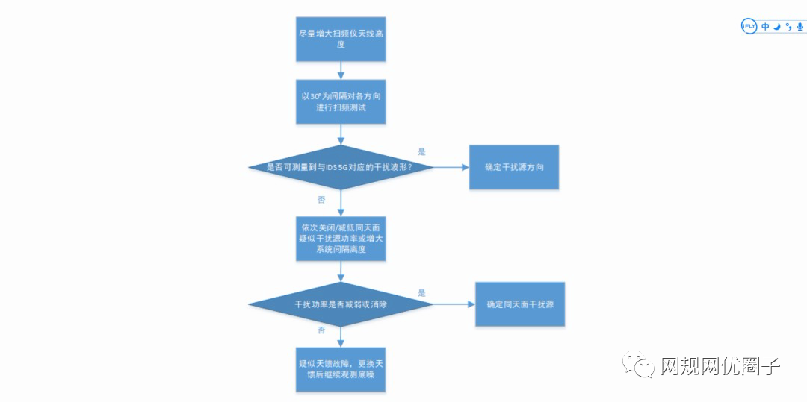
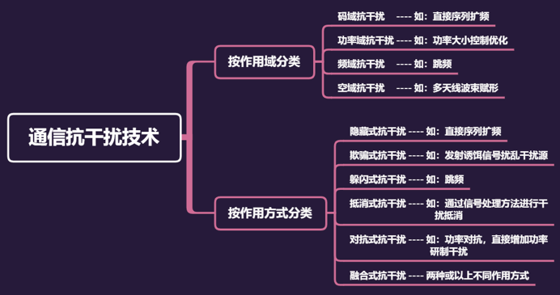
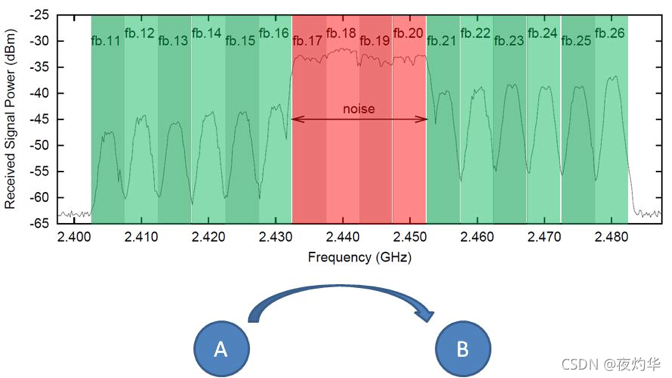
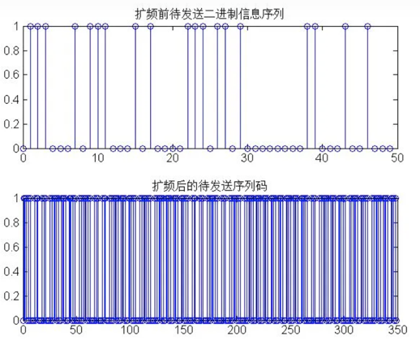
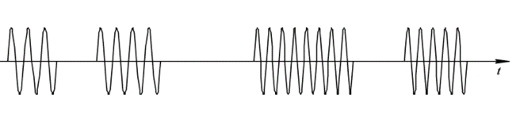
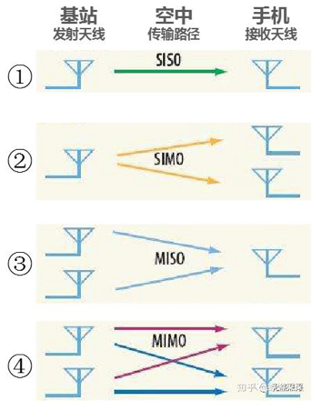
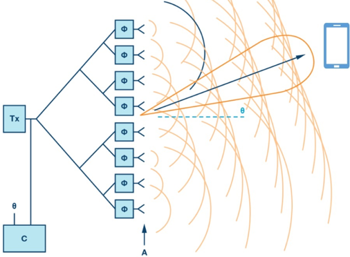

# **一、干扰排查流程**

# **二、5G 干扰排查与定位方法**

5G 干扰排查与 LTE 干扰排查类似， 主要包括 5G 干扰小区筛选、 干扰特征分析、 小区状态/告警信息核查、 小区参数配置核查和上站干扰排查五个步骤。

## 1、干扰排查

### 1.1、5G 干扰小区筛选

确定 5G 受干扰小区并对 5G 高干扰小区进行干扰归类， 确定每个干扰小区可能的干扰源类型。

### 1.2、干扰特征分析

干扰特征分析是指对 5G 干扰小区的 24 小时*273PRB 底噪数据进行干时域、 频域、 地理域维度的干扰特征分析：

1) 明确时域干扰特性：基于 24 小时干扰均值变化趋势确定干扰是连续存在还是间歇发生；

2) 分析频域干扰特征：将受扰 PRB 转换为频率， 确定受扰频率特性， 结合时域特性判断小区受扰类型和可能的干扰源；

3) 分析干扰的地理域特征：对同干扰类型的多小区进行地理分布分析， 结合各小区受扰强度、 覆盖方向等信息， 判断可能的干扰源所在区域， 缩小上站排查范围。

### 1.3、小区状态/告警信息核查

核查 5G 干扰小区状态是否正常、 有无告警， 排查受扰小区是否存在设备故障如 AAU故障、 GPS 告警、 天线通道告警等， 排除小区故障原因。

### 1.4、小区参数配置核查

核查 5G 干扰小区相关无线参数是否配置正确， 重点关注时隙配置、 帧偏置等参数， 排除参数配置错误原因。

### 1.5、 上站干扰排查

在排除 5G 干扰小区不存在故障问题、 参数配置错误等情况后， 根据该小区的干扰特征分析结果上站排查， 结合后台干扰波形分析与现场扫频测试等手段确定干扰源。上站干扰排查的基本方法是使用便携式频谱分析仪或扫频仪和定向天线， 利用天线的定向接收特性对多个方向进行扫频分析， 对比扫频测量到的干扰波形是否与后台干扰波形一致， 寻找干扰强度最大的干扰方向确定干扰来源。在找到疑似干扰源后， 采用协调关闭干扰源、 屏蔽/遮挡干扰信号等方式进行确认。建议在上站排查前， 根据干扰小区的干扰特征分析确定可能的干扰源和所在区域， 提高干扰排查的针对性和效率。

## 2、 5G 典型干扰排查建议

### 2.1 LTE 同频干扰

LTE 同频干扰是 LTE 同频邻区终端对 5G 的集总上行干扰， 无法通过扫频分析确定具体的干扰源小区。因此对 LTE 同频干扰， 需采用如下方法确定可能的干扰源小区：

1) 获取 4/5G 工参：提取现网最新的 5G 工参和 LTE 工参。

2) 制作 MapInfo 图层：按照 LTE 频点和 5G 带宽信息， 分别制作 LTE 工参图层和 5G工参图层， 确定受 LTE 同频干扰的 5G 小区位置。

3) 分析 LTE 同频邻区：根据 5G 小区的 LTE 受扰类型， 确定其周边一定距离内的同频 LTE 小区列表。

4) 确定潜在 LTE 干扰源小区：首先核实列表内的同频 LTE 小区是否已完成清频， 若仍未清频则结合 4/5G 小区间距、 相对位置、 LTE 小区业务负载等信息进行分析，确定潜在 LTE 干扰源小区。

5) 确认干扰源：通过关站、 去激活等方式确认 LTE 干扰源小区并推进后续清频工作。另外要注意的是 TD-LTE D1/D2 频段对应的载频号按照 Band38 和 Band41 计算有不同的取值， 在判断 TD-LTE 同频小区时需要予以关注， 避免漏判 LTE 同频邻区：

### 2.2 MMDS 干扰

LTE 时期已排查处理过 2575~2635MHz 范围内的 MMDS 干扰， 且广电总局也已安排MMDS 退网清频， 但目前仍存在部分地区的 MMDS 站点干扰 5G。MMDS 干扰频域特征呈现连续多个规律的 8MHz 矩形波形， 干扰频段与电视频道配置吻合， 且因其台站高度高、 发射功率大（500W~1KW） 一般呈现大规模干扰， 因此 MMDS 干扰可基于上述特征进行分析识别， 发现后与当地广电、 无委等部门沟通协调关闭即可。

### 2.3 视频监控干扰

现在电梯、 楼宇、 小区的视频监控安防设备使用较为普遍， 且其无线回传设备频率使用不规范非法占用 5G 频段造成严重干扰。发现疑似视频监控干扰后， 需要重点对电梯井、 屋顶等视频监控常见安装区域进行干扰排查确认。排查时在监控中心或交换机附近调测即可，非专业人士请勿进入电梯井道、 屋顶等危险区域排查。确认是视频监控设备干扰源后， 可协调物业等相关人员进行频段修改、 设备关断等方式规避解决干扰， 后续也需从集团层面推动监控设备厂家规范相关监控设备的频率使用。

### 2.4 伪基站干扰

在确定伪基站干扰后， 首先建议沟通关闭伪基站以避免对 5G 产生干扰。若无法关闭伪基站， 则可通过调整天馈控制伪基站覆盖区域、 将伪基站所用 PCI 加入到黑名单、 伪基站设备移频使用 E 频段、 调整伪基站帧偏置等手段降低伪基站对 5G 的干扰。

### 2.5 干扰器干扰

干扰器通过大功率发射干扰信号来阻断基站与终端的通信， 主要在监狱、法院、检查院、学校、 政府部门等区域安装使用。发现干扰器干扰后， 要对干扰器位置、 干扰小区等信息做好记录和干扰历史管理， 并与干扰器所属单位沟通协调关闭干扰器， 对确需开启的干扰器要做好记录， 并提醒相关单位用完之后及时关闭。

## 3、 干扰排查与定位方法

对于非 LTE 同频干扰的 5G 受干扰小区， 一般需要通过外场干扰排查进行定位与优化，在排查前应使用 IDS 5G 受干扰小区 GIS 分析功能确定小区周围一定距离范围内是否有同类型受干扰小区， 当存在同类型受干扰小区时， 应选择干扰功率最强的小区进行上站干扰排查工作。

### 3.1 干扰排查准备

开展 5G干扰排查需要的仪器设备包括便携式频谱分析仪或扫频仪、定向天线、望远镜、馈线、 衰减器等。

1) 便携式频谱分析仪或扫频仪：具备前置预防及衰减功能， 打开预放后底噪不高于-110dBm/200kHz；具备在 5G 上行时隙的扫频能力。

2) 定向天线：八木天线或对数周期天线， 天线主瓣增益不小于 10dBi；

3) 可调衰减器：衰减量可设置为 0~50dB；

4) 馈线：可正常使用， 上站干扰排查前应测量馈线损耗

5) 望远镜：无具体要求， 可正常使用即可；

干扰排查前需要熟悉掌握待排查小区的工参信息， 且需要前后台的密切配合， 应在以下方面做足准备。

另外， 测试扫频时发现干扰源附近时， 需要进入特殊场景测试， 而业主较难协调， 根据以往排查经验， 需要提前准备工作证或介绍信或现场协调进场测试， 如企业单位、 工业区、党政机关、 学校、 医院等。

### 3.2 仪器仪表设置

干扰源定位主要通过“频谱分析仪+定向天线” 的方法， 通过多点定位法逐步缩小干扰源范围， 各仪表设备的连接方式如下图所示：

频谱分析仪的 RBW 建议设置为 200kHz， 并开启频谱分析仪的前置预放功能， 降低设备基础底噪。

可调衰减器的衰减量预置为 0dB， 当上站干扰排查频谱分析仪饱和时， 可适当增加可调衰减器的衰减量， 保证频谱分析仪的正常工作。

### 3.3 天面扫频测试

在进行天面扫频测试时， 应根据受干扰小区干扰波形分析及干扰地理相关性分析结果，初步确定怀疑的干扰源， 尽量做到有针对性的干扰定位与排查， 提升工作效率。具体流程如下：

步骤 1：测试时尽量抬升定向天线高度， 最好可以到达与受干扰小区天线同高度或超过受干扰小区天线挂高；

步骤 2：以正北方向为 0° 方向， 以 30° 为间隔进行定向干扰测量， 分别选用“Maxhold模式” 及“10 次平均模式”， 在此过程中应重点关注与受干扰小区天线方位角同方向时是否测量到干扰信号；

步骤 3：对比各角度频谱仪测量到的波形及 IDS 5G 系统该小区 PRB 波形图， 当干扰形态相同时表明测量到干扰信号；

步骤 4：当测量到干扰信号时， 通过分析各角度干扰信号功率强弱， 确定干扰信号的方向；

步骤 5：如果未测量到与 IDS 5G 系统 PRB 波形图相似的干扰信号， 则干扰源疑似与受干扰小区同天面的其它无线系统或天馈问题， 依次降低各同天面疑似干扰源系统的功率或短时关闭系统， 观察干扰功率是否降低或消除；

步骤 6：若干扰功率降低或消除， 则确定相应的干扰源， 否则疑似天馈故障， 更换天馈后重新监测。

# **三、抗干扰技术分类**

通信抗干扰技术，可根据作用域的不同和作用原理的不同进行分类，如下图所示：

# **四、抗干扰技术原理**

## **4.1  跳频技术**

跳频技术是无线通信中广泛应用的一种抗干扰技术，在无线通信系统中应用非常广泛。跳频技术原理是通信系统的工作频段可以依据某一特定的速度与规律进行来回跳动，可以在采用多频率频移键控选择码序列的时候保证载波频率以实现持续跳变的目标，最后可以达到扩展频谱的目的。

该种抗干扰技术特征表现如下：跳速越高，跳频的宽度越大，无线通信抗干扰能力越高。此种抗干扰技术可以保护与隔离某一频段，保证其不受到外界各种因素的干扰。如下图所示，某通信系统，工作频段在频段区间A和频段工作区间B之间来回跳动，而避开noise覆盖的红色干扰区域：

图2跳频原理示意图

## **4.2  扩频技术**

在众多扩频抗干扰技术中，直接序列扩频技术的应用最为广泛，尤其是在军事领域的无线通信和民用无线通信领域中的噪声环境下都有应用，具有抗干扰能力强，截获率低与隐蔽性能好等应用优势，可以保证无线通信信号的质量。

直接序列扩频通信系统(DSSS: Direct Sequence Spread Spectrum)是目前应用最为广泛的系统。在发送端，直扩系统将发送序列用伪随机序列扩展到一个很宽的频带上去，在接受端又用相同的扩频序列进行解扩，回复出原有信息。由于干扰信息与伪随机序列不相关，扩频后能够使窄带干扰得到有效的抑制，提高输出信噪比。如某DSSS系统，生成50位随机待发送二进制比特序列，并进行扩频编码，如下图所示：

图3随机50位待发二进制序列扩频编码

## **4.3  跳时技术**

时间跳变也是一种扩展频谱技术，跳时扩频通信系统（Time Hopping Spread Spectrum Communication Systems，TH-SS）是时间跳变扩展频谱通信系统的简称，主要用于时分多址（TDMA）通信中。与跳频系统相似，跳时是使发射信号在时间轴上离散地跳变。我们先把时间轴分成许多时隙，这些时隙在跳时扩频通信中通常称为时片，若干时片组成一跳时时间帧。在一帧内哪个时隙发射信号由扩频码序列去进行控制。因此，可以把跳时理解为：用伪随机码序列进行选择的多时隙的时移键控。由于采用了窄得很多的时隙去发送信号，相对说来，信号的频谱也就展宽了。

跳时扩频系统也可以看成是一种时分系统，所不同的地方在于它不是在一帧中固定分配一定位置的时隙，而是由扩频码序列控制的按一定规律跳变位置的时隙。跳时系统能够用时间的合理分配来避开附近发射机的强干扰，是一种理想的多址技术。但当同一信道中有许多跳时信号工作时，某一时隙内可能有几个信号相互重叠，因此，跳时系统也和跳频系统一样，必须采用纠错编码，或采用协调方式构成时分多址。由于简单的跳时扩频系统抗干扰性不强，很少单独使用。跳时扩频系统通常都与其他方式的扩频系统结合使用，组成各种混合方式。

从抑制干扰的角度来看，跳时系统得益甚少，其优点在于减少了工作时间的占空比。一个干扰发射机为取得干扰效果就必须连续地发射，因为干扰机不易侦破跳时系统所使用的伪码参数。跳时系统的主要缺点是对定时要求太严。

图4跳时信号波形

## **4.4  多天线技术**

通过充分利用无线信道的"空间"特性，可以使用布置在无线通信系统中发射机和/或接收机处的多根天线，实质性地提高系统性能。这些系统，现在广泛称为“多路输入多路输出(MIMO：Multiple Input Multiple Output) ”，即在发射机和接收机处设置两根或更多根天线。在MIMO术语中，"输入"和"输出"是相对于无线信道来说的。在这些系统中，多台发射机同时将其信号"输入"到无线信道中，然后同时将这些信号组合从无线信道"输出"到多台接收机。此种方式在空间域“把相同的内容通过不同的天线发送出去”，使通信系统获得性能增益和抗干扰能力，称为“传输分集”。

图5从SISO到MIMO

①SISO：单输入单输出( Single Input Single Output )

②SIMO：单输入多输出( Single Input Multiple Output )

③MISO：多输入单输出( Multiple Input Single Output )

④MIMO：多输入多输出( Multiple Input Multiple Output )

## **4.5  智能天线技术**

随着MIMO技术的发展，MIMO变成了Massive MIMO，也就是“大规模MIMO”。传统的MIMO通常有2天线、4天线、8天线，Massive MIMO的天线数量可以超过100个。Massive MIMO系统可以控制每一个天线单元发射（或接收）信号的相位和信号幅度，通过对多个天线单元进行调节，产生具有指向性的波束，即波束赋形（Beam-Forming）。波束赋形技术将MIMO技术的空间分级与复用的优点集于一身，有效提高系统性能和抗干扰能力。

图6波束赋形

# **五、美军抗干扰技术**

在军事对抗环境下，所有通信系统都可能会受到各种形式的干扰，甚至是己方系统相互之间的干扰，这对通信装备的抗干扰性能提出了更高的要求。随着电子信息对抗技术的发展，通信装备已面临“发现即被摧毁”的威胁。因此，通信系统装备应该具有高隐蔽性、低截获率低探测率和强抗干扰性。

美军抗干扰安全通信系统的实现途径包括两种。一种是开发专门的抗干扰、网络对抗功能模块，嵌入到已有的或未来的通信设备中，使其具备抗干扰通信能力；一种是在通信装备开发、设计之初就考虑增加强大的抗干扰功能。其采用的技术实现方法包括以下几种：

1）在传统抗干扰技术上创新发展，进一步提高抗干扰性能。

典型项目如DARPA于2014年6月推出的“超宽带有效射频信息”（HERMES）项目，意在研发先进微系统技术实现瞬时带宽超过10GHz、干扰抑制能力超过70分贝的超宽频带扩频抗干扰通信。

2）利用认知无线电技术，感知电磁干扰环境，智能产生最佳抗干扰方式，极大提高系统的抗干扰能力和频谱利用率。

典型项目如“利用计算优势对抗监视系统”（CLASS），是用认知无线电技术创建新的通信波形加入到现有通信设备中，使之能感知外部电磁环境和内在电磁状态，并自动调整、优化其行为状态，使敌方难以捕获并干扰。

3）综合利用包括传统技术和新兴技术在内的多种抗干扰技术，实现抗干扰效率最大化。

典型项目如DARPA2018年初发起的“受保护前线通信”（PFC），将综合采用功率可管理的宽带扩频通信、利用无线电台协同实现的分布式相干传输、包括毫米波技术在内的定向通信技术、机器学习技术等，集各种新旧技术之大成。

# **六、结束语**

通信干扰、抗干扰是通信领域永恒不变的主题。随着电磁环境呈现高度复杂化、动态化、对抗性特征日趋显著。信号干扰问题是制约无线通信技术发展的一个核心问题。在提升无线通信抗干扰能力期间，除了应用常规的扩频技术等抗干扰技术之外，也要注意有效地应用智能组网技术等新兴抗干扰技术，加之综合应用上述这几种抗干扰技术，这样可以更好地保证无线通信抗干扰性能。

# 参考文献：

- 1）探究无线通信抗干扰技术佚名

https://www.sohu.com/a/459263320_120945789；

- 2）常见无线通信中抗干扰方法夜灼华

https://blog.csdn.net/xuhao0258/article/details/120501229；

- 3）美军抗干扰安全通信typeidea

https://zhuanlan.zhihu.com/p/258806307；

- 4）动态频谱抗干扰通信：机遇与挑战Mercy

https://zhuanlan.zhihu.com/p/399967649；

- 5）5G的Massive MIMO到底是一个什么技术小枣君

https://www.zhihu.com/question/389179142/answer/1167001002；

- 6）通信对抗干扰效果评估方法综述周朋海军91404部队河北秦皇岛；
- 7）军用无线通信干扰与抗干扰技术研究梁涛海军装备部北京。