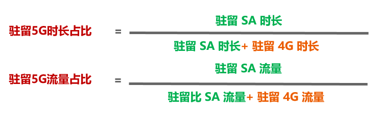
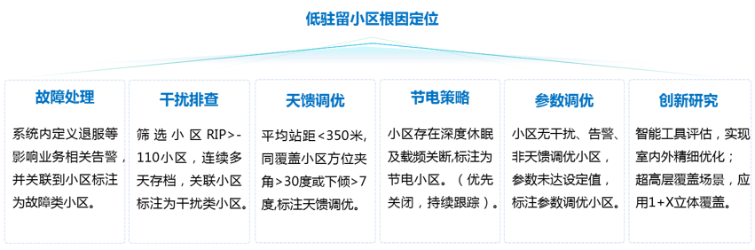
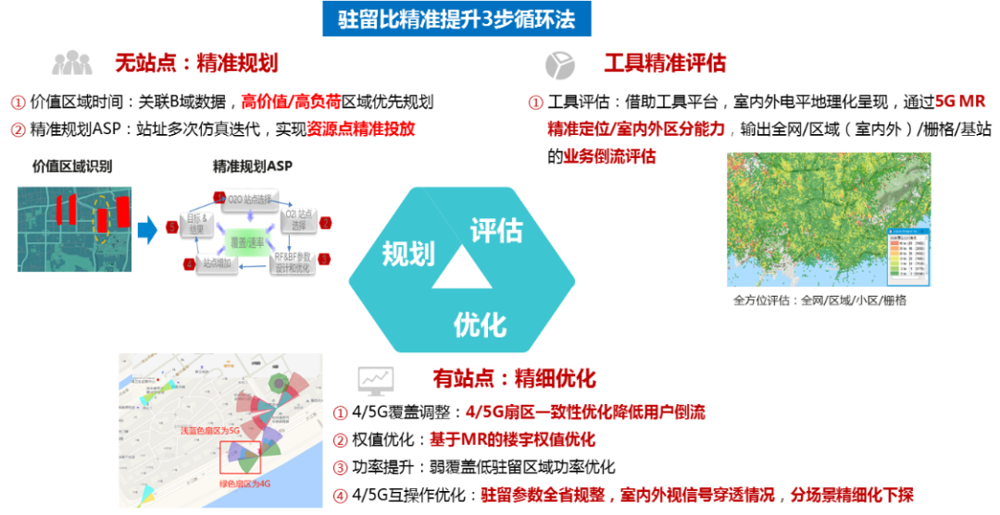

随着5G网络建设不断发展，5G网络覆盖已逐步完善。但从5G网络使用情况看，当前5G驻留比指标较低，5G分流比也就较低，5G网络效率不高。因此，提升5G驻留比和分流比指标成为各地当前优化的重点工作。

5G驻留比和分流比的优化相辅相成，提升分流比首先要提升驻留比，驻留比提升后，方能更好的提升5G分流比。

**5G低驻留比小区根因定位思路**

**现场采用的优化措施：**

1、4/5G互操作参数下探

5G互操作参数A1、A2、B2分别对应5G切换4G关闭测量A1事件判决门限、5G切换4G启测A2事件判决门限和5G切换4G执行B2事件服务小区判决门限，4G互操作参数B1对应4G定向重定向回5G的判决门限。下探4/5G互操作参数，可以延缓5G用户切换到4G，加快5G用户从4G返回5G网络，从而提升5G用户占用5G网络时长。

| **参数表名**           | **参数名称**                                    | **参数短名**      | **现网值** | **修改值** |
| ---------------------- | ----------------------------------------------- | ----------------- | ---------- | ---------- |
| **NRCloseInterFRATHo** | **A1事件判决的RSRP绝对门限**                    | **rsrpThreshold** | **-105**   | **-110**   |
| **NROpenInterFRATHo**  | **A2事件判决的RSRP绝对门限**                    | **rsrpThreshold** | **-110**   | **-115**   |
| **InterRATCovHO**      | **B2事件服务小区判决的RSRP绝对门限1**           | **rsrpThreshold** | **-110**   | **-115**   |
| **NrRatMeasCfgLTE**    | **NR的B1测量时RSR绝对门限（测量配置号为2124）** | **rSRPNRTrd**     | **-104**   | **-108**   |

**2、5G小区功率增加**

增加5GAAU发射功率，能够增加5G覆盖，有利于5G驻留比提升。目前中兴外场5G设备主要型号主要分为两种，9611AS26设备支持240W，9631AS26设备支持320W。如有反开4G，需按要求给4G预留功率。然后对5G未满功率配置进行核查并完成满功率配置。

| **参数所在的表名称**                       | **参数名称**       | **参数短名**      | **推荐值**                          |
| ------------------------------------------ | ------------------ | ----------------- | ----------------------------------- |
| **NRRadioInfrastructure/NRPhysicalCellDU** | **小区RE参考功率** | **powerperreref** | **156 -> 240W** **178 -> 320w** |

**3、SA用户定向迁移定时器调整**

增加SA用户定向迁移测量等待定时器，可以使在4G的SA用户尽量迁移到5G网络，提升5G时长驻留比。

| **参数表名**             | **参数名称**                           | **参数短名**             | **现网值** | **修改值** |
| ------------------------ | -------------------------------------- | ------------------------ | ---------- | ---------- |
| **ControlPlaneTimerLTE** | **SA用户定向迁移测量等待定时器（秒）** | **sADIRECTmIGmEAStimer** | **5**      | **10**     |

**4、5到4E1频点重选门限调整**

增加5G小区重选到4GE1频点的门限，可以延缓5G用户过早重选到4GE1频点，增加驻留5G的机率，从而提升5G驻留比

| **参数表名**         | **参数名称**                         | **参数短名**   | **现网值** | **修改值** |
| -------------------- | ------------------------------------ | -------------- | ---------- | ---------- |
| **EUTRAReselection** | **向低优先级EUTRAN小区重选RSRP门限** | **threshXLow** | **8**      | **10**     |

**5、关断型节能功能关闭**

目前多数外场节能均属于开启状态，考虑到目前5G网络负荷较低，较容易触发节能功能，对于触发深度休眠和载波关断功能后，不可避免对5G覆盖产生影响，进而影响5G时长驻留比。适当关闭节能功能，可以提升5G时长驻留比。

**6、低流量小区处理**

筛选低流量小区进行处理，默认小区的流量低则时长驻留也低。筛选出7天流量低于1G的周粒度小区明细，剔除告警/节电/参数导致的低流量小区，现场进行勘查并制定合理RF调整方案。通过RF优化，提升小区用户数，从而提升5G驻留时长。

**7、基线参数对齐**

基线参数是5G小区开通的基本配置参数，它是5G网络基本功能和KPI指标的基本保障。主要包括互操作参数、基线参数、SON功能部署、外部小区参数等。对全网小区基线参数进行核查，及时修改对齐，确保用户接入、保持、切换等基本KPI达标。