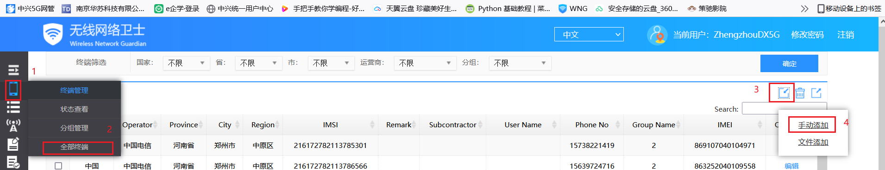
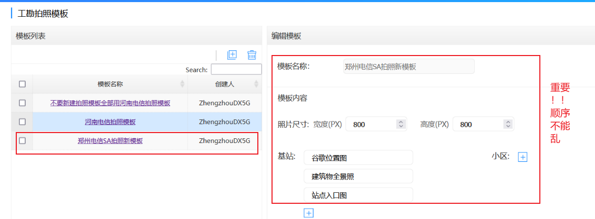
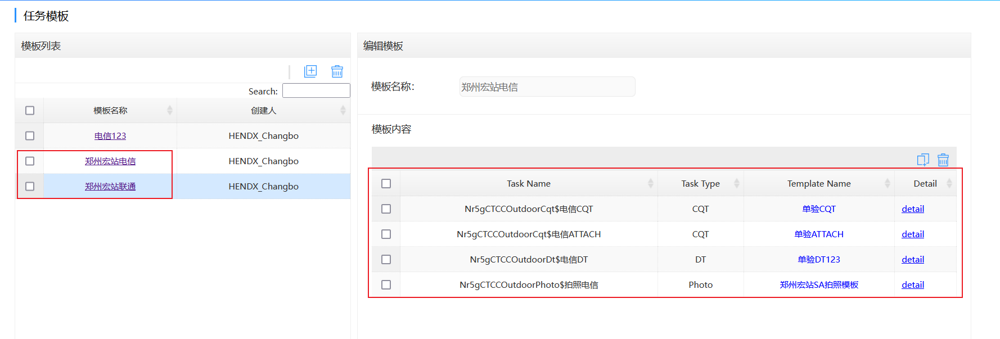
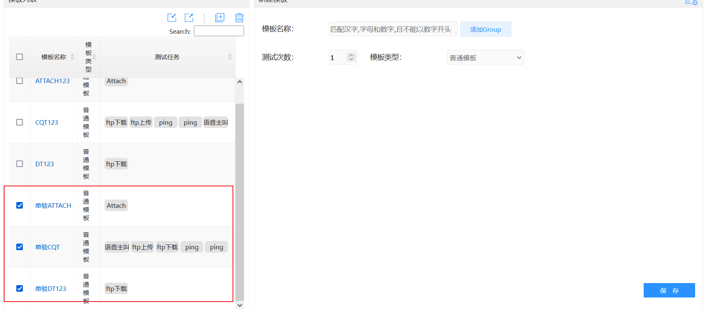

# 												WNG

## 一、WNG介绍

### 	1.1 WNG网页地址

​				20211116新地址：`https://wngcn2.wx.zte.com.cn:9553/wng/login.html`

### 	1.2 河南电信WNG使用

#### 			1.2.1 登录账号密码	

​					账号：个人账号	

​					密码：自己设置

​					备注：登录验证码区分大小写

#### 			1.2.2 通知页面介绍

​					此页面非常重要，里面会更新一些最新通知、常见问题解决办法,请仔细阅读

#### 			1.2.3 终端管理

##### 					1.2.3.1 添加测试机到WNG平台				

### 	1.3  WNG APP获取服务器

​				FTP地址：120.25.217.59

​				端口号：11501	

​				账号：ZCW	

​				密码：ZCW.2022

​			备注：推荐使用FZ软件连接服务器

## 二、单验模块

### 2.1 拍照模板配置

### 2.2 任务模板配置

### 2.3 单验测试模板

​					[测试模板存放位置](D:\用户\文档\GitHub\study-notes\网优\工具使用\WNG\相关文件\宏站SA-单验测试模板)

## 三、簇优化模块