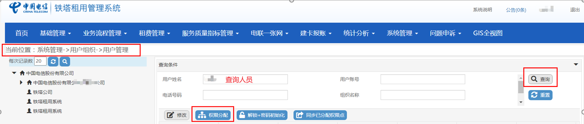

## 一、用户权限管理

### 权限说明

| 序号 | 权限明细               | 权限分类       | 备注 |
| ---- | ---------------------- | -------------- | ---- |
| 1    | 报表_建设质量查询_河南 | 报表查询       |      |
| 2    | 报表_建设质量导出_河南 | 报表导出       |      |
| 3    | 报表_全景视图_河南     | 报表视图       |      |
| 4    | 报表_租用信息查询_河南 | 报表查询       |      |
| 5    | 报表_租用信息导出_河南 | 报表导出       |      |
| 6    | 费用核对及调账_河南    | 费用核对及调账 |      |
| 7    | 建设经办人_河南        | 建设经办人     |      |
| 8    | 建设审批人_河南        | 建设审批人     |      |
| 9    | 维护经办人_河南        | 维护经办人     |      |
| 10   | 维护审批人_河南        | 维护审批人     |      |
| 11   | 维护质量指标_河南      | 维护指标       |      |
| 12   | 信息查询_河南          | 信息查询       |      |
| 13   | 集成报账_河南省        | 集成报账       |      |
| 14   | 产品定义__河南         | 产品定义       |      |
| 15   | 费用规则管理_河南      | 规则管理       |      |
| 16   | 费用规则审批_河南      | 规则审批       |      |
| 17   | 起租确认_河南          | 起租确认       |      |
| 18   | 系统管理员_河南        | 系统管理员     |      |
| 19   | 用户管理员角色_河南    | 用户管理员角色 |      |
| 20   | 资源变更确认_河南      | 资源变更确认   |      |

### 系统操作

