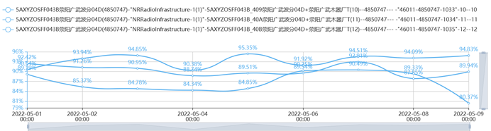
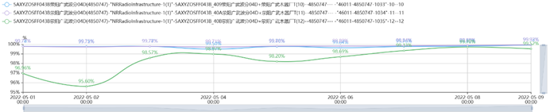
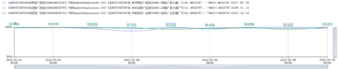
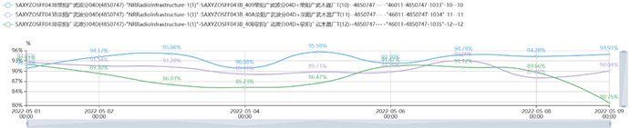
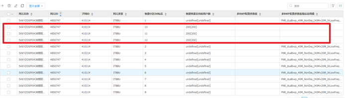
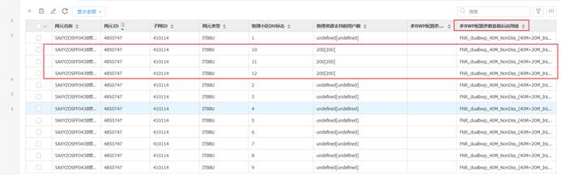
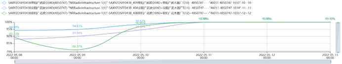

# 一、背景

随着 NR 2.1G站点大量开通，低接入占比约9.6%，对现网指标考核造成严重影响。

# 二、低接入介绍

低接入小区指的是无线接入成功率低于98%的小区。

**计算公式：**

无线接入成功率 = RRC连接建立成功率 * NG接口UE相关逻辑信令连接建立成功率 * 分5QI的QoSFlow建立成功率

## 2.1 RRC连接建立成功率

​    RRC连接建立成功率反映gNB或者小区的UE接纳能力，RRC连接建立成功率意味着UE与网络建立了信令连接。RRC连接建立，包括：位置更新、系统间小区重选、注册等的RRC连接建立。

**计算公式：**

RRC连接建立成功率 = RRC连接建立成功次数/RRC连接建立请求次数 * 100%

### 2.1.1 RRC连接建立失败原因分析

RRC建立失败原因包括定时器超时、接纳失败、其它原因。

Ø 定时器超时

当gNB由于RRC连接建立完成消息（RRCSetupComplete）定时器超时后，计数器加1。

造成等待定时器超时的原因包括：

²  功控参数设置不合理

²  RRU功率异常

²  弱覆盖

²  上行干扰

²  高CPU利用率

Ø 接纳失败

当gNB接收到从UE来的分接入类型RRC连接建立请求（RRCSetupRequest）消息后，由于接纳失败导致RRC连接建立失败时，计数器加1.

造成接纳失败的原因包括：

²  接纳参数设置不合理

²  小区负荷过高

Ø 其它原因

当gNB接收到从UE来的分接入类型RRC连接建立请求（RRCSetupRequest）消息后，由于gNB内部原因（例如CPU冲高）失败导致RRC连接建立失败时，计数器加1。

造成该失败的主要原因可能是由于NR内部处理流程异常，需要通过分析失败信令进行问题定位。

### 2.1.2 RRC建立影响因素

影响RRU接入的主要因素如下：

² 基站故障：

² PRACH参数配置，最小接入电平设置

² 上行干扰NI太高

² 弱场接入，RRC无法完成

² 用户数多导致，SR容量不足

² CPU负荷高

### 2.1.3 RRC连接建立成功率处理思路

² 通过统计分析是否出现RRC接入成功率低的问题，当前RRC接通率指标要求为99%。

² 确认是否全网指标恶化，如果是全网指标恶化，需要检查操作记录，告警，是否存在网络变动和升级行为

² 如果是部分站点指标恶化，拖累全网指标，需要寻找TOP站点。

² 查询RRC连接建立最低的TOPN站点及时间段，细分失败原因值。

² 查看TOPN站点告警，BBU状态，小区状态，OB操作日志，配置是否异常

² 针对TOP站点进行针对性的信令跟踪、干扰检测进行分析。

² 将信令跟踪文件，干扰检测结果，操作日志交研发人员分析。

## 2.2 NG接口UE相关逻辑信令连接建立成功率

NG接口UE相关逻辑信令连接建立成功率反映gNB与NGC连接稳定性。

**计算公式：**

NG接口UE相关逻辑信令连接建立成功率 = NG接口UE相关逻辑信令连接建立成功次数/NG接口UE相关连接建立请求次数 * 100%

## 2.3 QoS Flow建立成功率

QoS Flow建立成功率表示成功为用户分配了用户平面的连接

**计算公式：**

QoS Flow建立成功率 = Flow建立成功数/Flow建立请求次数 * 1

### 2.3.1 QoS Flow建立成功率失败原因分析

QoSF1ow建立失败原因包括消息参数错误、切换引起、空口失败、其它原因。

Ø 消息参数错误

gNodeB处理InitialContextSetupRequest、PDU SESSION RESOURCE SETUP REQUEST或PDU SESSION RESOURCE MODIFY RESPONSE过程中，校验消总中的参数，如果参数校验失败，则导致5QIF1ow建立失败。造成消息参数错误的原因可能是由于R侧和核心网侧对消息中某些字段理解不一致导致，该问题的排查需要根据失败信令进行分析。

Ø 切换引起

当切换流程打断了PDU Session流程(PDU SESSION RESOURCE SETUP RESPONSE或PDUSESSION RESOURCE MODIFY RESPONSE)造成消息携带的QoS Flow Setup Request List中存在某些5QI的QoSF1ow异常释放.切换引起的F10w建立失败主要是流程冲突导致，该问题主要通过优化信令流程来进行规避。

Ø 空口失败

向AMF发送了INITIAL CONTEXT SETUP FAILURE、PDU Session Resource Failed to SetupLis、INITIAL CONTEXT SETUP RESPONSE消息携带了一个或多个PDU session的QoS FlowFailed to Setup List、PDU SESSION RESOURCE SETUP RESPONSE携带了PDU SessionResource Failed to Setup List或PDU SESSION RESOURCE MODIFY RESPONSE携带了一个或多个PDU session的QoS Flow Failed to Add or Modify List,且失败原因为“空口失败”。该问题主要适合基站故障、空口质量相关，需要重点排查：弱覆盖、重叠覆盖、过覆盖、上行干扰、基站告警、基站功率设置。

### 2.3.2 QoS Flow建立成功率影响因素

Ø 无线覆盖环境较差，如弱场覆盖，上行NT偏高

Ø 无线参数设置错误，如加密完保算法不合理，接纳控制门限过低

Ø 传输故障

Ø 系统Bug

### 2.3.3 QoS Flow建立成功率处理思路

Ø 通过统计分析是否出现ERAB接入成功率低的问题，目前ERAB接通率指标一般为99%。

Ø 确认是否全网指标恶化，如果是全网指标恶化，需要检查操作，告警，是否存在网络操作和升级行为。

Ø 如果是部分站点指标恶化，拖累全网指标，需要查找TOP站点。

Ø 查询ERAB连接建立最低的TOPN站点及时间段，细分失败原因值。

Ø 查看TOP站点告警，检查单板状态，小区状态，OB操作日志，配置是否异常。

Ø 针对TOP站点进行针对性的信令跟踪、干扰检测进行分析。

Ø 将信令跟踪文件，干扰检测结果，操作日志交研发人员分析

# 三、低接入优化案例

## 3.1 电信NR2.1G小区多BWP配置参数套未配置导致接入成功率低

**问题现象:**

2022.5.1新建站点荥阳广武木器厂开通后，持续观察指标发现3个小区接入成功率都低于98%考核线，下图为此站点2022.5.1-2022.5.9无线接入成功率每天的走势：

**问题分析**

无线接入成功率 = RRC连接建立成功率 * NG接口UE相关逻辑信令连接建立成功率 * 分5QI的QoSFlow建立成功率

RRC连接建立成功率指标走势如下图所示：

NG接口UE相关逻辑信令连接建立成功率指标走势如下图所示：

分5QI的QoSFlow建立成功率指标走势如下图所示：

根据相关指标走势图发现分5QI的QoSFlow建立成功率3个小区都存在问题，可能是站点存在告警或者配置问题

1、 核查告警站点无告警

2、 核查站点功率配置，站点功率配置正常

3、 核查站点参数配置发现开站参数：多BWP配置参数套未配置，现网配置图如下所示：

**问题解决**

协调督导对开站参数：多BWP配置参数套进行配置，连续观察3天指标发现指标恢复正常。

参数配置图：

无线接入成功率指标走势图：

 