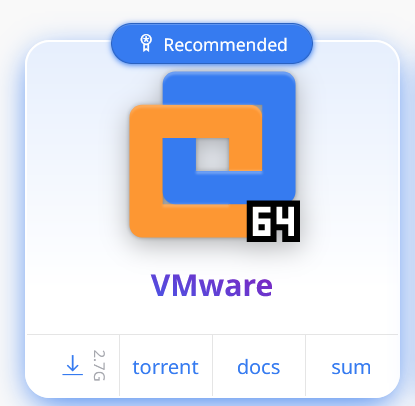
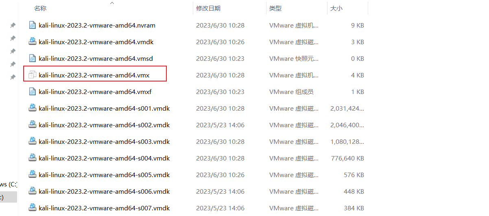
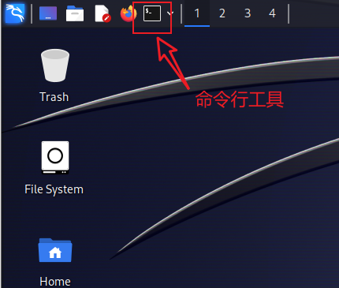

# 一、入门准备

## 1、了解kali和安装

**kali - 黑客最喜欢的操作系统**

kali官网：https://www.kali.org

### kali下载：

这里选择虚拟机下载，根据自己的虚拟机软件选择相应版本下载

### kali安装：

下载完成后解压，双击.vmx虚拟机文件即可打开，无需安装。(安装前提电脑必须已经安装VMware)

kali的默认用户名和密码都是kali

### kali使用：

kali工具使用大全:https://www.kali.org/tools/

#### 命令行工具：

放大窗口：Ctrl + Shift + “+”

缩小窗口: Ctrl + “-”

复制：Ctrl + Shift + C

终止执行：Ctrl +  C

#### Kali最强渗透工具- metasploit

metasploit是什么?
msf是一款开源安全漏洞利用和测试工具，集成了各种平台上常见的溢出漏洞和流行的shellcode，并持续保持更新。
metasploit让复杂的漏洞攻击流程变的非常简单，一个电脑小白经过几小时的学习，就能对操作系统等主流漏洞发起危害性攻击。

##### 体验Kali渗透工具- metasploit

metasploit 攻击 windows 操作系统

msfconsole:启动metasploit命令行[命令行效率高，使用方便]

启动metasploit前需要做:

- 打开kali终端
- 使用sudo su命令，切换至root用户,并输入kali的密码kali
- 使用msfdb init命令 初始化metasploit数据库(*可选)
- msfconsole 打开metasploit工具

