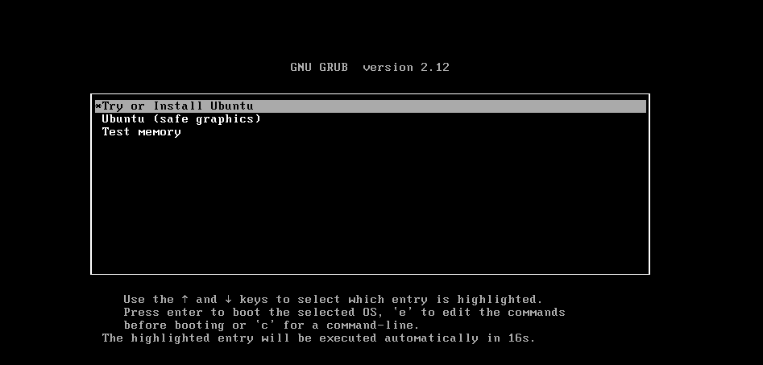

### :one:下载：

> https://cn.ubuntu.com/download/desktop


### :two:安装

个别步骤注意，其他默认




### :three:安装tool

`sudo  ./vmware-install.pl`

### :four:解决不能拖拽复制及共享问题

```
sudo vi /etc/gdm3/custom.conf
sudo apt install open-vm-tools-desktop
sudo /usr/bin/vmhgfs-fuse .host:/ /mnt/hgfs -o subtype=vmhgfs-fuse,allow_other 添加到 ~/.bashrc
添加执行 sudo 权限 

要为 Ubuntu 用户增加权限，可以使用以下步骤：
切换到 root 用户：使用以下命令切换到 root 用户：
sudo su -
添加用户：使用以下命令添加新用户（假设要添加的用户名为newuser）：
adduser newuser
将用户添加到 sudo 组：使用以下命令将用户添加到 sudo 组，以赋予其管理员权限：
usermod -aG sudo newuser
检查用户权限：可以使用以下命令查看新用户的权限：
sudo -l -U newuser
退出 root 用户：完成设置后，可以使用以下命令退出 root 用户：
exit
现在，新用户应该具有 sudo 权限，可以执行需要管理员权限的操作
添加
sudo /usr/bin/vmhgfs-fuse .host:/ /mnt/hgfs -o subtype=vmhgfs-fuse,allow_other 添加到 ~/.bashrc
```

### :five:添加管理员

```
创建一个新用户（替换new_user为你想要的用户名）:
sudo adduser new_user
添加新用户到sudo组（这样用户就可以执行管理员命令了）:
sudo usermod -a -G sudo new_user
为新用户设置密码（如果你想要手动设置密码，而不是在创建时设置）:
sudo passwd new_user
```


# 使用笔记

## 软件相关

### 卸载软件

```
sudo apt-get autoremove --purge python3
autoremove:删除所有自动安装且其不再需要的依赖包
--purge：删除配置文件
```

### 查看已安装的包

```
apt list --installed
```

## git 相关

安装git : `sudo apt install git`

配置git:

```
git config --global user.name "disguiser" 
git config --global user.email "978345836@qq.com"
```

创建文件夹并初始化 Git 存储库

现在，让我们为项目创建一个新文件夹并初始化一个 Git存储库。

```text
$ mkdir project_code
$ cd project_code
$ git init
```

进行更改后，即可将其提交到 Git 存储库：

```text
$ git add .
$ git commit -m "First Commit"
```

此命令暂存所有更改，并提交描述更改的消息。

生成SSH公钥：

公钥文件位置 `cat ~/.ssh/id_rsa.pub`

```
ssh-keygen -t rsa -C 978345836@qq.com
```

具体参考：[](D:\数据库\记事本\study-notes\github\github 公钥配置.md)

关联远程仓库

```
$ git remote add origin git@github.com:pradeepantil/project_code.git
$ git remote -v
```

最后，将本地更改推送到 存储库，运行“git push”命令。

```text
$ git push -u origin master
```

远程仓库拉取到本地

```
$ git fetch origin
$ git merge origin/master
```

## python相关

安装pip 

```
sudo apt install python3-pip
```

安装 `Uwsgi`

```
sudo apt install python3 uwsgi
```


