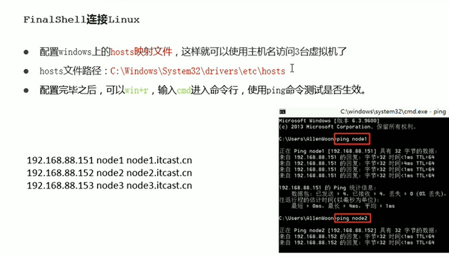

CRT一直持续收费，偶尔一些需要用到免费ssh工具的时候，会首先考虑使用Xshell，最近在网上看到了一款免费的ssh工具，FinalShell，初步测试了下，用起来是真的很舒服。

## 一.FinalShell介绍

**官网:**

**主要特性:**

```
1.多平台支持Windows,macOS,Linux
2.多标签,批量服务器管理.
3.支持登录ssh和Windows远程桌面.
4.漂亮的平滑字体显示,内置100多个配色方案.
5.终端,sftp同屏显示,同步切换目录.
6.命令自动提示,智能匹配,输入更快捷,方便.
7.sftp支持,通过各种优化技术,加载更快,切换,打开目录无需等待.
8.服务器网络,性能实时监控,无需安装服务器插件.
9.内置海外服务器加速,加速远程桌面和ssh连接,操作流畅无卡顿.
10.内存,Cpu性能监控,Ping延迟丢包,Trace路由监控.
11.实时硬盘监控.
12.进程管理器.
13.快捷命令面板,可同时显示数十个命令.
14.内置文本编辑器,支持语法高亮,代码折叠,搜索,替换.
15.ssh和远程桌面均支持代理服务器.
16.打包传输,自动压缩解压.
17.支持rz,sz (zmodem)
18.多地点ping监控
19.命令输入框,支持自动补全,命令历史
20.自定义命令参数功能,可动态根据输入参数生成命令
21.可设置终端背景图片,并拥有动态背景模糊,文字阴影效果.
22.一键查看各种系统信息
```

**下载地址:**

```
Windows版下载地址:
http://www.hostbuf.com/downloads/finalshell_install.exe
Mac版,Linux版安装及教程:
http://www.hostbuf.com/t/1059.html

更新日志:
http://www.hostbuf.com/t/989.html
```

## 二.初步使用

1.新建一个连接




1. 这个UI界面也真的很棒

   

   

3.直接查看资源使用率
 不用敲命令，直接可以看到资源使用率和网络相关的，确实比较方便


4.高级功能需要会员收费
 高级功能例如系统信息，进程管理，需要会员登录


